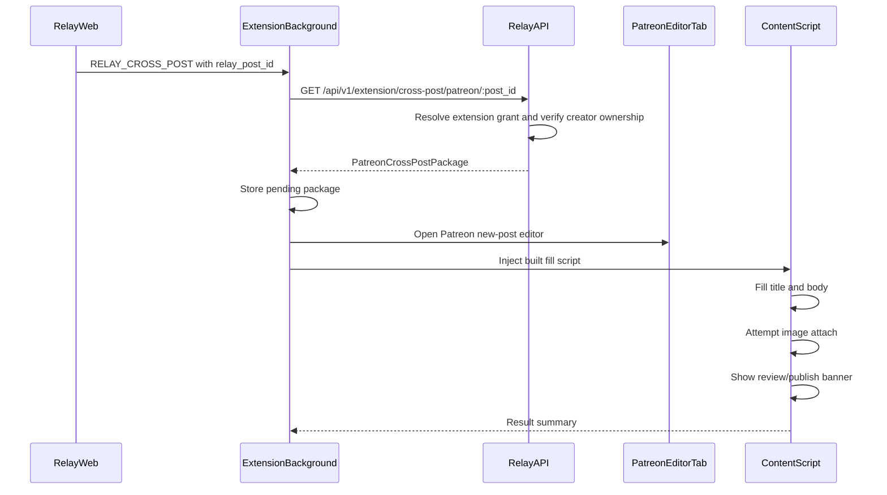
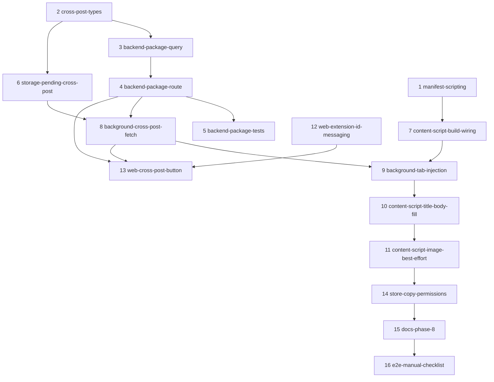

# Relay Extension Cross-Post Bridge — Build Plan

**Status:** v1 implementation complete (items 1–16). Human E2E gate passed locally (text + image best-effort). Audience/tier mapping deferred to post-v1 follow-up.
**Scope:** Expand the Relay browser extension from Patreon session-token capture into a creator-controlled cross-post bridge from Relay posts to Patreon's post editor.
**Parent extension plan:** [`EXTENSION_BUILD_PLAN.md`](EXTENSION_BUILD_PLAN.md)
**Builder prompt folder:** [`docs/Airtable Drops/Extension Cross-Post/`](Airtable%20Drops/Extension%20Cross-Post/)

---

## North Star

The extension serves two bridge functions:

1. **Session-token management:** already implemented. The extension captures the creator's Patreon `session_id` after explicit Relay consent and syncs it to Relay for media acquisition.
2. **Cross-posting:** new work. From a Relay post, the creator clicks **Publish to Patreon**. Relay web sends only a `relay_post_id` to the official extension. The extension fetches a backend-authorized Patreon draft package, opens Patreon's post editor, fills title/body, attempts image upload, then stops. The creator reviews and clicks **Publish** manually.

The extension must not become a bot that publishes on behalf of the creator. It is a user-triggered form-filling bridge.

---

## Data Flow



---

## Hard Boundaries

- Relay web sends only `relay_post_id`; it does not send title, body, or media URLs.
- Backend owns package assembly and verifies the extension grant owns the target creator/post.
- Text fill is the v1 must-pass behavior.
- Image upload is best-effort because Patreon's React upload controls may reject synthetic file/paste events.
- The extension never clicks Patreon's final publish button.
- No `relay_session`, Patreon `session_id`, Relay extension bearer token, or raw cookie value is displayed or logged.
- Patreon only for v1. SubscribeStar, Twitter/X, Discord, scheduling, tags, tiers, and paywall mapping are out of scope.

---

## Work Items

These are scoped for inline builders. Items marked **bespoke prompt** have a companion markdown prompt in [`docs/Airtable Drops/Extension Cross-Post/`](Airtable%20Drops/Extension%20Cross-Post/).

| # | ID | Goal | Prompt |
|---|---|---|---|
| 1 | `manifest-scripting` | Add `scripting` permission to Chrome dev/prod and Firefox manifests; update store permission copy. | Master only |
| 2 | `cross-post-types` | Define trigger/package types and validation helpers shared by extension background/content storage. | Master only |
| 3 | `backend-package-query` | Read Relay post/version/media and enforce creator ownership. | Bespoke |
| 4 | `backend-package-route` | Add `GET /api/v1/extension/cross-post/patreon/:post_id`. | Bespoke |
| 5 | `backend-package-tests` | Cover owner, non-owner, missing post, no media, and non-image media behavior. | Master only |
| 6 | `storage-pending-cross-post` | Add typed `pending_cross_post` get/set/clear helpers in extension storage. | Master only |
| 7 | `content-script-build-wiring` | Make the extension build emit an injectable content script artifact. | Bespoke |
| 8 | `background-cross-post-fetch` | External message validates origin/grant and fetches the package from Relay API. | Master only |
| 9 | `background-tab-injection` | Open Patreon editor, wait for tab load, inject built script, handle timeout. | Bespoke |
| 10 | `content-script-title-body-fill` | Text-only vertical slice: wait for editor, fill title/body, show banner. | Bespoke |
| 11 | `content-script-image-best-effort` | Fetch Relay image blobs and attempt upload/paste; graceful fallback. | Bespoke |
| 12 | `web-extension-id-messaging` | Add web helper that tries all configured `NEXT_PUBLIC_RELAY_EXTENSION_IDS`. | Master only |
| 13 | `web-cross-post-button` | Add the user-facing Relay **Publish to Patreon** action and UX states. | Master only |
| 14 | `store-copy-permissions` | Update Chrome/Firefox descriptions and permission justifications for cross-posting. | Master only |
| 15 | `docs-phase-8` | Add cross-posting Phase 8 notes to `EXTENSION_BUILD_PLAN.md`. | Master only |
| 16 | `e2e-manual-checklist` | Add manual verification checklist for text fill and best-effort image behavior. Include the **Return to** section below. | Master only |

---

## Suggested Build Order



Recommended vertical slice:

1. Backend package endpoint.
2. Extension fetch + tab injection.
3. Text-only fill.
4. Web button.
5. Image best-effort.

This proves the bridge before spending time on Patreon's upload mechanics.

---

## Package Shape

```ts
export type PatreonCrossPostPackage = {
  relay_post_id: string;
  title: string;
  body_text: string;
  body_html?: string;
  media: Array<{
    media_id: string;
    filename: string;
    mime_type: string;
    content_url: string;
  }>;
};
```

`content_url` should point at Relay-controlled media delivery, e.g. `/api/v1/export/media/:creator_id/:media_id/content` or an absolute `https://relayapp.me/api/v1/...` URL. The extension fetches it with `Authorization: Bearer <extension token>`.

---

## Verification Commands

Use the narrowest relevant checks per item, then run broader checks at the vertical-slice gates.

```bash
npm run test
npm run build
npm run build --prefix web
cd extension && npm run build:chrome:dev
cd extension && npm run build:chrome:prod
cd extension && npm run build:firefox:prod
```

Manual checks require a real or staging Patreon creator login because the editor DOM and upload controls are third-party UI.

---

## Bespoke Prompt Index

- [`XPOST-03-backend-package-query-prompt.md`](Airtable%20Drops/Extension%20Cross-Post/XPOST-03-backend-package-query-prompt.md)
- [`XPOST-04-backend-package-route-prompt.md`](Airtable%20Drops/Extension%20Cross-Post/XPOST-04-backend-package-route-prompt.md)
- [`XPOST-07-content-script-build-wiring-prompt.md`](Airtable%20Drops/Extension%20Cross-Post/XPOST-07-content-script-build-wiring-prompt.md)
- [`XPOST-09-background-tab-injection-prompt.md`](Airtable%20Drops/Extension%20Cross-Post/XPOST-09-background-tab-injection-prompt.md)
- [`XPOST-10-content-script-title-body-fill-prompt.md`](Airtable%20Drops/Extension%20Cross-Post/XPOST-10-content-script-title-body-fill-prompt.md)
- [`XPOST-11-content-script-image-best-effort-prompt.md`](Airtable%20Drops/Extension%20Cross-Post/XPOST-11-content-script-image-best-effort-prompt.md)

---

## Inline / master-only items (no bespoke prompt file)

| # | ID | Notes |
|---|---|---|
| 12 | `web-extension-id-messaging` | `web/lib/relay-extension-messaging.ts` |
| 13 | `web-cross-post-button` | `PublishToPatreonButton` in compose success flow |
| 14 | `store-copy-permissions` | `extension/store/{chrome,firefox}/` + manifest descriptions |
| 15 | `docs-phase-8` | Phase 8 section in `EXTENSION_BUILD_PLAN.md` |
| 16 | `e2e-manual-checklist` | [`XPOST-16-e2e-manual-checklist.md`](Airtable%20Drops/Extension%20Cross-Post/XPOST-16-e2e-manual-checklist.md) |

---

## Return to (post-build follow-ups)

Standing reminders to revisit after the v1 bridge ships. None of these block starting downstream work items; item **8** (`background-cross-post-fetch`) and item **16** (`e2e-manual-checklist`) are the earliest natural verification points.

### Cross-post package route CORS

**Context:** `GET /api/v1/extension/cross-post/patreon/:post_id` (item **4**) lives outside the tight extension CORS allowlist in `src/server.ts`, which pins `RELAY_EXTENSION_ORIGINS` only for `/api/v1/auth/extension/*`. The route currently relies on global CORS middleware (and extension `host_permissions` on `relayapp.me` for background `fetch`).

**Verify during item 8 and item 16:**

- Extension background can fetch the package route with `Authorization: Bearer <extension grant>` from chrome-dev, chrome-prod, and Firefox unpacked builds.
- Preflight (`OPTIONS`) and the `GET` both succeed when `Origin` is `chrome-extension://…` or `moz-extension://…`.

**If blocked:**

- Extend the extension-origin allowlist to `/api/v1/extension/*` (same rules as `/api/v1/auth/extension/*`), **or**
- Document that `host_permissions` on `https://relayapp.me/*` is sufficient and add an automated regression test so the distinction does not drift.

**Do not** broaden CORS preemptively without evidence; see [`XPOST-04-backend-package-route-prompt.md`](Airtable%20Drops/Extension%20Cross-Post/XPOST-04-backend-package-route-prompt.md) Part C.

### Audience / tier mapping (post-v1)

**Context:** Patreon defaults new posts to **Free access**. Relay tier-gated posts do not auto-map to Patreon paid tiers in v1. Relay already syncs the Patreon tier catalog during backup; a future content-script pass could best-effort select **Paid access** when the Relay post is tier-gated.

**Why deferred:** Wrong audience is higher-stakes than missing media. v1 requires manual creator review before Patreon publish.

**Verify in v1:** E2E checklist includes manual audience review step. See [`XPOST-16-e2e-manual-checklist.md`](Airtable%20Drops/Extension%20Cross-Post/XPOST-16-e2e-manual-checklist.md).

