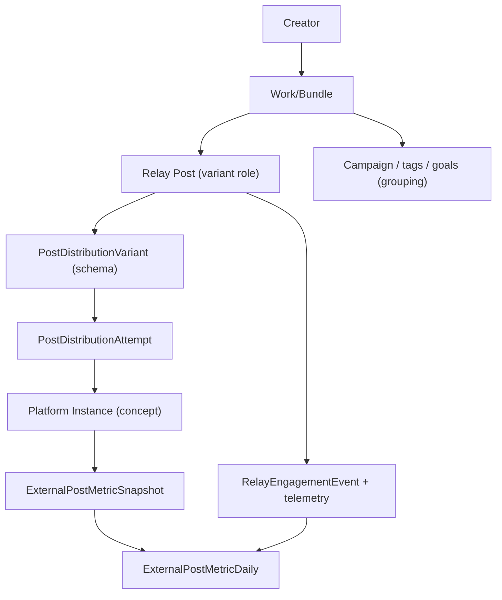

# Performance Intelligence — Product & Data Vocabulary

> **Status:** Builder-ready vocabulary (Phase 0 of Cross-Platform Performance Intelligence).  
> **Depends on:** Slice 2d aggregation (`ExternalPostMetricDaily`, unified read endpoint, rollup job).  
> **Audience:** Product, backend, frontend, and agent handoffs for Phases 1–10.

This document is the **stable glossary** for Relay’s cross-platform performance intelligence layer. Later schema, API, and UI tasks must use these terms consistently.

---

## Product thesis

Relay is the artist’s **cross-platform performance intelligence layer**: publish broadly, gather metrics across connected surfaces, and surface plain-language next actions.

The **Work/Bundle** is the durable analytics object. A Relay Post is a publishable variant of that work. A **Platform Instance** is where that variant (or an externally matched post) actually lives on Patreon, X, DeviantArt, Instagram, or Relay first-party surfaces.

---

## Object hierarchy

### Drill-down questions the hierarchy answers

| Question type | Primary object | Example |
|---------------|----------------|---------|
| **One work across platforms** | Work/Bundle | “How did *Autumn Series No. 4* perform on Patreon vs X vs Relay?” |
| **All works in a category** | Campaign / tag / goal / platform / date window | “How did all *sketch* posts do this month on X?” |

Both views are first-class. Do not collapse them into a single aggregate without preserving grain.

---

## Core entities

### Creator

The Relay studio tenant owner. All analytics are scoped by `creatorId` (Relay creator id / tenant bridge).

**Existing:** `Tenant`, creator session, `GET /api/v1/creator/analytics/*`.

---

### Work/Bundle

**Definition:** One creative work the artist treats as a single piece of art in their head—regardless of how many teasers, reposts, or platform-specific versions exist.

**Purpose:**

- Group full Patreon posts and X/Instagram teasers under one analytics node.
- Preserve patron-facing visibility: bundling is an **analytics/publishing convenience**, not a change to what patrons see on Patreon.
- Serve as the canonical drilldown target for “show me this one object across all instances.”

**Planned fields (Phase 1 — implemented as `CreativeWork`):**

| Field | Schema | Description |
|-------|--------|-------------|
| `id` | `CreativeWork.id` | Stable Work/Bundle id |
| `creatorId` | `CreativeWork.creatorId` | Owner |
| `title` | `CreativeWork.title` | Display title |
| `description` | `CreativeWork.description` | Optional artist note |
| `analyticsCampaignLabel` | `CreativeWork.analyticsCampaignLabel` | Optional analytics campaign (not Patreon `Campaign`) |
| `tags` | `CreativeWork.tags` | Category rollups |
| `isDefaultBundle` | `CreativeWork.isDefaultBundle` | 1:1 auto bundle for legacy/single posts |
| `createdAt` / `updatedAt` | audit | |

**Membership:** `CreativeWorkMember` links `Post` → `CreativeWork` with `variantRole` (`full`, `teaser`, `promo`, `repost`, `standalone`).

**Schema doc:** [CREATIVE_WORK_SCHEMA.md](./CREATIVE_WORK_SCHEMA.md)

**Default behavior:** Every existing Relay Post gets a 1:1 default Work/Bundle on migration so nothing breaks.

**Do not confuse with:** `PostDistributionPlan` (autopost batch for one Relay Post).

---

### Relay Post (variant role)

**Definition:** A Relay library post (`Post` in schema) that plays a **role** within a Work/Bundle: full piece, teaser, promo clip, repost, etc.

**Variant roles (product enum — planned):**

| Role | Meaning | Example |
|------|---------|---------|
| `full` | Primary complete work | Patreon gallery post with full resolution |
| `teaser` | Partial/preview intended to drive traffic | X crop + link |
| `promo` | Marketing-oriented repost | “New drop” announcement |
| `repost` | Same work resurfaced | DeviantArt re-upload |
| `standalone` | Default when no bundle context | Legacy posts |

**Existing schema:** `Post`, `PostVersion`, distribution plans.

**Naming collision — important:**

| Term in this doc | Prisma model | Meaning |
|------------------|--------------|---------|
| Relay Post **variant role** | `Post` + planned `workRole` | Full vs teaser within a Work/Bundle |
| **Distribution variant** | `PostDistributionVariant` | Platform-specific autopost payload (title/body/tags for Patreon vs X) |

Always qualify: **work variant role** vs **distribution variant**.

---

### Platform Instance

**Definition:** A single published (or linkable) presence of content on one destination: one Patreon post URL, one X status, one DeviantArt deviation, one Relay gallery post surface, etc.

**Identity (minimum):**

| Field | Description |
|-------|-------------|
| `destination` | `patreon` \| `x` \| `deviantart` \| `instagram` \| `relay` \| … |
| `externalUrl` | Canonical public URL |
| `externalId` | Platform-native id when known |
| `postId` | Relay Post id when linked |
| `attemptId` | `PostDistributionAttempt.id` when created via Relay handoff |
| `linkedAt` | When Relay recorded the link |
| `linkSource` | How the link was established (see Link provenance) |
| `lastRefreshedAt` | Last successful metric pull |
| `refreshPolicy` | Platform-specific refresh rules |

**Phase 2 (implemented):** Platform Instance is a first-class `platform_instances` table keyed by `postId + destination`, backfilled from posted distribution attempts and linked to metric snapshots. See [PLATFORM_INSTANCE_SCHEMA.md](./PLATFORM_INSTANCE_SCHEMA.md).

**Highest-resolution tracking:** Instances the user **cross-linked in Relay** (post handoff confirm, manual URL confirm, or autopost success) are the ones Relay can refresh and attribute with confidence.

---

### Campaign

**Definition:** A user-defined or system-suggested grouping of Works/Bundles for category analytics (“Autumn 2026 launch”, “Sketch-a-day”, “Patreon migration push”).

**Rollup grain:** `(creatorId, campaignId, day, metricType, destination?)`.

**Planned:** optional `Campaign` table; until then, tags on Work/Bundle may substitute.

---

### Tag

**Definition:** Freeform or controlled labels on Works/Bundles or Relay Posts used for **category rollups** (“sketch”, “commission”, “WIP”, “NSFW”).

**Distinct from:** `PostDistributionVariant.tags` (platform posting tags for autopost).

---

### Goal

**Definition:** A creator target tied to performance intelligence: posting cadence, platform focus, reach target, conversion experiment, etc.

**Existing partial:** `CreatorPostingGoal` (monthly Relay-native post count).

**Planned expansion:** goals scoped to Work/Bundle, campaign, platform, or metric threshold; consumed by Insight action cards.

**Do not confuse with:** posting goal nudge worker (WI-5)—that is one goal *type*, not the whole goals system.

---

### Action (Insight action)

**Definition:** A plain-language recommendation derived from metrics, surfaced as an action card: “Repost this teaser on X”, “Make another post like this”, “Review Gold tier churn”, etc.

**Properties (planned):**

| Property | Description |
|----------|-------------|
| `trigger` | What metric pattern fired the action |
| `body` | Human-readable explanation |
| `confidence` | How strongly data supports the action |
| `href` / `actionLabel` | Deep link into Relay (studio, autopost, goal setup) |
| `tierGate` | Optional Pro/Studio packaging (decision deferred) |

**Existing UI seed:** `AnalyticsInsightsHub` action cards, `CreatorActionCard` type.

---

## Metric layer (existing + planned)

### Metric types

Core cross-platform metrics (Slice 2d unified read model):

| `metricType` | Typical sources | Notes |
|--------------|-----------------|-------|
| `impressions` | Patreon CSV/API, some platforms | Reach proxy |
| `seen` | Patreon CSV | Patreon-specific “seen” |
| `views` | Relay first-party, some APIs | Gallery/post views |
| `likes` | APIs, DOM scrape, Relay telemetry | |
| `comments` | APIs, DOM scrape, Relay telemetry | |
| `reveal_interactions` | Relay engagement | Relay-only |
| `favorites` / `reposts` / `quotes` / `bookmarks` | Platform-specific | Pass-through when captured |

Platform-specific metrics stay on their instance; Work/Bundle rollups **sum or max** according to documented rules per metric (Phase 3).

---

### ExternalPostMetricSnapshot

**Definition:** Append-only time-series row: one metric reading for one platform instance at one capture time.

**Grain:** `(attemptId or link, metricType, capturedAt)`.

**Existing:** `ExternalPostMetricSnapshot` in `prisma/schema.prisma`.

---

### ExternalPostMetricDaily

**Definition:** Materialized daily fact row for creator analytics.

**Grain:** `(creatorId, postId, destination, metricType, day)`.

**Fields:** `value` (absolute that day), `deltaFromPrior`, `source`, `computedAt`.

**Existing:** Slice 2d rollup job + `GET /api/v1/creator/analytics/unified-performance`.

**Future:** rollups may also aggregate at `(workBundleId, …)` without removing post-level grain.

---

### Relay first-party metrics (`destination = relay`)

**Sources:**

- `RelayEngagementEvent` (`gallery_view`, `reveal_interaction`, `profile_view`)
- `PlatformTelemetryEvent` (`post_view`, `post_liked`, `comment_created`)

Merged in rollup with **max per grain** to avoid double-counting post detail views.

---

## Metric source

**Definition:** How a metric value entered Relay—not how trustworthy the platform itself is.

### Snapshot / rollup `source` values (implemented)

| Value | Meaning | Typical origin |
|-------|---------|----------------|
| `platform_api` | Official platform API | Highest precedence for snapshots |
| `extension_dom` | Extension DOM scrape after user-initiated handoff | High precedence |
| `third_party` | Patreon Insights CSV import | Overlay when no high-fidelity snapshot |
| `public_scrape` | Scheduled/consent-based scrape | Lower precedence |
| `manual` | Relay first-party counts, manual entry | Used for `destination=relay` |

**Precedence (within a UTC day, same grain):**  
`platform_api` > `extension_dom` > `third_party` > `public_scrape` > `manual`

**CSV overlay rule:** CSV fills gaps, or replaces snapshot rows whose source is **not** `platform_api` or `extension_dom`.

**Reference:** `EXTERNAL_METRIC_SOURCE_PRECEDENCE` in `src/analytics/external-metric-rollup-service.ts`.

### Ingest priority (product policy)

When choosing **how** to refresh, prefer:

1. Official APIs (where licensed and available)
2. Relay-linked URLs (handoff confirm, autopost success, manual link)
3. CSV enrichment (user-uploaded Patreon Insights)
4. Conservative scraping (user-initiated or scheduled with platform-specific rate limits)

**Non-goal:** aggressive always-on scraping of Patreon or other platforms.

---

## Confidence

**Definition:** Relay’s estimate of how well a metric row represents the true platform-reported value **for that instance**.

Confidence is **not** the same as source precedence. A `third_party` CSV row can be high confidence for Patreon historical data; a stale `extension_dom` scrape can be low confidence.

### Planned confidence levels (UI + API)

| Level | Code | Meaning |
|-------|------|---------|
| High | `high` | Linked instance + fresh API/CSV or successful handoff capture |
| Medium | `medium` | Linked instance but stale, or CSV without per-day alignment |
| Low | `low` | Inferred match, partial scrape, or missing metric types |
| Unknown | `unknown` | No linked instance; mock/demo data |

### Signals that affect confidence (planned)

- Link provenance (autopost vs manual vs suggested merge)
- Freshness age vs platform policy
- Metric completeness (impressions present but not likes)
- Match score for bundled external-only posts

**UI rule:** Show source label + freshness on drilldowns; show simplified confidence on summary cards.

---

## Freshness

**Definition:** How current the displayed metrics are.

### Fields

| Field | Scope | Description |
|-------|-------|-------------|
| `capturedAt` | Snapshot | When metric was observed |
| `computedAt` | Daily rollup | When rollup job last wrote the row |
| `rollup_computed_at` | Unified API | Latest rollup `computedAt` in window |
| `lastRefreshedAt` | Platform Instance | Last successful refresh |
| `import_uploaded_at` | CSV path | Patreon Insights import time |

### Staleness thresholds (implemented / planned)

| Surface | Rule |
|---------|------|
| Unified rollup | Warn if `rollup_computed_at` > **48h** (`AnalyticsInsightsHub`) |
| CSV fallback | Warn if import older than configured threshold (`analytics-data-freshness`) |
| Manual refresh | Resets instance freshness; subject to cooldown |

**UI copy pattern:** “Data may be outdated” + what to do (refresh, upload CSV, wait for daily rollup).

---

## Link provenance

How a Platform Instance became known to Relay:

| Provenance | Description | Typical confidence |
|------------|-------------|------------------|
| `autopost_success` | Relay autopost/handoff completed with `externalUrl` | High |
| `manual_url_confirm` | Creator confirmed URL in UI | High |
| `api_identity` | Resolved via platform API without Relay post | Medium–high |
| `csv_import` | Matched from Patreon Insights CSV post id | Medium |
| `suggested_merge` | User confirmed bundling suggestion | Medium |
| `inferred_only` | Title/time/media match, not confirmed | Low (do not auto-merge) |

---

## Refresh model

### Manual refresh

Creator-triggered pull for a linked Platform Instance. Must respect:

- Per-platform cooldown (relay 5m, Patreon 15m, others 30m — overridable via env)
- Clear API response: `status`, `handoff`, `cooldown`, `method`, `message`

**API (Phase 4):** `GET/POST /api/v1/creator/analytics/platform-instances/:id/refresh-status|refresh` — see [SAFE_REFRESH.md](./SAFE_REFRESH.md).

### Scheduled refresh (BullMQ)

**Queues:**

- `external_metric_daily_rollup` — daily rollup hygiene (2 UTC day lookback)
- `platform_instance_refresh_sweep` — conservative stale relay rollups + external stale marking (no auto scrape)

**Policy:** Hygiene and catch-up, not real-time polling.

**Env:** `RELAY_EXTERNAL_METRIC_DAILY_ROLLUP_MS`, `RELAY_PLATFORM_INSTANCE_REFRESH_SWEEP_MS`, `RELAY_JOB_BACKEND=bullmq`, `REDIS_URL`.

---

## Bundling and matching

### Suggestion

Relay proposes that two posts/instances belong in one Work/Bundle (e.g. Patreon full piece + X teaser).

**Signals (in priority order):**

1. Same Relay origin (distribution plan / autopost lineage)
2. Same `externalUrl` / `externalId` family
3. Title/caption similarity
4. Media perceptual hash (when available)
5. Publish-time proximity

### Confirmation

**Policy:** Suggestions require **explicit user confirmation** before merge. Never silent auto-merge in v1.

**API (Phase 5):** See [SUGGESTED_BUNDLING.md](./SUGGESTED_BUNDLING.md) — list/dismiss/confirm suggestions + member split.

### Split / unbundle

User can remove a variant from a Work/Bundle; metrics remain on original instances but rollups recompute at Work level.

---

## Analytics views (UI vocabulary)

| View | Scope | Primary API (current / planned) |
|------|-------|----------------------------------|
| Creator overview | All works, all platforms | `unified-performance` (legacy) / `performance/overview` (V2) |
| Platform breakdown | Filter by `destination` | `unified-performance?destination=` / `performance/overview?destination=` |
| Campaign / tag / goal | Category rollups | `performance/campaigns`, `performance/tags`, posting goal on `performance/overview` |
| Work/Bundle drilldown | One work, all variants/instances | `performance/works/:creative_work_id` |
| Relay Post drilldown | One post, all destinations | `performance/posts/:post_id` |
| Platform Instance detail | One URL/status | `performance/platform-instances/:platform_instance_id` |

**Insights Hub hierarchy (target):**  
Creator-wide → platform → campaign/tag/goal → Work/Bundle → variant → instance.

**Reference:** `docs/analytics/INSIGHTS_IA_TREE.md` (portal model aligns with Reach / Content trees).

---

## Monetization vocabulary (decision deferred)

Packaging is a **product gate layer**, not baked into core metric storage.

| Tier (directional) | Capability |
|--------------------|------------|
| Basic / free creator | Posting convenience + simple rollups (exact boundary TBD) |
| Pro | Cross-platform tracking, drilldowns, history, manual refresh, bundle suggestions |
| Studio | Insight Bot, targeted goals, drafted actions, campaign intelligence |

Features must **degrade gracefully** when gated (show existence of insight, not raw paywall on basic counts).

---

## Mapping to existing codebase

| Vocabulary term | Current schema / module |
|-----------------|-------------------------|
| Relay Post | `Post`, `PostVersion` |
| Distribution variant | `PostDistributionVariant` |
| Handoff / link attempt | `PostDistributionAttempt` |
| Metric snapshot | `ExternalPostMetricSnapshot` |
| Daily rollup | `ExternalPostMetricDaily` |
| Rollup job | `external-metric-rollup-job.ts`, queue `external_metric_daily_rollup` |
| Creator unified read | `creator-unified-performance.ts` |
| CSV overlay | `PatreonInsightsPostMetric`, `overlayCsvDailyCandidates` |
| Relay destination metrics | `RelayEngagementEvent`, `PlatformTelemetryEvent` |
| Work/Bundle | `CreativeWork`, `CreativeWorkMember` — see [CREATIVE_WORK_SCHEMA.md](./CREATIVE_WORK_SCHEMA.md) |
| Platform Instance (first-class) | **Yes** — `platform_instances` table ([PLATFORM_INSTANCE_SCHEMA.md](./PLATFORM_INSTANCE_SCHEMA.md)) |
| Campaign / expanded goals | **Partially** via tags, `CreatorPostingGoal` |

---

## Agent handoff rules

When implementing Phases 1–10:

1. Use **Work/Bundle** for cross-platform “one creative work” analytics.
2. Use **Relay Post (variant role)** for full vs teaser; never overload `PostDistributionVariant` for that meaning.
3. Use **Platform Instance** for per-URL metrics and refresh policy.
4. Preserve **postId + destination** grain in `ExternalPostMetricDaily` even after Work/Bundle exists.
5. Expose **source**, **freshness**, and **confidence** on read APIs and drilldown UI.
6. Require **user confirmation** for bundling merges.

---

## Related documents

- [EXTERNAL_POST_METRICS_SLICE2.md](../distribution/EXTERNAL_POST_METRICS_SLICE2.md) — Slice 2 ingest + Phase 2d rollups
- [INSIGHTS_IA_TREE.md](./INSIGHTS_IA_TREE.md) — Insights Hub information architecture
- [DATA_FLOWS_REFERENCE.md](./DATA_FLOWS_REFERENCE.md) — Legacy insight recipes (membership-focused)
- Cross-Platform Performance Intelligence build plan — `.cursor/plans/performance_intelligence_*.plan.md`

---

**Last updated:** 2026-07-01  
**Phase 0 acceptance:** Stable definitions for Work/Bundle, Relay Post variant role, Platform Instance, metric source, confidence, freshness, campaign, tag, goal, and action—ready for Phase 1 schema design.
