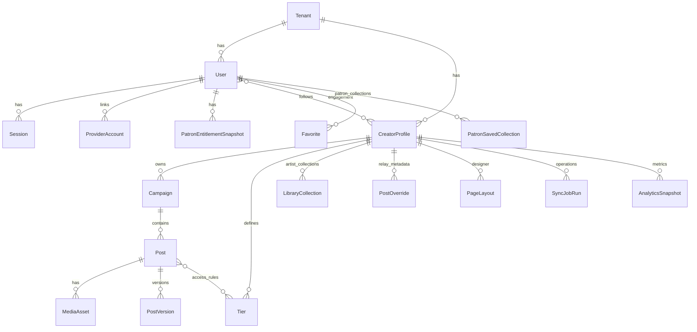

# Relational model — Relay PostgreSQL target

## Principles

1. **Single content truth:** Canonical ingest + artist overrides merge at read time (`docs/patreon-ingest-canonical.md`, `docs/relay-artist-metadata.md`). The database must not allow patron-facing queries to fork a second inventory; they join **canonical + overrides + entitlements** per `docs/pattern-library.md` (viewer parity).

2. **Patreon upstream, Relay snapshots:** Subscription/tier authority remains on Patreon; Relay stores **credential health**, **`last_sync_at`**, **staleness**, and **entitlement snapshots** for authorization and feed assembly (`road map.md` Part 3 K/L, contingency).

3. **Provider abstraction:** Use `provider` + opaque provider IDs — avoid Patreon-only column names as the only keys on core entities. Patreon-specific payloads can live in versioned JSON on extension rows.

4. **OAuth separation:** Creator ingest credentials and patron entitlement tokens **must not** share storage paths or logical tables without a strict `purpose` discriminator (`road map.md` Part 1 A vs Part 3 K).

5. **Naming — Library vs patron collections:** Use distinct models (e.g. **LibraryCollection** vs **PatronSavedCollection**) so schema and APIs never conflate artist Library collections with Relay-native patron collections.

6. **Events:** Honor `tenant_id` + payload `creator_id` and `primary_id` idempotency from `builder-boost-pack/contracts/events.md`.

## Object storage vs database

- **S3/R2** holds media blobs; Postgres holds **metadata**, **storage keys**, **checksums**, and policy inputs for signed delivery — not raw files.

- **BullMQ + Redis** own ephemeral job execution; Postgres holds **durable job records**, **DLQ / failure audit**, and **idempotency keys** where replay and compliance matter.

## ERD (high level)



## Representative Prisma schema

The repository does not yet contain `schema.prisma`; the fragment below is a **target** for iteration. Adjust naming (`@@map`, enums) to match implementation conventions. **Prisma requires bidirectional relations** — add the matching inverse fields on `User`, `CreatorProfile`, `Post`, `Tier`, etc., when you materialize this in code.

```prisma
// --- Core multi-tenancy & identity ---

model Tenant {
  id        String   @id @default(cuid())
  createdAt DateTime @default(now())
  users     User[]
  creators  CreatorProfile[]
}

enum UserKind {
  creator
  patron
  staff
}

model User {
  id        String   @id @default(cuid())
  tenantId  String
  tenant    Tenant   @relation(fields: [tenantId], references: [id])
  kind      UserKind
  emailHash String?
  createdAt DateTime @default(now())
  updatedAt DateTime @updatedAt

  sessions          Session[]
  providerAccounts  ProviderAccount[]
  patronProfile     PatronProfile?
  creatorProfile    CreatorProfile?

  @@index([tenantId, kind])
}

model Session {
  id         String    @id @default(cuid())
  userId     String
  user       User      @relation(fields: [userId], references: [id], onDelete: Cascade)
  tokenHash  String    @unique
  createdAt  DateTime  @default(now())
  expiresAt  DateTime?
  userAgent  String?
  ipInet     String?
  revokedAt  DateTime?

  @@index([userId, expiresAt])
}

enum ProviderKind {
  patreon
}

model ProviderAccount {
  id             String         @id @default(cuid())
  userId         String
  user           User           @relation(fields: [userId], references: [id], onDelete: Cascade)
  provider       ProviderKind
  providerUserId String
  displayName    String?
  createdAt      DateTime       @default(now())

  oauthCredential OAuthCredential?

  @@unique([provider, providerUserId])
  @@index([userId])
}

model OAuthCredential {
  id                String          @id @default(cuid())
  providerAccountId String          @unique
  providerAccount   ProviderAccount @relation(fields: [providerAccountId], references: [id], onDelete: Cascade)
  purpose           OAuthPurpose
  encryptedPayload  Bytes
  keyId             String
  healthStatus      CredentialHealth
  lastSuccessAt     DateTime?
  lastFailureAt     DateTime?
  lastFailureCode   String?
  expiresAtHint     DateTime?
  createdAt         DateTime        @default(now())
  updatedAt         DateTime        @updatedAt
}

enum OAuthPurpose {
  creator_ingest
  patron_entitlement
}

enum CredentialHealth {
  healthy
  degraded
  invalid
  revoked
}

model CreatorProfile {
  id                 String   @id @default(cuid())
  tenantId           String
  tenant             Tenant   @relation(fields: [tenantId], references: [id])
  userId             String   @unique
  user               User     @relation(fields: [userId], references: [id])
  patreonCampaignId  String?  @unique

  campaigns           Campaign[]
  tiers               Tier[]
  libraryCollections  LibraryCollection[]
  postOverrides       PostOverride[]
  layouts             PageLayout[]

  @@index([tenantId])
}

model Campaign {
  id                 String   @id @default(cuid())
  creatorId          String
  creator            CreatorProfile @relation(fields: [creatorId], references: [id])
  providerCampaignId String?
  title              String?
  rawSnapshot        Json?
  createdAt          DateTime @default(now())
  posts              Post[]

  @@index([creatorId])
}

model Post {
  id               String   @id @default(cuid())
  campaignId       String
  campaign         Campaign @relation(fields: [campaignId], references: [id])
  providerPostId   String?
  currentVersionId String?  @unique
  createdAt        DateTime @default(now())

  versions  PostVersion[]
  media     MediaAsset[]
  postTiers PostTier[]

  @@unique([campaignId, providerPostId])
  @@index([campaignId, createdAt(sort: Desc)])
}

model PostVersion {
  id          String   @id @default(cuid())
  postId      String
  post        Post     @relation(fields: [postId], references: [id], onDelete: Cascade)
  versionSeq  Int
  publishedAt DateTime?
  title       String?
  tagIds      String[]
  rawPayload  Json?
  createdAt   DateTime @default(now())

  @@unique([postId, versionSeq])
}

model MediaAsset {
  id               String   @id @default(cuid())
  postId           String
  post             Post     @relation(fields: [postId], references: [id], onDelete: Cascade)
  providerMediaId  String?
  storageKey       String?
  sha256           String?
  mimeType         String?
  role             String
  createdAt        DateTime @default(now())

  @@index([postId])
}

model Tier {
  id             String   @id @default(cuid())
  creatorId      String
  creator        CreatorProfile @relation(fields: [creatorId], references: [id])
  providerTierId String
  title          String?
  position       Int?

  @@unique([creatorId, providerTierId])
}

model PostTier {
  postId String
  tierId String
  post   Post @relation(fields: [postId], references: [id], onDelete: Cascade)
  tier   Tier @relation(fields: [tierId], references: [id])

  @@id([postId, tierId])
}

model PostOverride {
  id           String   @id @default(cuid())
  creatorId    String
  creator      CreatorProfile @relation(fields: [creatorId], references: [id])
  postId       String
  mediaId      String?
  addTagIds    String[] @default([])
  removeTagIds String[] @default([])
  visibility   GalleryVisibility @default(visible)
  updatedAt    DateTime @updatedAt

  @@unique([creatorId, postId, mediaId])
}

enum GalleryVisibility {
  visible
  hidden
  review
}

model LibraryCollection {
  id                  String   @id @default(cuid())
  creatorId           String
  creator             CreatorProfile @relation(fields: [creatorId], references: [id])
  name                String
  themeTagIds         String[] @default([])
  accessCeilingTierId String?
}

model PageLayout {
  id         String   @id @default(cuid())
  creatorId  String
  creator    CreatorProfile @relation(fields: [creatorId], references: [id])
  layoutJson Json
  updatedAt  DateTime @updatedAt
}

model PatronProfile {
  id        String   @id @default(cuid())
  userId    String   @unique
  user      User     @relation(fields: [userId], references: [id], onDelete: Cascade)
  handle    String?
  createdAt DateTime @default(now())
}

model PatronEntitlementSnapshot {
  id              String   @id @default(cuid())
  patronUserId    String
  patron          User     @relation(fields: [patronUserId], references: [id], onDelete: Cascade)
  creatorId       String
  creator         CreatorProfile @relation(fields: [creatorId], references: [id])
  entitledTierIds String[]
  active          Boolean
  source          EntitlementSource
  asOf            DateTime
  staleAfter      DateTime?

  @@unique([patronUserId, creatorId])
  @@index([creatorId, asOf(sort: Desc)])
}

enum EntitlementSource {
  oauth_exchange
  scheduled_refresh
  webhook
  manual_support
}

model Follow {
  id           String   @id @default(cuid())
  patronUserId String
  patron       User     @relation(fields: [patronUserId], references: [id], onDelete: Cascade)
  creatorId    String
  creator      CreatorProfile @relation(fields: [creatorId], references: [id])
  createdAt    DateTime @default(now())

  @@unique([patronUserId, creatorId])
}

model Favorite {
  id           String   @id @default(cuid())
  patronUserId String
  patron       User     @relation(fields: [patronUserId], references: [id], onDelete: Cascade)
  creatorId    String
  postId       String?
  mediaId      String?
  createdAt    DateTime @default(now())

  @@index([patronUserId, creatorId])
}

model PatronSavedCollection {
  id           String   @id @default(cuid())
  patronUserId String
  patron       User     @relation(fields: [patronUserId], references: [id], onDelete: Cascade)
  name         String
  createdAt    DateTime @default(now())
}

model Comment {
  id             String   @id @default(cuid())
  creatorId      String
  postId         String
  patronUserId   String
  body           String
  createdAt      DateTime @default(now())
  deletedAt      DateTime?
  moderationState ModState @default(visible)
}

enum ModState {
  visible
  hidden
  removed
}

model DiscoveryDecisionLog {
  id            String   @id @default(cuid())
  patronUserId  String?
  creatorId     String?
  itemKey       String
  rankScore     Float?
  reasonCodes   String[]
  inputsJson    Json
  createdAt     DateTime @default(now())

  @@index([createdAt(sort: Desc)])
}

model JobRun {
  id         String    @id @default(cuid())
  kind       String
  creatorId  String?
  status     String
  payload    Json?
  startedAt  DateTime  @default(now())
  finishedAt DateTime?
  error      String?
}

model AnalyticsSnapshot {
  id          String   @id @default(cuid())
  creatorId   String
  kind        String
  periodStart DateTime
  periodEnd   DateTime
  payload     Json
  createdAt   DateTime @default(now())

  @@index([creatorId, kind, periodStart])
}

model RecommendationRecord {
  id           String    @id @default(cuid())
  creatorId    String
  cardType     String
  confidence   Float
  state        String
  evidenceRefs Json
  createdAt    DateTime  @default(now())
  resolvedAt   DateTime?
}
```

### Optional: vectors (later)

**Smart Tag Assistant** (`road map.md`): add either `Unsupported("vector(1536)")` with raw SQL migrations or a dedicated `Embedding` table scoped by `(creator_id, entity_type, entity_id, model_version)`.

### Part 2 (clone / payments)

Replica tiers, payment providers, migration campaigns, and deploy records should stay in **bounded tables** (or separate Prisma schemas) so Part 3 patron features do not entangle with clone billing.
