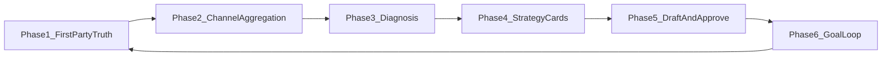

# Growth analytics & creator loop — feature vision

This document **formalizes long-term product ideas** for measurement, diagnosis, and growth tooling. It does **not** override execution order in [road map.md](../road%20map.md). **Near-term shipping** remains: Part 1 gallery + ingest stability, **Workstream E** (analytics foundation), and the [Analytics Action Center Spec](../analytics-action-center-spec.md) (cards, confidence, explainability, guarded execution).

**Update this file** when growth phases are promoted to ledgers or workstreams; link from the road map only when navigation changes.

---

## Why this exists

Platforms like Patreon expose incomplete analytics for creator-owned surfaces. Relay’s wedge is **first-party truth** on Relay-hosted gallery (and later clone / patron surfaces), then—only when stable—**optional** expansion into unified reach, coaching, and cross-channel workflows. That sequence avoids building a fragile “social OS” before the core **Library + canonical + viewer parity** contracts are solid.

---

## Short-term context (what ships first)

Use these as **active pointers**—implementation and gates live in the linked docs, not here.

| Priority | Pointer | Role |
|----------|---------|------|
| Foundation | [road map.md](../road%20map.md) — **Workstream B, D, E** | Ingest → gallery UX → analytics snapshots and insight cards. |
| Contracts | [analytics-action-center-spec.md](../analytics-action-center-spec.md) | Signal → diagnosis → recommendation → **explicit** accept/execute; no black-box mass actions without review where specified. |
| Events / APIs | [builder-boost-pack/contracts/events.md](../builder-boost-pack/contracts/events.md), [api.md](../builder-boost-pack/contracts/api.md) | Canonical event names and Action Center API patterns. |
| Sync trust | [part1-sync-hardening-ledger.md](part1-sync-hardening-ledger.md) | Export retries, tier alignment, sync health—analytics is meaningless if data freshness is opaque. |
| Search depth | [road map.md](../road%20map.md) — **Ledger: Smart Tag Assistant** | Relay-level tags (confirm-before-apply) improve segmentation for future diagnostics—not a substitute for first-party view/click telemetry. |
| Metadata truth | [relay-artist-metadata.md](relay-artist-metadata.md), [patreon-ingest-canonical.md](patreon-ingest-canonical.md) | Overrides vs canonical; churn/cadence analysis must join on stable post/tier identity. |
| External metrics strategy | [third-party-metrics-sourcing.md](third-party-metrics-sourcing.md) | When official APIs are insufficient: tiered model (first-party → OAuth → aggregators → extractors), **after** Relay-owned telemetry exists. |

**Short-term definition of success:** creators trust Relay’s **own** engagement and inventory signals; Action Center–style cards fire with **explainability** and **human gates** for high-risk actions (aligned with Action Center spec v1 out-of-scope list).

---

## Long-term phases (strategic arc)

Each phase is a **capability bucket**. Later phases assume earlier **data quality** and **compliance** gates. Integrations (OAuth, ToS, rate limits) are **one channel at a time** unless explicitly rescoped.

| Phase | Feature theme | Mechanism (Relay-aligned) | Artist value |
|-------|----------------|---------------------------|--------------|
| **1 — The hook** | First-party analytics gap | Instrument **Relay surfaces** (gallery, previews, clone when live): views, clicks, plays, funnels Patreon does not own. | A **source of truth** for behavior on infrastructure the creator controls. |
| **2 — Aggregation** | Omni-channel reach (optional) | Pull **per-integration** metrics (e.g. impressions, likes, shares) where APIs and ToS allow; normalize into creator-scoped time series—**no** implied global accuracy until each connector is production-grade. Sourcing options and risks: [third-party-metrics-sourcing.md](third-party-metrics-sourcing.md). | Unified **view of declared reach** across the web (honest limits in UI). |
| **3 — Diagnosis** | Retention & cadence | Correlate **membership snapshots** (join/churn/tier change) with posting cadence and content features; language stays **correlational** until statistical rigor is documented. | See **what coincides** with gains/losses, not magic causation. |
| **4 — Strategy** | AI-assisted planning | **Internal** models or rules tuned to **this** creator’s history; surface as Action Center–style suggestions (confidence + reason codes)—same bar as [analytics-action-center-spec.md](../analytics-action-center-spec.md). | Turn metrics into **concrete next steps** (e.g. format/time experiments). |
| **5 — Execution** | Cross-channel mirroring | **Draft** and format variants per network; **human approval** before publish. Autopost to third parties only where **policy + platform ToS** explicitly allow (road map excludes autonomous gated publish). | Less manual re-tweaking; **no** silent cross-post of paywalled or sensitive work. |
| **6 — The loop** | Goal-driven growth | Artists set milestones (revenue, engagement, Relay DAU); system **projects** paths from historical lift and experiment backlog—again with confidence and disclaimers. | Repeatable, **data-backed** planning cycle anchored on Relay truth first. |

---

## Guardrails (non-negotiable across phases)

- **Single content truth:** Library / canonical + artist overrides remain authoritative for what exists; analytics **references** content IDs, never forks inventory.
- **Viewer parity:** Anything that affects what patrons see stays on the shared read path ([pattern-library.md](pattern-library.md)).
- **No dark automation:** Mass outreach, publishing, or paywalled exposure follow **review gates** and roadmap compliance language.
- **Integration discipline:** Each external network gets its own **spike → ledger slice → ship**; avoid “omni” Big Bang. Aggregators and extractors follow the tiered rules in [third-party-metrics-sourcing.md](third-party-metrics-sourcing.md).
- **Honest marketing:** Operational privacy and accuracy claims only (avoid “cryptographic” or overstated cross-platform completeness).

---

## Sequencing relative to Relay parts

| Relay part | Growth relevance |
|------------|------------------|
| **Part 1** | Phases 1, 3, 4, 6 anchor on gallery + membership-linked data; Smart Tag Assistant feeds **better segments** for diagnosis. |
| **Part 2** | Clone adds **second first-party surface** for the same telemetry model. |
| **Part 3** | Patron feed / Browse adds **reader-side** events; phase 2 connectors remain optional. |

---

## When to promote a phase to a roadmap ledger

Open a **dedicated ledger** (or workstream row) when:

1. There is a **named MVP** (e.g. “Phase 1: gallery impression events + dashboard”) with exit gates.
2. **Legal/product review** is done for any user-visible cross-platform or AI claim.
3. **Contracts** (events, APIs) are updated in the Builder Boost Pack if payloads change.

Until then, this file remains **strategic backlog** linked from the road map for context only.
