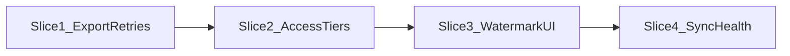

# Part 1 sync & access hardening — Slices 1–4 (ledger)

Single map of what shipped, where it lives in code, and which docs go deep. **Update this file first** when a new slice lands; link from [road map.md](../road%20map.md) and [AGENTS.md](../AGENTS.md) only when navigation changes.



(Read as product clarity sequence, not a strict code dependency graph.)

---

## Slice 1 — Export fetch reliability + Library retry

### Goal

Creators see failed media exports as actionable state in the Library; transient Patreon/CDN issues are retried automatically instead of failing permanently on first error.

### Shipped

- Bounded retries and timeouts in export fetch (`ExportService`).
- `export_failures` on the per-creator export index for last error per `media_id` after retries exhaust.
- Gallery list surfaces `has_export`, `export_status`, `export_error`; Library **Retry** triggers `POST /api/v1/export/media`.

### APIs / contracts

- **`POST /api/v1/export/media`** — body includes creator + media identifiers; clears `export_failures` on success.
- **`GET /api/v1/export/media/:creator_id/:media_id/content`** — optional tier gate via `RELAY_EXPORT_REQUIRE_TIER_ACCESS` (see root `.env.example`).

### Persistence / env

- Export root + `export_index.json` per creator (see [export-behavior.md](export-behavior.md)).
- **`RELAY_EXPORT_MAX_ATTEMPTS`**, **`RELAY_EXPORT_BASE_DELAY_MS`**, **`RELAY_EXPORT_FETCH_TIMEOUT_MS`**, optional **`RELAY_EXPORT_REQUIRE_TIER_ACCESS`**.

### UI

- Library grid/list retry affordance for missing exports (not a separate “sync” surface).

### Tests

- `tests/export-media-retry.test.ts`  
- Run: `npx vitest run export-media-retry`

### Explicit non-goals

- New export storage backends, CDN migration, or Slice 4-style sync **history** dashboards.

### Deep dive

- [export-behavior.md](export-behavior.md)

---

## Slice 2 — Access rules match reality (cookie vs OAuth tiers)

### Goal

Cookie-shaped Patreon HTML must not silently classify paid posts as public; OAuth list and per-post enrichment stay authoritative; cookie and OAuth-only ingest paths share the same tier list normalization.

### Shipped

- **`applyPatreonAccessToTierIdsForCookie`** in [`src/patreon/map-patreon-to-ingest.ts`](../src/patreon/map-patreon-to-ingest.ts) — narrow mapping for cookie scraper: ambiguous empty tiers + misleading `is_paid: false` → member-only synthetic tier instead of public.
- [`src/patreon/cookie-scraper.ts`](../src/patreon/cookie-scraper.ts) uses the cookie-specific helper.
- **`enrichTiersFromCampaignPostsList`** runs for **both** `media_source === "cookie"` and `"oauth"` after posts are collected in [`src/patreon/patreon-sync-service.ts`](../src/patreon/patreon-sync-service.ts).
- Scrape responses include **`tier_access_summary`** and **`media_source`** for observability and UI copy.

### APIs / contracts

- **`POST /api/v1/patreon/scrape`** — body: `creator_id`, optional `campaign_id`, `dry_run`, `force_refresh_post_access`, `max_post_pages`, etc. Response: `warnings`, `apply_result`, `tier_access_summary`, `media_source`.

### Persistence / env

- Same as canonical ingest / watermark (no separate Slice 2 store).

### UI

- [`web/lib/relay-api.ts`](../web/lib/relay-api.ts) **`formatPatreonSyncResult`** — summarizes `media_source` + `tier_access_summary` after a live scrape (used by Patreon menu).

### Tests

- `tests/patreon-tier-mapping.test.ts` (cookie vs API mapping)
- `tests/patreon-cookie-oauth-body.test.ts`, `tests/workstream-patreon-scrape.test.ts` (integration-style scrape batches)
- Run: `npx vitest run patreon-tier-mapping patreon-cookie-oauth-body workstream-patreon-scrape`

### Explicit non-goals

- Re-litigating Slice 1 export retry policy or Slice 3 watermark UX in this slice.

---

## Slice 3 — Watermark + creator re-sync escape hatch

### Goal

Creators see per-campaign sync watermark state and can choose **incremental newer posts** vs **force refresh tier/access** for older posts without guessing API flags.

### Shipped

- [`SyncWatermarkStore`](../src/ingest/sync-watermark-store.ts) exposes row read (`last_synced_at` as newest applied `published_at`, `updated_at`).
- **`PatreonSyncService.getSyncState`** resolves campaign like scrape, reads watermark + cookie session, optional **`probe_upstream`** (first OAuth posts page) → **`likely_has_newer_posts`**.
- **`GET /api/v1/patreon/sync-state`** — `creator_id` (required), optional `campaign_id`, `probe_upstream`.

### APIs / contracts

- **`GET /api/v1/patreon/sync-state`** — response includes `watermark_published_at`, `watermark_updated_at`, `has_cookie_session`, optional `upstream_newest_published_at`, `likely_has_newer_posts` (and fields extended in Slice 4 — see below).

### Persistence / env

- **`RELAY_PATREON_SYNC_WATERMARK_PATH`** (default under `.relay-data/` — see root `.env.example`).
- Web: optional **`NEXT_PUBLIC_RELAY_PATREON_CAMPAIGN_ID`** when multiple campaigns exist ([`web/.env.example`](../web/.env.example)).

### UI

- [`web/app/components/PatreonSyncMenu.tsx`](../web/app/components/PatreonSyncMenu.tsx) — opened from Library top bar ([`GalleryView.tsx`](../web/app/GalleryView.tsx)); confirmations for **Fetch newer posts** vs **Re-sync access for older posts**; result line via `formatPatreonSyncResult`.

### Tests

- `tests/patreon-sync-state-watermark.test.ts`
- Run: `npx vitest run patreon-sync-state-watermark`

### Explicit non-goals

- Full sync **health history** (Slice 4), dry-run preview UX.

---

## Slice 4 — Creator-facing sync health

### Goal

Reduce opaque failures: last scrape / member sync outcome, OAuth health and expiry signals, and plain-language **`hint`** text for common errors — v1 file-backed, no multi-day analytics.

### Shipped

- [`src/patreon/patreon-sync-health-store.ts`](../src/patreon/patreon-sync-health-store.ts) — JSON store keyed by `creator_id`: `last_post_scrape`, `last_member_sync`.
- [`src/patreon/sync-error-copy.ts`](../src/patreon/sync-error-copy.ts) — **`classifySyncError`** → stable `code` + `hint`.
- [`src/server.ts`](../src/server.ts) handlers for **`POST /api/v1/patreon/scrape`** and **`POST /api/v1/patreon/sync-members`** record health best-effort after success/failure.
- **`GET /api/v1/patreon/sync-state`** extended with **`oauth`** (`credential_health_status`, `access_token_expires_at`, `access_token_expired`, `access_token_expires_soon`), **`last_post_scrape`**, **`last_member_sync`** (merged in `PatreonSyncService.getSyncState`).
- **`campaign_display`** on the same endpoint: Patreon campaign **`image_url`**, **`image_small_url`**, **`patron_count`** from OAuth (file **`creator_campaign_display.json`**, env **`RELAY_CREATOR_CAMPAIGN_DISPLAY_PATH`**). See [sync-health.md](sync-health.md).

### APIs / contracts

- Same **`GET /api/v1/patreon/sync-state`** — clients must tolerate new fields; existing Slice 3 fields unchanged.
- **`POST /api/v1/patreon/sync-members`** — still returns member sync payload; health row updated from handler.

### Persistence / env

- **`RELAY_PATREON_SYNC_HEALTH_PATH`** (default `.relay-data/patreon_sync_health.json`).

### UI

- [`web/lib/relay-api.ts`](../web/lib/relay-api.ts) — `syncStateNeedsAttention`, `formatSyncHealthBanner`; [`PatreonSyncMenu.tsx`](../web/app/components/PatreonSyncMenu.tsx) connection block; [`GalleryView.tsx`](../web/app/GalleryView.tsx) / [`LibraryTopBar.tsx`](../web/app/components/LibraryTopBar.tsx) sync pill + optional issue line.

### Tests

- `tests/patreon-sync-health.test.ts`, extended `tests/patreon-sync-state-watermark.test.ts`
- Run: `npx vitest run patreon-sync-health patreon-sync-state-watermark`

### Explicit non-goals

- Historical charts, email alerts, DB-backed health for multi-instance (future plans).

### Deep dive

- [sync-health.md](sync-health.md)

---

## Verification (all four slices)

```bash
npx vitest run export-media-retry patreon-tier-mapping patreon-cookie-oauth-body workstream-patreon-scrape patreon-sync-state-watermark patreon-sync-health
```

---

## Maintenance rule

When Slice 5+ ships: add a **new section** here (or a linked doc) and update slice-specific runbooks only where behavior deepens. Do not duplicate the full ledger into [road map.md](../road%20map.md).

## Optional next planning prompt

> **Plan Slice 5+ only:** Next Part 1 gap (e.g. proactive token refresh before scrape, webhook-driven health, multi-instance health storage). Read `docs/part1-sync-hardening-ledger.md` first; do not re-scope Slices 1–4. End with ops notes and test commands.
