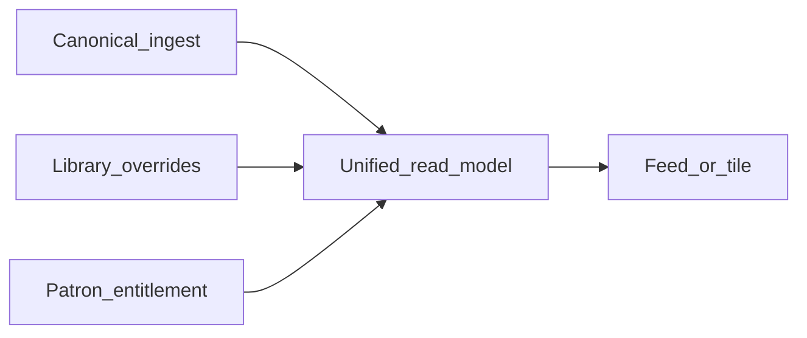

# Relay pattern library

Single source of truth for **product ideals**, **artist vs viewer workflows**, and **UX/UI patterns** in this repo. It informs code and UI work; it does not replace inline documentation in individual modules.

**Governing principle:** harden the **Library** (find, tag, curate, collections) before investing heavily in **visitor-facing** polish. Designer, **public pages**, and **fan surfaces** should consume **stable data contracts** from Library work and a **single viewer entitlement pipeline**—otherwise they churn or desync.

---

## 1. Product ideals: three surfaces

### Artist surface (Library)

- **Role:** **Source of truth** for curation—everything ingested, with fast find, filters, and **per-asset** decisions (visibility, tags, collections, triage). This is where the artist defines *what Relay may show* (subject to patron tier and platform rules), not a casual file dump.
- **Mental model:** **Control room**, not the final “story” visitors read.
- **Entry:** [`web/app/page.tsx`](../web/app/page.tsx) renders [`GalleryView`](../web/app/GalleryView.tsx).

### Artist viewer surface (Designer + public / clone)

- **Role:** Calm hierarchy—hero, sections, grids/lists, minimal chrome; **consumption-first**. **Projection** of Library policy plus layout: no second inventory.
- **Mental model:** **Stage**—what the audience sees after curation.
- **In-app preview:** [`web/app/designer/DesignerView.tsx`](../web/app/designer/DesignerView.tsx), [`LayoutPreview.tsx`](../web/app/designer/LayoutPreview.tsx).

### Fan surface (Part 3: feed, Browse, profiles)

- **Role:** Patrons catch up on followed creators, open profiles, and use **Browse** for algorithmic discovery (with caps and opt-in free content per roadmap). **Comments, favorites, and patron collections** are Relay-native engagement layers.
- **Mental model:** **Feed + discovery**—distinct from the artist control room; prefer a **dedicated app shell or route group** so chrome and density do not inherit Library patterns.
- **Implementation:** future patron-facing routes and APIs (see [road map.md](../road map.md) Part 3).

**Rule:** Behance-like minimalism belongs on the **stage** (artist public pages) and on **consumption** UIs (fan feed cards). The Library may show more density (filters, badges, batch actions) as long as it stays scannable.

### Viewer parity (anti-desync)

- **Rule:** Any UI that answers “what does a **viewer** see?” (Designer preview, generated public gallery, **fan feed tile**, Browse card) must use the **same semantic pipeline**: canonical content + **artist overrides** (visibility, tags, collections) + **effective patron entitlement** (tier, subscription state) + layout rules where applicable.
- **Not OK:** artist Library defaulting to `visibility=visible` while preview or fan APIs omit visibility and accidentally surface hidden/flagged rows.
- **Authoring vs viewer:** The Library may offer “workspace / all” filters for **editing**; patron-facing queries default to **policy-aligned** filters unless explicitly building an admin-only path.

### UX copy guidelines (SoT vs stage)

- **Library:** State clearly that changes here control what appears on the **public page** and in **fans’ feeds** (subject to the viewer’s tier and Patreon state). Example direction: *“Controls what visitors and subscribers see on Relay.”*
- **Designer:** Reinforce that the preview only shows content **allowed by Library rules**; layout does not bypass hides or flags.
- **Fan / onboarding:** Explain Patreon link, entitlement refresh, and what happens on **cancel or downgrade** without implying Relay stores a parallel paywall truth.

---

## 2. Core workflows (code map)

| Workflow | Primary UI | APIs / types |
|----------|------------|----------------|
| Browse / filter / sort | [`GalleryView.tsx`](../web/app/GalleryView.tsx), [`GallerySidebar.tsx`](../web/app/components/GallerySidebar.tsx) | `GET /api/v1/gallery/items` via [`buildGalleryQuery`](../web/lib/relay-api.ts); facets `GET /api/v1/gallery/facets` |
| Universal search (`q`) | Sidebar Find Assets field | [`matchesFilters`](../src/gallery/query.ts) / [`itemMatchesFreeTextQuery`](../src/gallery/query.ts) |
| Inspect + per-asset visibility | [`InspectModal.tsx`](../web/app/components/InspectModal.tsx) | [`buildGalleryVisibilityBody`](../web/lib/relay-api.ts) → `POST /api/v1/gallery/visibility` |
| Bulk hide / workspace / flag | [`BulkActionBar.tsx`](../web/app/components/BulkActionBar.tsx) | Same body; **media_targets** for real media rows (see pattern *Visibility semantics* below) |
| Bulk add tags | `applyBulkTags` in [`GalleryView.tsx`](../web/app/GalleryView.tsx) | `POST /api/v1/gallery/media/bulk-tags` — **post-scoped** via `post_ids` derived from selection |
| Hygiene | [`TriageDialog.tsx`](../web/app/components/TriageDialog.tsx) | Triage analyze + auto-flag APIs |
| Collections | [`CollectionsPanel.tsx`](../web/app/components/CollectionsPanel.tsx), [`CollectionBuilderDrawer.tsx`](../web/app/components/CollectionBuilderDrawer.tsx), [`CollectionEditor.tsx`](../web/app/components/CollectionEditor.tsx) | Collections CRUD; [`Collection`](../web/lib/relay-api.ts) (`theme_tag_ids`, `access_ceiling_tier_id`, `cover_media_id`, add-posts validation) |
| First-run onboarding | [`library-onboarding.ts`](../web/lib/library-onboarding.ts) + GalleryView | `localStorage` only (`relay.libraryOnboarding.v1`) |
| Compose page layout | [`DesignerView.tsx`](../web/app/designer/DesignerView.tsx), [`LayoutPreview.tsx`](../web/app/designer/LayoutPreview.tsx) | `GET`/`PUT /api/v1/gallery/layout`; collections list for section sources |

```mermaid
flowchart LR
  subgraph artist [Artist_Library]
    GV[GalleryView]
    Inv[InspectModal]
    Bulk[BulkActionBar]
    Col[Collections]
  end
  subgraph apis [Relay_API]
    Items[/gallery/items]
    Vis[/gallery/visibility]
    Tags[/gallery/media/bulk-tags]
    Lay[/gallery/layout]
  end
  subgraph stage [Artist_stage]
    DV[DesignerView]
    LP[LayoutPreview]
  end
  subgraph fan [Fan_surface_Part3]
    Feed[Feed_and_Browse]
  end
  GV --> Items
  Inv --> Vis
  Bulk --> Vis
  GV --> Tags
  Col --> Items
  DV --> Lay
  LP --> Items
  Items --> Feed
  Lay --> Feed
```

*Fan surface is schematic: feed assembly must reuse the same content + policy + entitlement semantics as gallery read APIs, not a forked list.*

---

## 3. Pattern ruleset

Each pattern: **ideal** → **current behavior** → **gap** → **synergy** → **likely code area**.

### Identity (row key)

- **Ideal:** One stable key per gallery row for selection, React keys, and API targeting.
- **Current:** `${post_id}::${media_id}` (`itemKey` in [`GalleryView.tsx`](../web/app/GalleryView.tsx), [`GalleryGrid.tsx`](../web/app/components/GalleryGrid.tsx)).
- **Gap:** None for flat lists; **post batch** grid uses collapsed stack + expand (per-asset keys unchanged).
- **Synergy:** Same key shape in [`LayoutPreview`](../web/app/designer/LayoutPreview.tsx) when mapping items.
- **Code:** `itemKey` helpers, `GalleryItem` in [`web/lib/relay-api.ts`](../web/lib/relay-api.ts).

### Visibility semantics

- **Ideal:** Users understand whether an action affects **one file**, **all media in a post**, or **post-only** synthetic rows.
- **Current:** [`buildGalleryVisibilityBody`](../web/lib/relay-api.ts) sends `media_targets: { post_id, media_id }[]` for real media and `post_ids` for `post_only_*` synthetic rows. [`PostOverride.media`](../src/gallery/types.ts) stores per-asset overrides.
- **Gap:** Bulk **tags** apply via **post** list derived from selection—different scope than visibility; easy to misunderstand without copy or UI hints.
- **Synergy:** Clone / layout code can respect the same overrides (see [`layout-to-clone.ts`](../src/gallery/layout-to-clone.ts)).
- **Code:** [`BulkActionBar.tsx`](../web/app/components/BulkActionBar.tsx), [`InspectModal.tsx`](../web/app/components/InspectModal.tsx), [`overrides-store.ts`](../src/gallery/overrides-store.ts).

### Tagging

- **Ideal:** Consistent tags for search and filters; artist can add/remove without fighting ingest data.
- **Current:** Ingest provides base `tag_ids`; overrides add/remove per post ([`PostOverride`](../src/gallery/types.ts)); facets drive sidebar chips; bulk add via `post_ids`.
- **Gap:** No synonym/alias layer; no AI auto-tagging (intentionally deferred).
- **Synergy:** Tags feed universal `q` search on [`GalleryItem.tag_ids`](../src/gallery/types.ts).
- **Code:** [`gallery-service`](../src/gallery/gallery-service.ts), [`query.ts`](../src/gallery/query.ts), GalleryView bulk tags.

### Search (universal `q`)

- **Ideal:** One search box finds content by title, tags, description (HTML stripped), collection theme strings, and ids.
- **Current:** Token AND across fields in [`itemMatchesFreeTextQuery`](../src/gallery/query.ts); themes denormalized on rows as `collection_theme_tag_ids` from collections.
- **Gap:** Quality still depends on artist tagging and collection themes; no fuzzy/semantic search.
- **Synergy:** Same `GalleryItem` fields can power Designer **filter** sections if queries align with `buildGalleryQuery`.
- **Code:** [`query.ts`](../src/gallery/query.ts), [`buildGalleryQuery`](../web/lib/relay-api.ts).

### Collections

- **Ideal:** Organize posts, optional tier ceiling, theme tags for search/metadata, optional cover media.
- **Current:** CRUD + add-posts with server-side tier checks; types include `theme_tag_ids`, `access_ceiling_tier_id`, `cover_media_id`.
- **Gap:** Not every field may be exposed or polished equally across [`CollectionEditor`](../web/app/components/CollectionEditor.tsx) / drawer.
- **Synergy:** Themes → Library search; post membership → Designer sections sourced by `collection_id`.
- **Code:** [`collections-store.ts`](../src/gallery/collections-store.ts), [`server.ts`](../src/server.ts) gallery routes, web components above.

### Grid vs list

- **Ideal:** Artist picks density; keyboard and screen-reader users can operate both modes.
- **Current:** Grid ([`GalleryGrid.tsx`](../web/app/components/GalleryGrid.tsx)) and virtualized **list** ([`GalleryListRow.tsx`](../web/app/components/GalleryListRow.tsx)); mode persisted (`relay.galleryViewMode`). List mode has arrow-key navigation in GalleryView; **grid returns early** from `onListKeyDown`—no arrow traversal of cards yet.
- **Gap:** Grid keyboard model; optional `prefers-reduced-motion` for layout transitions.
- **Synergy:** Same `displayItems` pipeline for both.
- **Code:** [`GalleryView.tsx`](../web/app/GalleryView.tsx).

### Designer preview

- **Ideal:** Preview matches what sections will show, including filter-driven sections, and matches **viewer** semantics (visibility, entitlement) per *Viewer parity* above.
- **Current:** [`LayoutPreview.tsx`](../web/app/designer/LayoutPreview.tsx) loads **manual**, **collection**, and **`filter`** sections using `buildGalleryQuery` / [`galleryParamsFromLayoutFilterQuery`](../web/lib/relay-api.ts) for filter sources.
- **Gap:** Default fetch paths for collection/manual preview must stay aligned with **patron-visible** rules (e.g. `visibility=visible` and future entitlement filters)—any mismatch is a product bug, not an optional polish item.
- **Synergy:** Public site and fan feed tiles should call the same “resolved for viewer” read model.
- **Code:** [`LayoutPreview.tsx`](../web/app/designer/LayoutPreview.tsx), [`DesignerView.tsx`](../web/app/designer/DesignerView.tsx).

### Hero and section story

- **Ideal:** Visitor sees a clear hero and ordered sections; artist understands which asset is the “face” of a post or site.
- **Current:** [`PageLayout.hero`](../web/lib/relay-api.ts) is **text** (title, subtitle); optional `cover_media_id` in theme area per types; sections carry `layout`, `columns`, `max_items`, `sort_order`.
- **Gap:** Unified mental model for **site hero image** vs **post cover** vs **export thumb**—product decision pending; may need new fields and Library UI.
- **Synergy:** Collection `cover_media_id` and layout hero could converge once specified.
- **Code:** [`HeroEditor.tsx`](../web/app/designer/HeroEditor.tsx), layout store / API.

---

## 4. What we have / want / gaps

### Already in the codebase (representative)

- List + grid toggle with localStorage preference.
- Filters: visibility, tag AND, tiers, media types, date range, sort (`published` / `visibility`), saved filters.
- Universal `q` search (titles, tags, stripped description, collection themes, post/media id substrings).
- Per-asset visibility, inspect modal, bulk action bar.
- Triage / Auto Cleaner flow.
- Collections CRUD, builder drawer, tier validation on add-posts.
- Designer: theme, hero copy, sections (manual, collection, **filter** query in preview), grid/list/masonry styling in preview, publish preflight.
- Onboarding steps keyed by creator in localStorage.

### What we want (directional)

- **Post batch affordance** (stack / expand) without merging selection or visibility to “whole post” unless explicit.
- **Explicit cover and display order** for posts/collections as they appear on Designer / public pages.
- **Bridge copy** in Library: what changing visibility or sections implies for the published page.
- **Richer tagging UX** (remove tags, suggestions, aliases) where API allows or after API extensions.
- **Designer / viewer:** lightbox / full-bleed inspect in preview, responsive polish, strict **viewer parity** with generated public/clone and fan surfaces.
- **Accessibility:** grid keyboard navigation, visible focus rings, reduced-motion respect.

### Gaps (synergy-aware)

- **Viewer parity:** Systematically audit preview, public, and (future) fan clients so none omit Library visibility (or entitlement) defaults.
- **Bulk tags vs visibility** scope mismatch → document in UI; consider API follow-up.
- **No shared design token** layer; colors/spacing duplicated across components (candidate: CSS variables in `layout.tsx` or a small tokens file—engineering pass separate from this doc).
- **No grouped-by-post** grid layout yet (visual-only grouping would not change `GalleryItem` model).
- **Hero image** story not fully unified between Patreon export, Library, and Designer.

---

## 5. Synergies

1. **Collection `theme_tag_ids`** → denormalized on [`GalleryItem.collection_theme_tag_ids`](../src/gallery/types.ts) → universal search; **Designer filter sections** use the same query semantics as [`buildGalleryQuery`](../web/lib/relay-api.ts).
2. **Per-media visibility** + **layout post lists** = same gallery rows; [`layout-to-clone.ts`](../src/gallery/layout-to-clone.ts) and export paths can reuse filtering rules documented in server/gallery code.
3. **Onboarding** is centralized in GalleryView + [`library-onboarding.ts`](../web/lib/library-onboarding.ts)—new first-run UI should extend that state deliberately, not scatter new localStorage keys without a migration story.
4. **Library → entitlement → feed card:** artist overrides flow into the same rows patron APIs read; Browse ranking only reorders **eligible** items, never bypasses policy.



---

## 6. Code map (quick jump)

| Area | Path |
|------|------|
| Library shell | [`web/app/GalleryView.tsx`](../web/app/GalleryView.tsx) |
| Sidebar filters / triage entry | [`web/app/components/GallerySidebar.tsx`](../web/app/components/GallerySidebar.tsx) |
| Grid / list rows | [`web/app/components/GalleryGrid.tsx`](../web/app/components/GalleryGrid.tsx), [`GalleryListRow.tsx`](../web/app/components/GalleryListRow.tsx) |
| Client API types & query builder | [`web/lib/relay-api.ts`](../web/lib/relay-api.ts) |
| List + filter + search server-side | [`src/gallery/query.ts`](../src/gallery/query.ts), [`gallery-service.ts`](../src/gallery/gallery-service.ts) |
| Overrides (visibility, tags) | [`src/gallery/types.ts`](../src/gallery/types.ts), [`overrides-store.ts`](../src/gallery/overrides-store.ts) |
| Layout → clone helper | [`src/gallery/layout-to-clone.ts`](../src/gallery/layout-to-clone.ts) |
| HTTP routes | [`src/server.ts`](../src/server.ts) (`/api/v1/gallery/...`) |
| Designer | [`web/app/designer/DesignerView.tsx`](../web/app/designer/DesignerView.tsx), [`LayoutPreview.tsx`](../web/app/designer/LayoutPreview.tsx) |
| Fan (planned) | Patron app shell, feed/Browse APIs—see [road map.md](../road map.md) Part 3 |

---

## 7. Phased roadmap (ease + dependencies)

Ordered so **Library contracts** stabilize before **visitor** investment.

| Phase | Focus | Examples |
|-------|--------|----------|
| **A** | Doc + tiny UX copy | This file; optional README/roadmap links; tooltips/copy for bulk tag vs visibility scope |
| **B** | Library polish (low–medium code) | Post batch grouping (presentation-only); inspect next/prev in same post; grid keyboard skeleton; skeleton/empty states |
| **C** | Curation metadata (often needs API) | Display order overrides; cover/hero asset selection wired to layout or post metadata |
| **D** | Designer preview completeness | Implement **`filter` sections** in LayoutPreview; masonry/lightbox polish; hero image if Phase C adds it |
| **E** | Public / visitor | Generated site parity, performance, SEO, share metadata—**after** C/D to limit rework |
| **F** | Fan shell (Part 3) | Dedicated patron routes, feed + Browse, engagement features—**after** viewer parity on artist read paths |

**Explicit rule:** Do not prioritize Phase E flourishes until Library tagging, grouping, search, and visibility behaviors are stable and **section data contracts** (collection / manual / filter) are implemented end-to-end in preview or API. Phase F assumes the **viewer parity** rule in §1 is satisfied for shared read semantics.

---

## 8. Out of scope (named deferrals)

- **AI auto-tagging** — future; not required for pattern compliance.
- **Full design-system extraction** — document tokens conceptually; implement in a dedicated UI pass.

---

*Last aligned with repo structure as of the pattern-library rollout. Update this file when workflows or APIs change materially.*
