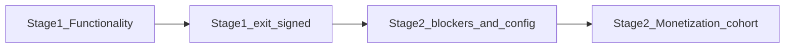

# Relay Pilot — Two-Stage Charter

**Status:** Canonical (supersedes single-stage scope language where they conflict)  
**Adopted:** 2026-07-25  
**Audience:** product, QA, engineering, creator outreach, DevOps  

This document **re-charters** the Relay pilot into two sequential stages. It does **not** amend the May 2026 Stage 1 scope in place. Historical execution detail for Stage 1 remains in [pilot-build-plan.md](pilot-build-plan.md) and the PILOT-017 family.

---

## Why two stages

The original pilot charter ([pilot-build-plan.md](pilot-build-plan.md), May 2026) proves **Part 1** gallery/export and a **thin Part 3** patron feed. It explicitly deferred Stripe live checkout, Workstream N audience monetization, and paid fan products.

In July 2026 the monetization stack (billing spine, Tip economy, fan plans, artist earnings, Connect payouts, frontend integration — MB-1 through MB-15) landed in code **outside** that charter. Signing off the May charter alone would close a functionality pilot that cannot test monetization viability. Folding monetization into Stage 1 unchanged would expose a defeatable paywall and an underpowered Tip funnel.

**Decision:** Close Stage 1 on its original terms, then run Stage 2 as a separate, gated monetization pilot.

---

## Stage 1 — Functionality (original charter)

**Authority for work items and engineering evidence:** [pilot-build-plan.md](pilot-build-plan.md), [PILOT-017-INDEX.md](PILOT-017-INDEX.md), [pilot-exit-checklist.md](pilot-exit-checklist.md), [pilot-017-human-signoff-checklist.md](pilot-017-human-signoff-checklist.md).

### In scope

- **Part 1:** Creator Patreon OAuth, ingest, Library, Designer/public projection, export/R2, sync health surfaced to creators, P5a Analytics / Action Center MVP (membership insights + optional Patreon Insights CSV).
- **Part 3 (thin):** Patron Relay account + Patreon link, unified feed shell, honest entitlement/degraded states.
- **Patreon-only** cohort (`RELAY_PILOT_PATREON_ONLY` / [pilot-patreon-only-scope.md](pilot-patreon-only-scope.md)).
- **M1-lite only:** `usage_events` instrumentation and non-binding usage preview — **not** invoices, **not** Stripe charges to fans or creators for Relay SaaS/fan products.

### Explicitly out of Stage 1 (do not block Stage 1 exit)

- Stripe live checkout (creator SaaS or fan plans)
- Tip economy enablement for real fans (`RELAY_TIPS_BETA`, `RELAY_FAN_PREMIUM_ENABLED`)
- Workstream N audience monetization (premium/boost) as a pilot gate
- Full Part 2 Clone / Re-Populate / Escape Hatch production release
- SubscribeStar, Smart Tag Assistant, NestJS rewrite, full CSP/helmet, Playwright E2E
- Monetization plan **M2–M5** as Stage 1 exit criteria

### Stage 1 success metrics (unchanged)

| Metric | Target |
|--------|--------|
| Creators complete OAuth + publish | ≥ **5** |
| Patron accounts active on feed | ≥ **25** |
| Feed engagement | ≥ **50%** of patrons load feed ≥2× (product-recorded) |
| New Sev-1 / P1 security regressions | **0** |
| `npm run verify:pilot` | Green on release candidate |
| UX gates A–J | Automated green (2026-05-23); human checklist still required |
| Browser matrix | Spot-check required ([pilot-browser-matrix.md](pilot-browser-matrix.md)) |
| Staging env | `RELAY_DB_STORE_*` + RLS + webhooks + Redis per ENV checklist |

### Stage 1 exit

Product/QA/Creator Outreach/DevOps complete [pilot-017-human-signoff-checklist.md](pilot-017-human-signoff-checklist.md), fill the scale table in [pilot-exit-checklist.md](pilot-exit-checklist.md), and record Airtable **PILOT-017 → Done**.

Stage 1 exit **does not** authorize charging fans or creators through Relay billing, enabling Tip beta for the cohort, or flipping `RELAY_FAN_PREMIUM_ENABLED` in a shared environment.

---

## Stage 2 — Monetization viability

**Authority for build contracts:** [MONETIZATION_MASTER_MAP.md](MONETIZATION_MASTER_MAP.md), [TIP_BETA_BUILD_PLAN.md](TIP_BETA_BUILD_PLAN.md), [FAN_PREMIUM_BUILD_PLAN.md](FAN_PREMIUM_BUILD_PLAN.md), [BILLING_SPINE_BUILD_PLAN.md](BILLING_SPINE_BUILD_PLAN.md), [FRONTEND_MONETIZATION_BUILD_PLAN.md](FRONTEND_MONETIZATION_BUILD_PLAN.md), [financial-atlas.md](financial-atlas.md).

Stage 2 starts only after Stage 1 exit **or** an explicit product waiver that Stage 1 human sign-off is parallelized with Stage 2 prep (prep may begin earlier; **live cohort money paths** must not).

### Purpose

Test whether Relay can:

1. Charge artists (Studio Core / Autopost / Growth Engine ladder) and fans (Supporter / Curator / Reload Pack) through Stripe without trust or compliance failures.
2. Run the Tip reveal funnel (Discover + artist public pages → timed reveal → offer CTA) with a **non-defeatable** media gate and correct entitlement rules.
3. Produce a **decision-grade** Tip engagement signal (converters ÷ active fans) **or** deliberately downgrade Stage 2 to a mechanics-only test if cohort size stays too small.

### In scope (when blockers cleared)

- Artist billing spine: Checkout, portal, entitlements, dunning, operator grants.
- Tip beta (`RELAY_TIPS_BETA`) with free granted Tips **without** artist cash liabilities until fan premium is intentionally enabled.
- Fan premium (`RELAY_FAN_PREMIUM_ENABLED`): paid plans, Reload Packs, plan-aware windows/caps, `$0.33` artist earnings, bill-credit waterfall, Connect payouts (threshold-gated).
- Promo Pool supply sufficient for the cohort (slot capacity + seeded or creator-filled inventory).
- Stripe **test mode** E2E first; live keys only after human launch review.
- Reconciliation of ledger entries vs `PlatformRevenueEvent`; dispute/clawback paths exercised.

### Stage 2 blockers (must clear before charging or enabling paid Tips)

These are **entry gates**, not optional polish:

1. **Server-generated blur/watermark derivative** — CSS-only blur on full-res URLs is not acceptable for paid surfaces ([TIP_BETA_BUILD_PLAN.md](TIP_BETA_BUILD_PLAN.md) deferred item).
2. **Patreon-entitled fan check wired** at Tip read and spend time — fans must never Tip-unlock content their subscription already grants.
3. **Artist earnings gated on fan premium** — free beta must not write `tip_earned` / `$0.33` liabilities; existing beta pollution audited and corrected.
4. **Dispute/clawback routing correct** — reload-pack vs fan-sub paths; artist clawbacks attributed to the correct creator.
5. **Phase 3 exit checklist** in [FAN_PREMIUM_BUILD_PLAN.md](FAN_PREMIUM_BUILD_PLAN.md) closed (flag-off regression, test-mode E2E, double-entry audit, dunning/webhook/dispute tests, human launch review).
6. **Pricing/copy reconciliation** — atlas vs `$18/$39/$79` ladder; Skips vs Tips terminology; plan-aware reveal window and money disclosure copy.

### Stage 2 cohort and measurement (product decision before flip)

| Option | When to choose | Implication |
|--------|----------------|-------------|
| **A — Demand signal** | Product needs the ~15% Tip converter metric to set pricing/supply | Expand active-fan and Promo Pool supply until the funnel is statistically usable; document N and the gate metric |
| **B — Mechanics only** | Cohort stays near Stage 1 N (≈25 patrons) | Drop the 15% conversion gate; Stage 2 proves money paths and trust rules only |

Do not run Option A at Stage 1 cohort size and treat the conversion rate as decision-grade.

### Explicitly out of Stage 2 (unless separately chartered)

- Escape Hatch production release (`productionSafe` / live-provider proofs) — separate program
- Boosts / algorithmic Exposure Feed
- Adult-segment high-risk payment rail
- Storefront listing integration (`isStorefrontListed` stub remains until storefronts ship)
- Re-Populate email migration campaigns
- Goal Cycle live trend providers, Automations general release, extension store submission — not Stage 2 gates

### Stage 2 exit (draft — finalize in a Stage 2 checklist when Stage 1 closes)

- Stripe test-mode journey green: fan plan → Tips granted → reveal → artist `+$0.33` (only when premium on) → settlement → threshold payout path → refund/dispute clawback.
- Kill switches verified: `RELAY_BILLING_ENABLED`, `RELAY_TIPS_BETA`, `RELAY_FAN_PREMIUM_ENABLED` default/off behavior.
- Human launch review: compliance section of monetization map re-read; Connect profile; live keys decision recorded.
- Product records either Tip funnel result (Option A) or explicit “mechanics-only” waiver (Option B).

---

## Document authority map

| Concern | Canonical doc |
|---------|----------------|
| Stage 1 / Stage 2 split | **This file** |
| Stage 1 work items P0–P9, M1-lite | [pilot-build-plan.md](pilot-build-plan.md) |
| Stage 1 human sign-off | [pilot-017-human-signoff-checklist.md](pilot-017-human-signoff-checklist.md), [PILOT-017-INDEX.md](PILOT-017-INDEX.md) |
| Stage 1 go/no-go scale table | [pilot-exit-checklist.md](pilot-exit-checklist.md) |
| Monetization how-to-build | [MONETIZATION_MASTER_MAP.md](MONETIZATION_MASTER_MAP.md) |
| Tip beta contracts | [TIP_BETA_BUILD_PLAN.md](TIP_BETA_BUILD_PLAN.md) |
| Paid fan + payouts exit boxes | [FAN_PREMIUM_BUILD_PLAN.md](FAN_PREMIUM_BUILD_PLAN.md) |
| Prices and payout rates | [financial-atlas.md](financial-atlas.md) (resolve conflicts before Stage 2 public copy) |
| Strategic product narrative | [road map.md](../road%20map.md) |

Where [pilot-build-plan.md](pilot-build-plan.md) Appendix C or “Explicitly deferred” lists say paid audience products stay post-pilot, interpret as **post–Stage 1**. Stage 2 is the deliberate pull-forward of monetization viability testing.

---

## Anti-patterns

- Marking PILOT-017 **Done** and enabling `RELAY_FAN_PREMIUM_ENABLED` for the same cohort without Stage 2 blocker clearance.
- Treating Tip beta engagement at N≈25 as pricing evidence without choosing Option B.
- Amending Stage 1 checklists to require Stripe/Tips — that conflates the two stages again.
- Shipping CSS-blur Tip unlocks as a paid surface.

---

*Adopted 2026-07-25 from the push-to-pilot readiness review. Update this file when Stage 1 exits or Stage 2 entry gates change; do not silently expand Stage 1 scope.*
