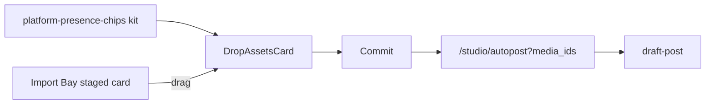

# Plan 1 — Drop Assets + shared chip kit

**Status:** Executed (chip kit + Drop Assets + Import Bay drag + Commit → Autopost)  
**Scope:** Schedule rail Drop Assets only — no Active Posts grid replace  
**Depends on:** Mounted rail at `[web/app/components/schedule-rail/](../../web/app/components/schedule-rail/)`; Active Posts v0 chip source (ported into distribution kit)

## Goal

Ship **Drop Assets** on the Studio schedule rail using the **same platform presence rings** as the new Active Posts concept, wired Import Bay drag → Commit → Autopost `draft-post`.

## Locked choices

| Decision    | Value                                                                                                 |
| ----------- | ----------------------------------------------------------------------------------------------------- |
| Scope       | Visual + drag-drop (Import Bay only) + Commit                                                         |
| Landing     | `/studio/autopost?media_ids=…` → existing bootstrap → `**draft-post`**                                |
| Empty/off   | Quiet minimized cue; do not hide Ready; `armed={true}` hard-wired for dev                             |
| Chips       | Extract `PlatformIcon` / `PresentChip` / `GhostChip` from Active Posts v0 (not text-only DEST_LABELS) |
| Drag source | Import Bay staged cards only                                                                          |

## Flow

## Work sequence

### A. Extract chip kit

Create `[web/app/components/distribution/platform-presence-chips.tsx](../../web/app/components/distribution/platform-presence-chips.tsx)`:

- Port from `.tmp/social-media-post-creator-8/app/studio/page.tsx` (~`PlatformIcon`,` PresentChip`,` GhostChip`, chip color meta)
- Destination ids: `patreon` | `x` | `deviantart` | `bluesky`
- Presentational only; callers own navigation (no toast stubs in the kit)

### B. Drop Assets card

Add `[web/app/components/schedule-rail/DropAssetsCard.tsx](../../web/app/components/schedule-rail/DropAssetsCard.tsx)`; mount from `[ScheduleRail.tsx](../../web/app/components/schedule-rail/ScheduleRail.tsx)` as primary Ready surface when `armed`:

| State         | UI                                                                            |
| ------------- | ----------------------------------------------------------------------------- |
| Armed empty   | Media-card shell + presence row (planned destinations) + “Drop staged assets” |
| Drag-over     | Mint ring                                                                     |
| Filled        | Thumbs + count + **Commit to Autopost**                                       |
| `armed=false` | Minimized: “Nothing cued — schedule a post in Autopost” → `/studio/autopost`  |

### C. Import Bay drag

In `[LibraryImportBay.tsx](../../web/app/components/LibraryImportBay.tsx)`:

- `draggable` on server-staged cards
- Payload MIME `application/x-relay-staged-media`: `{ media_ids, items?: { id, src, filename, mimeType }[] }`
- Prefer selected composable set; else the single dragged card

### D. Host commit

`[StudioScheduleRail.tsx](../../web/app/components/schedule-rail/StudioScheduleRail.tsx)` + `[GalleryView.tsx](../../web/app/studio/GalleryView.tsx)`:

- Reuse / share `handleImportBayAutopost` → `router.push` with `media_ids`
- Pass `onCommit`, `armed` into rail host

## Non-goals

- Active Posts grid replace, LinkedSet, HeroUnfold
- Real PostBot-driven `armed`
- Full rail v0 restyle
- Extension sticky toasts

## Verify

- Drag Import Bay → fill → Commit opens Autopost on Relay Post
- Rings match Active Posts solid/dashed language
- `armed={false}` shows minimized cue
- Existing “Autopost N selected” unchanged

## Todos

1. Extract chip kit
2. Build DropAssetsCard + mount
3. Import Bay drag + rail drop
4. Wire onCommit through GalleryView

