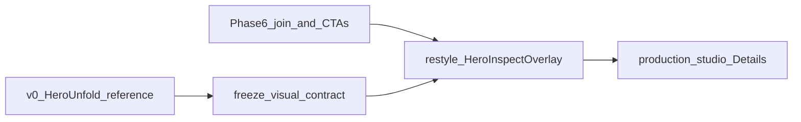

# Phase 6.1 brief — Hero visual fidelity (v0 HeroUnfold)

**Status:** Implemented — browser-check hero open; await visual sign-off vs v0  
**Master roadmap:** `[PLAN_STUDIO_RENOVATION_MASTER.md](./PLAN_STUDIO_RENOVATION_MASTER.md)`  
**Prior phase:** Phase 6 credibility spine — `[PLAN_PHASE_6_HERO_PACKAGING_INSPECT.md](./PLAN_PHASE_6_HERO_PACKAGING_INSPECT.md)` (**hard dependency**). Live join, entry points, gap → DistributionSheet, and Relay gate must stay.

---

## Goal

Replace the current Library-shell `HeroInspectOverlay` chrome with a **pixel- and motion-faithful** port of the v0 **`HeroUnfold`** composition (fixed hero card beside platform/gap column) — wired to the existing live `buildHeroInspectModel` / fetch path — so packaging inspect **looks and feels like the validated v0**, not a generic dialog.

## Exit criteria

1. Side-by-side with v0 reference: same layout (scrim → horizontal cluster: action bar + 260×340 hero card + 320px platform column), same motion grammar (enter/exit scale+fade, staggered row slide-in), same row card visual language (present stats block + dashed gap CTA).
2. All Phase 6 live behaviors still work: key credibility (A≠B), instances gate, Relay View after instances, refresh handoff, gap → DistributionSheet, Advanced + Post settings.
3. No import of the v0 monolith / quarantine trees; no `/dev/studio2` parallel product.

---

## Methodology (frozen for this pack + later panels)

**Product decision:** Phase 6.1 is **hero only**. After it ships and is reliable, resurface Studio **panel by panel** (grid → rail → Autopost, …) using the same method.

| Approach | Decision |
| -------- | -------- |
| Long-lived `/dev/studio2` or second Studio app | **Ban** — duplicates wiring; merge hell (see `[web-quarantine-trees.md](../web-quarantine-trees.md)`). |
| Rebuild pretty shell first, bolt on APIs later | **Ban** — Phase 6 already inverted correctly (live spine first). |
| **Strangler / surface swap** | **Required** — keep production `/studio` route + live data contracts; replace **visual shell** of one surface at a time. |
| v0 zip / `.tmp` tree | **Reference only** — copy or re-implement patterns into canonical `web/app` / `web/lib`; never import monolith or quarantine. |
| Short preview | Optional fixture-only Storybook **or** temporary `/studio/dev/hero-preview` behind env flag for pixel QA — delete or gate after verify. Not a second product. |



---

## Frozen decisions (v1)

| Topic | Decision |
| ----- | -------- |
| **Scope** | Packaging hero overlay **only**. No Active Posts grid, Linked Set card, rail, Autopost, or shell density (Phase 7) in this pack. |
| **Reference source of truth** | v0 column `HeroUnfold` / `PlatformRowCard` / `GapRowCard` / `RelayView` / `ActionBar` in `.tmp/social-media-post-creator-8/app/studio/page.tsx` (and zip `f:\social-media-post-creator (8).zip` if refreshed). **Ignore** `RadialPlatformCard` / `ConnectorLines`. |
| **Composition** | Centered scrim (`rgba(5,7,6,0.88)` + blur). Inner cluster: **ActionBar** (left) + **hero column** (260×340 card; optional media strip below) + **right column** width 320 (Per-platform / Relay View toggle + stacked rows). Close control matches v0 placement. |
| **Typography / color** | Match v0 hero: Fraunces (or licensed equivalent already in app) for title; mint `#9bf0c4` accents; platform colors from existing chip kit / v0 `PLATFORM_CONFIG` mapped through `platform-presence-chips` icons. |
| **Motion** | Use existing `framer-motion`. Port v0 timings/easings for overlay, cluster enter, and staggered rows. Prefer motion that aids hierarchy (2–4 intentional motions), not noise. |
| **Present row** | v0 `PlatformRowCard`: color accent, icon, label, stale/refresh/open affordances, large tabular impressions/likes/comments (map live stats: impressions←reach or raw impressions when available; likes; comments). |
| **Gap row** | v0 `GapRowCard`: dashed border in platform color, muted icon, “Not on {Dest} yet”, CTA label **“Cross-post”** (live → DistributionSheet; **not** toast / not Autopost staging). |
| **Media strip** | **In scope** when the opened post has multiple gallery assets (same post_id group). Strip selects active thumb on hero card. Single-asset posts: no strip. |
| **Relay View chrome** | Keep Phase 6 gate (toggle only when `instances_ok`); restyle the three summary panels to match v0 `RelayView` look while still using live `role_breakdown`. |
| **Action bar** | Port v0 ActionBar visual; wire actions that already exist (close, Advanced, Post settings) — do not invent new backend actions. Role badge = live `variant_role` / member label. |
| **Data** | **No** new packaging APIs. Keep `HeroInspectKey`, `buildHeroInspectModel`, generation abort. Extend hints only if needed for multi-media strip (pass sibling gallery items / thumbs from `GalleryView`). |
| **Z-index** | Stay ≥ InspectModal (`z-[100]`); DistributionSheet remains above when opened from gap. |
| **Tokens** | Hero may use local hex matching v0 for fidelity inside the overlay; do not fork a third chip icon set. Later panel resurfacing may lift shared tokens. |

---

## In scope

- Visual rewrite of `[HeroInspectOverlay.tsx](../../web/app/components/studio/HeroInspectOverlay.tsx)` (+ split presentational pieces as needed)
- Restyle / replace `[HeroPlatformRow.tsx](../../web/app/components/studio/HeroPlatformRow.tsx)` to v0 PlatformRow / GapRow fidelity
- Optional `HeroActionBar.tsx`, `HeroRelayPanels.tsx` presentational components
- Multi-asset strip wired from gallery siblings for the open `post_id`
- Motion + Fraunces (load font if not already global for this surface)
- Side-by-side verify notes vs v0 screenshots / zip
- Optional gated preview route for pixel QA

## Out of scope (do not build)

- `/dev/studio2`, quarantine merge, importing `.tmp/.../page.tsx` monolith
- Radial / SVG connectors
- Grid / Linked Set card / Schedule rail / Autopost visual ports (future panel packs)
- Phase 7 shell virtualization / list removal
- New analytics APIs, draft APIs, or Autopost staging changes
- Set-wide Relay rollup
- Changing Phase 6 entry points or gap → DistributionSheet semantics

---

## Dependencies

| Dependency | Role |
| ---------- | ---- |
| Phase 6 credibility | Live overlay, join util, CTAs, Relay gate |
| v0 reference | `.tmp/social-media-post-creator-8/app/studio/page.tsx` (+ zip) |
| `framer-motion` | Already in `[web/package.json](../../web/package.json)` |
| Chip icons | `[platform-presence-chips.tsx](../../web/app/components/distribution/platform-presence-chips.tsx)` |

**Master dependency:** `Phase6 → Phase6.1 hero visual`. Independent of Phase 7; do Phase 6.1 before or after Phase 7 shell — prefer **before** broad shell polish so hero z-index/overflow is known.

---

## Data contract

### Unchanged (Phase 6)

- `HeroInspectKey`, `HeroInspectModel`, `buildHeroInspectModel`
- Fetches: bundle (`group_by=variant_role`) + instances; generation stale guard

### Additive for media strip

```ts
// GalleryView → HeroInspectOverlay
type HeroMediaThumb = {
  media_id: string;
  thumb_src: string;
  caption?: string | null;
};

// props
mediaStrip?: HeroMediaThumb[]; // siblings for open post_id; length <= 1 → no strip UI
```

Stats display on present rows: prefer `impressions` / `likes` / `comments` from destination totals when the join exposes them; if model only has `reach`, show Reach as the primary large number and keep likes/comments when present (extend join lightly if needed — still no new API).

---

## File touch list

| Path | Action |
| ---- | ------ |
| `[HeroInspectOverlay.tsx](../../web/app/components/studio/HeroInspectOverlay.tsx)` | **Rewrite chrome** — v0 composition + motion; keep fetch/handlers |
| `[HeroPlatformRow.tsx](../../web/app/components/studio/HeroPlatformRow.tsx)` | **Rewrite** — PlatformRowCard / GapRowCard fidelity |
| `web/app/components/studio/HeroActionBar.tsx` (optional new) | **Create** — v0 ActionBar visual + wired actions |
| `web/app/components/studio/HeroRelayPanels.tsx` (optional new) | **Create** — v0 Relay View panels from live relay model |
| `[GalleryView.tsx](../../web/app/studio/GalleryView.tsx)` | **Edit** — pass `mediaStrip` siblings into overlay |
| `[hero-inspect-data.ts](../../web/lib/hero-inspect-data.ts)` | **Edit only if** present-row stats need impressions field (keep tests green) |
| Font / CSS | **Edit** — ensure Fraunces (or approved substitute) available to hero overlay |
| Optional `web/app/studio/dev/hero-preview/page.tsx` | **Create** only if needed for fixture pixel QA; env-gated |
| Tests | **Keep** join unit tests; add light presentational smoke if useful |

**Do not edit:** schedule-rail, extension sticky, Autopost composer staging rules, quarantine trees, v0 monolith import, ActivePostPresenceCard layout.

---

## Ordered todos (builder)

1. **Freeze visual checklist** — Screenshot / note v0 HeroUnfold: dimensions, colors, motion, ActionBar, row anatomy, Relay panels, gap CTA copy.
2. **Port presentational shells** — Hero card + ActionBar + PlatformRow + GapRow + Relay panels matching v0 (fixture props OK).
3. **Wire live model** — Swap fixtures for `HeroInspectModel` + existing handlers (refresh, open URL, gap fill, Advanced, Post settings).
4. **Media strip** — Pass siblings from GalleryView; active index drives hero thumb.
5. **Motion pass** — Overlay/cluster/row stagger parity with v0 easings.
6. **Empty / loading** — Restyle Phase 6 empty copy states inside the new chrome (still no foreign stats).
7. **Verify** — Checklist below vs v0 + live credibility; remove or gate any preview route.
8. **Stop** — Do not start grid/rail visual packs in this phase.

---

## Verify checklist

- Overlay composition matches v0 (hero left, rows right, action bar, close)
- Enter/exit and row stagger feel like v0 (not a stock modal)
- Present rows show live stats; gap CTA opens DistributionSheet for that destination
- Multi-asset post shows strip; single-asset does not
- Rapid A→B still never paints wrong stats
- Relay View toggle only when instances OK; panels use live breakdown
- Advanced / Post settings still work
- No radial, no monolith import, no `/dev/studio2`
- Extension sticky + post-link toast unchanged

---

## Do-not-do list

- Do not invent a parallel Studio route as the long-term home for the redesign
- Do not import `.tmp/social-media-post-creator-8` or quarantine trees into production bundles
- Do not port radial / connector SVG
- Do not change Phase 6 credibility contracts or gap → Autopost staging
- Do not expand into grid / rail / Autopost visuals in this pack
- Do not leave toast-only gap CTAs

---

## Handoff — later panel resurfacing

After 6.1 is verified, shape **separate** packs in the same methodology (one surface, v0 reference, live spine kept):

1. **Linked Set data-tree** — `[PLAN_PHASE_6_2_LINKED_SET_DATA_TREE.md](./PLAN_PHASE_6_2_LINKED_SET_DATA_TREE.md)` (implemented)
2. **Slim selection bar + click-to-unfold** — `[PLAN_PHASE_6_3_SLIM_SELECTION_BAR.md](./PLAN_PHASE_6_3_SLIM_SELECTION_BAR.md)` (implemented)
3. Active Posts presence / Linked Set **grid card** chrome  
4. Schedule rail chrome  
5. Autopost pick/composer chrome  
6. (Optional) broader token lift once 2–3 surfaces share the look  

Phase 7 remains shell density / virtualization — complementary, not a substitute for panel visual packs.

---

## Reference assets

- Zip: `f:\social-media-post-creator (8).zip`
- Extracted cite path: `.tmp/social-media-post-creator-8/app/studio/page.tsx` — `HeroUnfold`, `PlatformRowCard`, `GapRowCard`, `RelayView`, `ActionBar`
- Live spine: `[PLAN_PHASE_6_HERO_PACKAGING_INSPECT.md](./PLAN_PHASE_6_HERO_PACKAGING_INSPECT.md)`
- Packaging data: `[STUDIO_PACKAGING_DATA.md](../analytics/STUDIO_PACKAGING_DATA.md)`
- Quarantine lesson: `[web-quarantine-trees.md](../web-quarantine-trees.md)`
