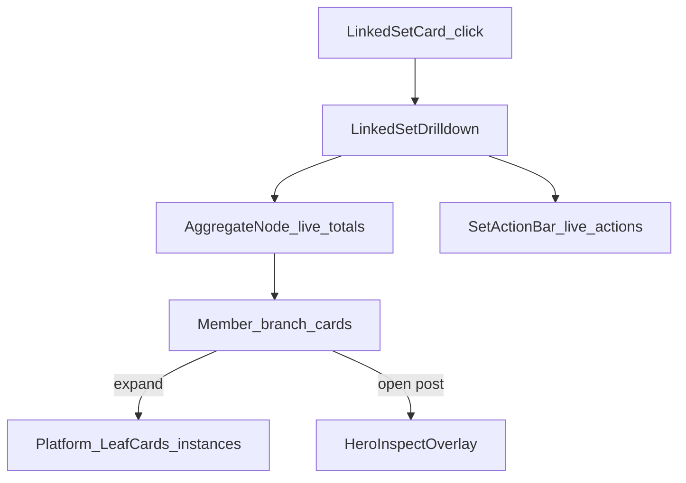

# Phase 6.2 brief — Linked Set data-tree (v0 SetDrilldown)

**Status:** Implemented — verify Linked Set click vs 3010 SetDrilldown on live fixtures  
**Master roadmap:** `[PLAN_STUDIO_RENOVATION_MASTER.md](./PLAN_STUDIO_RENOVATION_MASTER.md)`  
**Prior phases:** Phase 3 Linked Sets (membership + filmstrip summary) — `[PLAN_PHASE_3_LINKED_SETS.md](./PLAN_PHASE_3_LINKED_SETS.md)`. Phase 6 packaging hero — `[PLAN_PHASE_6_HERO_PACKAGING_INSPECT.md](./PLAN_PHASE_6_HERO_PACKAGING_INSPECT.md)`. Phase 6.1 HeroUnfold chrome — `[PLAN_PHASE_6_1_HERO_VISUAL.md](./PLAN_PHASE_6_1_HERO_VISUAL.md)`.

---

## Goal

Replace the barebones side-drawer `[LinkedSetSummaryPanel](../../web/app/components/studio/LinkedSetSummaryPanel.tsx)` with a **full-scrim Linked Set data-tree** ported from v0 **`SetDrilldown`**: sticky mosaic cover → aggregate trunk → “splits into N branches” → member cards → expand into per-platform leaf cards — wired to **live** work-bundle + work-instances APIs — so creators can see how one creative work fans out across pages/variants and destinations in one glance.

## Exit criteria

1. Clicking a Linked Set card on Active Posts opens the data-tree (not the Phase 3 drawer). Side-by-side with v0/`localhost:3010`: same composition grammar (scrim + set-scoped left action bar + scrolling thread + measured mint connectors + member expand → platform leaves).
2. Branch/leaf metrics and presence come from live packaging (`fetchPerformanceWorkBundle`, `fetchPerformanceWorkInstances`); no seeded fake impressions; no toast-only “distribute all” stubs.
3. Member thumbnail (or explicit open) opens Phase 6/6.1 **hero** for `(creative_work_id, member post_id)` without losing set context (hero stacks above the tree).
4. Unlink / multi-unlink use existing `splitCreativeWorkMember`; dissolve = confirm then split remaining members (or close after last). No new `LinkedSet` table.
5. No import of the v0 monolith / quarantine trees; no `/dev/studio2`.

---

## Methodology (same as 6.1)

| Approach | Decision |
| -------- | -------- |
| Long-lived `/dev/studio2` | **Ban** |
| Pretty shell first, APIs later | **Ban** |
| **Strangler / surface swap** | **Required** — production `/studio`; replace Linked Set **inspect surface** only |
| v0 zip / `.tmp` | **Reference only** — re-implement into `web/app/components/studio/` |
| Phase 3 “ban measured SVG” | **Lifted for this surface only** — SVG thread/branches/leaves are the product |



---

## Frozen decisions (v1)

| Topic | Decision |
| ----- | -------- |
| **Scope** | Linked Set drilldown / data-tree **only**. Not Active Posts grid chrome, Schedule rail, Autopost, or Phase 7 shell. |
| **Reference** | `.tmp/social-media-post-creator-8/app/studio/page.tsx` — `SetDrilldown`, `AggregateNode`, `ThreadMemberNode`, `LeafCard`, `SetActionBar`, measured `ThreadGeo`. Zip: `f:\social-media-post-creator (8).zip`. Local QA: `http://localhost:3010/studio`. |
| **Replace** | `[LinkedSetSummaryPanel.tsx](../../web/app/components/studio/LinkedSetSummaryPanel.tsx)` — rewrite in place **or** new `LinkedSetDrilldown.tsx` + thin GalleryView swap; delete or stop shipping the drawer chrome. |
| **Composition** | Full-viewport scrim (`rgba(5,7,6,~0.92)` + blur). Cluster: **SetActionBar** (left, set-scoped) + **thread column** (~`THREAD_W`, scrollable). Sticky collapsing cover (mosaic + title). Aggregate node → “splits into N branches” → staggered member nodes. |
| **Connectors** | Measured SVG trunk / cubic branches / dashed leaves (live `getBoundingClientRect` + ResizeObserver + remeasure on expand/scroll). Mint gradient matching v0 (`#9bf0c4`). **Not** radial platform layout; **not** hero radial. |
| **Data — set** | `fetchPerformanceWorkBundle(creative_work_id, { group_by: "variant_role" })` for title, `total_reach`, `totals`, `variants[]`, `role_breakdown`, `crosspost_gaps`. Gallery `members` prop still supplies thumbs / labels / cover / presence chips for instant paint. |
| **Data — leaves** | On member expand: use `fetchPerformanceWorkInstances(creative_work_id)` (fetch once per open tree, cache in panel). Map `posts.find(p => p.post_id === member).platform_instances` → LeafCards. Empty expand: show “No linked platforms yet” + optional ghost destinations from that member’s `missing` / work `crosspost_gaps` (dashed CTA → DistributionSheet for that `post_id` + destination — same Phase 6 gap rule). |
| **Member → hero** | Open `HeroInspectOverlay` with `(creative_work_id, post_id)`; **do not** unmount the tree (stack z-index: tree ~80–90, hero ≥100). Closing hero returns to the tree. |
| **Cover mosaic** | Tile click scrolls thread to that member node (v0 behavior). |
| **SetActionBar** | Thin bar: **Structure** (Add posts to set) + **More** (Break apart set). Close + **Refresh** are top-right modal chrome (stale badge from instances). No Distribute / Visibility / toast stubs. |
| **Multi-select toolbar** | In scope: check members → sticky bar → “Remove from set” (sequential `splitCreativeWorkMember`). **Out:** Change role / set cover unless a reorder/role PATCH already exists (today: **no** member reorder/role patch API — omit). |
| **Drag reorder** | **Out of v1** — no CreativeWorkMember `sort_order` reorder endpoint and no `@dnd-kit` in `web/package.json`. Do **not** add a fake grip. Cover remains `sort_order === 0` from link flow. |
| **Inline rename / description** | **Out of v1** unless a CreativeWork PATCH is added in this pack (default: **no new API**). Show live `title` read-only (Fraunces). |
| **AggregateNode** | Live set totals from bundle; “Ads + teasers” / canonical split only when `role_breakdown` present — same Relay mapping as hero. No invented multipliers on reach. |
| **Member card** | Thumb, label (`member_label` or gallery title), COVER badge when `post_id === cover_post_id`, reach from matching `variants[].total_reach`, short platform chips from member `present` (Phase 2 chip kit / short labels — do not invent a second icon set). Expand control: “N platforms”. |
| **LeafCard** | Match v0 leaf chrome; stats from instance metrics when present (impressions/likes/comments or reach fallback). Refresh / open URL only when live instance fields support them (reuse hero refresh handoff patterns if already shared; otherwise open URL + omit dead refresh). |
| **Motion** | `framer-motion` enter/exit, pathLength on connectors, expand height — port v0 timings lightly. |
| **Copy** | User-facing **Linked Set** (never “bundle” / “Collection” for this concept). |
| **Z-index** | Tree above Library; DistributionSheet / hero above tree when opened from leaves/members. |

---

## In scope

- Full-scrim Linked Set data-tree replacing Phase 3 summary drawer
- Measured SVG trunk / branches / leaves
- Aggregate node + member branches + expand → platform leaves
- Live bundle + instances wiring + generation/stale guard if user switches sets quickly
- Set-scoped action bar (live actions only)
- Multi-unlink toolbar
- Member → stacked hero; leaf gap → DistributionSheet
- GalleryView entry swap (`onOpenLinkedSet` → new surface)
- Unit helpers for join (member ↔ variant ↔ instances) + light tests
- Side-by-side verify notes vs 3010

## Out of scope (do not build)

- `/dev/studio2`, quarantine merge, importing `.tmp/.../page.tsx`
- Radial hero / single-post HeroUnfold changes (belongs to 6.1)
- Active Posts mosaic card visual port, Schedule rail, Autopost chrome
- Phase 7 virtualization / list removal
- New analytics tables or a `LinkedSet` model
- Persist drag-reorder / bulk role change / set rename-description APIs (unless product explicitly expands this pack)
- Toast-only distribute / refresh-all / collections / export
- Set-wide Relay View rollup UI (AggregateNode summary is enough; full Relay toggle stays on hero)

---

## Dependencies

| Dependency | Role |
| ---------- | ---- |
| Phase 3 | Grid `linked_set` cards, membership, `LinkedSetMemberCard`, unlink via split |
| Phase 6 / 6.1 | Hero stack target; gap → DistributionSheet; chip kit |
| `GET .../performance/works/:id` (+ `group_by=variant_role`) | Aggregates + per-variant reach |
| `GET .../performance/works/:id/instances` | Leaf platform rows |
| `splitCreativeWorkMember` | Unlink / dissolve |
| `framer-motion` | Already in web |
| v0 reference | SetDrilldown family in `.tmp/social-media-post-creator-8` |

**Master dependency:** `Phase3 + Phase6 → Phase6.2`. Prefer Phase 6.1 hero chrome stable so stacked hero feels coherent. Independent of Phase 7.

**Phase 3 note:** The v1 ban on measured SVG / `SetDrilldown` is **superseded by this pack** for the Linked Set inspect surface only.

---

## Data contract

### Props (GalleryView → drilldown)

```ts
type LinkedSetDrilldownProps = {
  open: boolean;
  creativeWorkId: string;
  title: string;
  coverPostId: string;
  members: LinkedSetMemberCard[]; // thumbs, labels, present/missing, sort_order
  onClose: () => void;
  onChanged: () => void; // refresh gallery after unlink/dissolve
  onOpenHero: (postId: string) => void; // parent sets HeroInspectKey; keep tree mounted
  onGapFill: (postId: string, destination: string) => void; // → DistributionSheet
};
```

### Join (client helper — prefer `web/lib/linked-set-drilldown-data.ts`)

```ts
type DrilldownMemberView = {
  post_id: string;
  member_label: string;
  variant_role: string;
  is_cover: boolean;
  thumb_src: string | null;
  total_reach: number; // from bundle.variants or 0
  present_short: string[]; // PA / X / DA …
  platform_instances: PerformanceWorkInstanceRowWire[]; // from instances payload
  missing_destinations: string[];
};
```

Abort / ignore stale fetches when `creativeWorkId` changes mid-flight (same credibility rule as hero).

### Dissolve

Confirm in SetActionBar → for each remaining member `post_id`, `splitCreativeWorkMember` → `onChanged` → `onClose`. Partial failure: surface error; refresh list.

---

## File touch list

| Path | Action |
| ---- | ------ |
| `web/app/components/studio/LinkedSetDrilldown.tsx` (new) **or** rewrite `LinkedSetSummaryPanel.tsx` | **Create/rewrite** — SetDrilldown composition |
| `web/app/components/studio/linked-set/*` (optional splits) | **Create** — `AggregateNode`, `ThreadMemberNode`, `LeafCard`, `SetActionBar`, connector measure hook |
| `web/lib/linked-set-drilldown-data.ts` | **Create** — join helpers + tests |
| `[GalleryView.tsx](../../web/app/studio/GalleryView.tsx)` | **Edit** — mount drilldown; `onOpenHero` without unmounting tree; gap handoff |
| `[LinkedSetSummaryPanel.tsx](../../web/app/components/studio/LinkedSetSummaryPanel.tsx)` | **Delete or gut** after swap |
| Tests under `web` / `tests` | **Add** join unit tests |
| Docs | This pack + master roadmap link |

**Do not edit:** schedule-rail, extension sticky, Autopost staging rules, quarantine trees, hero credibility join (except shared gap CTA wiring from GalleryView).

---

## Ordered todos (builder)

1. **Freeze visual checklist** — Screenshot 3010 SetDrilldown: cover, aggregate, branch label, member card, expanded leaves, action bar, connectors.
2. **Join helpers** — Map gallery members + bundle + instances → `DrilldownMemberView`; unit tests.
3. **Shell + connectors** — Scrim, thread column, measure hook, SVG paths with fixture layout.
4. **Aggregate + member cards** — Live reach/chips; expand/collapse; mosaic jump-scroll.
5. **Leaves** — Wire instances; gap leaves → DistributionSheet; refresh/open when real.
6. **SetActionBar + unlink toolbar** — Live dissolve / remove-from-set only.
7. **GalleryView integration** — Replace summary panel; stack hero; stale-fetch guard.
8. **Verify** — Checklist below vs 3010 + live comic/A-B fixtures.
9. **Stop** — Do not start grid/rail visual packs or reorder APIs in this phase.

---

## Verify checklist

- Linked Set card → data-tree (no Phase 3 drawer)
- “Splits into N branches” matches member count; connectors track layout on resize/expand
- Aggregate totals match work bundle for the open set
- Expand member → leaf stats match instances for that `post_id` (A≠B across members)
- Member open → hero for correct `(work, post)`; closing hero returns to tree
- Unlink one / multi-remove / dissolve persist via split and refresh grid
- Gap leaf opens DistributionSheet for that post + destination
- No toast-only distribute/rename; no dnd-kit; no monolith import
- Hero + extension sticky still work; z-index stacking sane

---

## Do-not-do list

- Do not keep the filmstrip drawer as a second Linked Set inspect path
- Do not invent seeded platform stats when instances are empty
- Do not add `@dnd-kit` “for show” without a reorder API
- Do not toast-stub SetActionBar segments
- Do not change Phase 6 hero credibility contracts
- Do not expand into grid card visual redesign in this pack

---

## Handoff — later

- Member reorder / change cover / rename set → small API pack + enable grip + Edit tray
- Set-wide “refresh all instances” when batch refresh exists
- Active Posts `LinkedSetCard` visual fidelity (separate panel pack)
- Phase 7 shell still complementary

---

## Reference assets

- Zip: `f:\social-media-post-creator (8).zip`
- Cite: `.tmp/social-media-post-creator-8/app/studio/page.tsx` — `SetDrilldown`, `AggregateNode`, `ThreadMemberNode`, `LeafCard`, `SetActionBar`
- Live spine: Phase 3 membership + Phase 6 packaging APIs — `[STUDIO_PACKAGING_DATA.md](../analytics/STUDIO_PACKAGING_DATA.md)`
- Quarantine lesson: `[web-quarantine-trees.md](../web-quarantine-trees.md)`
