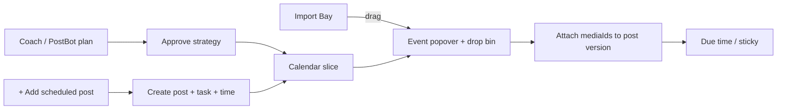

# Phase 8 brief — Scheduled post create + event media attach

**Status:** Nearly complete — create/attach APIs + client wired; ownership tests + strict `needs_media` gate landed; manual E2E verify remaining  
**Scope note (2026-07):** The rail `+` control is superseded by **Create Event** (any supported type, URL or Library target) under [PLAN_MANUAL_SOCIAL_EVENTS.md](./PLAN_MANUAL_SOCIAL_EVENTS.md). Phase 8 media-attach semantics remain for **publish-type / PostbotTask-backed** slices (`needs_media`, Import Bay drop). URL-only reminders use `CreatorScheduleEvent` and do not invent fake Relay posts.  
**Master roadmap:** `[PLAN_STUDIO_RENOVATION_MASTER.md](./PLAN_STUDIO_RENOVATION_MASTER.md)`  
**Prior phases:** Phase 4 schedule-rail data; Phase 1 Drop Assets / Import Bay drag; Phase 5 sticky reminders (consume filled posts when due).

---

## Goal

Let a creator **add or receive a dated scheduled post on the calendar → open that event → drop Import Bay media onto it** so media lands on the **scheduled post**, not a detached Autopost draft. Two entry paths, one fill path:

1. **Coach / PostBot** — approve a plan → slices appear (existing).
2. **Manual `+`** — **Add scheduled post** (this phase) → same post-shaped slice with empty media + drop bin.

At due time, Remind me / extension sticky can fire against a media-ready step.

### North-star flow

---

## Exit criteria

1. Schedule-rail **events** expose per-item `needs_media` so the UI can gate the drop bin without guessing.
2. Dropping staged media onto a pending `action === "post"` event **persists** `mediaIds` on that event’s `post_id` (latest `PostVersion`) and survives refresh.
3. Popover commit no longer *requires* navigating to Autopost for a successful fill (optional “Review in Autopost” remains).
4. Repost / pin_comment / done / already-filled posts **never** show the media drop bin.
5. Rail **`+` creates a persisted scheduled post** (dated slice + empty media + `needs_media`) — not a local-only custom event.
6. Top-of-rail Drop Assets stays a separate “compose now” path; event drop is the PostBot / scheduled-post fill path.
7. Unit tests cover `needs_media` aggregation, create ownership, and attach ownership (wrong creator / wrong post rejected).

---

## In scope

### A. Schedule-rail payload

Extend `[schedule-rail-service.ts](../../src/distribution/schedule-rail-service.ts)` + wire types in `[schedule-rail-data.ts](../../web/lib/schedule-rail-data.ts)`:

| Field | Type | Rule |
| ----- | ---- | ---- |
| `needs_media` | `boolean` | `true` iff `action === "post"`, status pending (not done/dismissed), and latest post version has empty/unattached `mediaIds` (reuse `isPostMediaEmpty`) |
| `media_count` | `number` (optional) | Count of non-empty media ids when filled — for “3 assets attached” chip |

- Compute **per event / ready item**, not only rail-level `armed` / `cue`.
- Keep existing `armed` + `cue` for top Drop Assets until product retires that surface; prefer deriving `armed` as “any event with `needs_media`” once per-event flags exist.
- Batch media lookups (avoid N+1): load latest versions for distinct `post_id`s in the month window.

### B. `+` Add scheduled post (locked product)

**Locked:** The rail `+` control is **Add scheduled post** only — not a multi-type picker, not a lightweight custom reminder.

| Decision | Value |
| -------- | ----- |
| Label | `+` / “Add scheduled post” |
| Creates | Real Relay post (empty media) + `PostbotTask` `action: post` + timed slice (`suggested_time` and/or variant `scheduled_for`) |
| After create | Slice appears on calendar; open popover → media drop bin (`needs_media: true`) |
| Destinations | Minimal: creator default / single destination selectable in create sheet, **or** destination deferred until Autopost/cross-post — pick one in implementation and document; do not invent four drop bins |
| Coach | Optional later; create must work **without** re-running LLM |
| Out | Repost / pin_comment / `custom` calendar-only rows from this button |

Replace / repurpose `[AddEventPopover.tsx](../../web/app/components/schedule-rail/AddEventPopover.tsx)` (today’s mock `action: "custom"` form). Wire from `[ScheduleRail.tsx](../../web/app/components/schedule-rail/ScheduleRail.tsx)` + `[StudioScheduleRail.tsx](../../web/app/components/schedule-rail/StudioScheduleRail.tsx)` — stop hard-`allowCustomAdd={false}` once create API exists; rename prop to something honest (`allowAddScheduledPost`).

### C. Create API

Illustrative:

`POST /api/v1/creator/schedule-rail/scheduled-posts`  
Body: `{ title?: string; scheduled_for: string; destination?: string; notify?: boolean; note?: string }`  

Behavior (align with existing post + distribution + Postbot create patterns — reuse services, don’t invent a calendar table):

1. Create creator-owned Relay post + empty-media `PostVersion` (title/note as available).
2. Ensure a distribution variant (or equivalent) carrying `scheduled_for` / remind flag.
3. Create pending `PostbotTask` with `action: post`, `suggested_time` aligned to `scheduled_for`, linked `post_id` / `variant_id`.
4. Return the new schedule-rail event wire shape (including `needs_media: true`).

Reject invalid times / foreign destinations. No Prisma `custom` action.

### D. Attach API

`POST /api/v1/creator/schedule-rail/events/:task_id/attach-media`  
Body: `{ media_ids: string[] }`  

1. Resolve `PostbotTask` for creator; require `action === "post"` and pending.
2. Resolve `post_id`; load latest `PostVersion`.
3. Validate each media id is creator-owned staging / library media eligible for attach (same rules as Autopost `draft-post` / library compose).
4. **Set-when-empty, append-when-partial** (document edge cases).
5. Return updated event wire fields including `needs_media: false` and optional thumb urls.

### E. Popover + rail client

Already partially shipped:

- `[EventMediaDropBin.tsx](../../web/app/components/schedule-rail/EventMediaDropBin.tsx)` + gated mount in `[EventPopover.tsx](../../web/app/components/schedule-rail/EventPopover.tsx)` for `action === "post" && status !== "done"`.
- Interim commit → Autopost `media_ids` via `onEventMediaCommit`.

Phase 8 client work:

1. Enable `+` → Add scheduled post sheet → create API → reload rail / insert event → open new event (optional).
2. Gate drop bin on **`needs_media === true`** (not action alone).
3. On media commit: call attach API; optimistic update; stay on rail.
4. Optional secondary: “Review in Autopost” with `media_ids` + `post_id`.
5. Optional: muted “needs media” mark on calendar slice when `needs_media`.

### F. Autopost (minimal)

- Prefer **no Autopost rewrite**. Only add query bootstrap (`post_id` + `media_ids`) if Review path is required.
- Do not force Coach copy regeneration on create or attach.

### G. Due-time behavior (light touch)

- Align Phase 5 sticky media-readiness with `isPostMediaEmpty`.
- **Out of scope:** auto-publish / extension auto-click Publish.

---

## Out of scope (do not build)

- Multi-type `+` picker (repost / pin / custom reminder)
- Persisting `action: "custom"` calendar-only events
- Dropping onto repost / pin_comment
- Per-destination different assets inside one popover
- Google Calendar sync
- Replacing Coach / Transformer UI inside the rail
- Auto-send when the clock hits without user/extension confirm
- Removing top Drop Assets in this phase (may demote later)

---

## Dependencies

| Dependency | Role |
| ---------- | ---- |
| Phase 4 schedule-rail GET + mutations | Event identity (`task_id`, `post_id`, `variant_id`) |
| Phase 1 Import Bay drag MIME | `[staged-media-dnd.ts](../../web/lib/staged-media-dnd.ts)` |
| `PostVersion.mediaIds` | Attach persistence target |
| Post + distribution + Postbot create paths | Reuse for scheduled-post create |
| Autopost / library staging ownership checks | Reuse validation, don’t fork |
| Phase 5 sticky | Consumer of media-ready state at due time |

---

## Work sequence

1. **Spec fixtures** — Pending post + empty media → `needs_media: true`; filled → false; repost → false; dismissed excluded; create returns dated `needs_media` event.
2. **Service + GET** — Per-event flags; batch version fetch; tests in `tests/schedule-rail-service.test.ts`.
3. **Create scheduled-post route + service** — post + task + time; tests; no custom action.
4. **Attach route + service** — Ownership, empty/partial rules, tests.
5. **Client `+`** — Repurpose AddEventPopover → Add scheduled post; enable control; reload rail.
6. **Client gate + attach** — Popover uses `needs_media`; commit calls attach.
7. **Optional slice badge** — Needs-media affordance on day axis.
8. **Sticky copy align** — Only if reminder packet already branches on media.
9. **Manual verify** — `+` create → slice → drop → refresh; Coach path still works end-to-end.

---

## Locked product choices

| Decision | Value |
| -------- | ----- |
| Rail `+` | **Add scheduled post** only |
| Which events get a bin | `action === "post"` **and** `needs_media` |
| Multi-platform Coach plan | One media fill on the **post** task/post; destinations ride distribution variants |
| Top Drop Assets | Remains “compose now”; event bin is scheduled-post fill |
| Commit default | Stay on Studio rail after attach; Autopost optional |
| Scheduler role | Consumes Coach queues **or** manual create; does not re-run LLM on `+` |

---

## Verify

- [ ] `+` → Add scheduled post → dated slice on calendar after refresh
- [ ] New event opens with media drop bin (`needs_media`)
- [ ] Coach plan with dated post still appears on calendar
- [ ] Click post event → media section visible iff `needs_media`
- [ ] Click repost / pin → no media section
- [ ] Import Bay drag → drop → attach → refresh → `needs_media` false; gallery/post shows media
- [ ] Wrong creator / foreign media id → 4xx
- [ ] Top Drop Assets still commits to Autopost independently
- [ ] `+` does not offer custom / repost / pin types

---

## Relationship to shipped UI (pre-create/attach)

- Popover drop bin + “Open in Autopost” is an **interim shell**.
- Rail `+` is visible but disabled until create API lands — label/title should read **Add scheduled post**, not “custom event.”
- Phase 8 replaces Autopost-only commit with attach-to-`post_id`, tightens the gate to `needs_media`, and enables `+` create.
