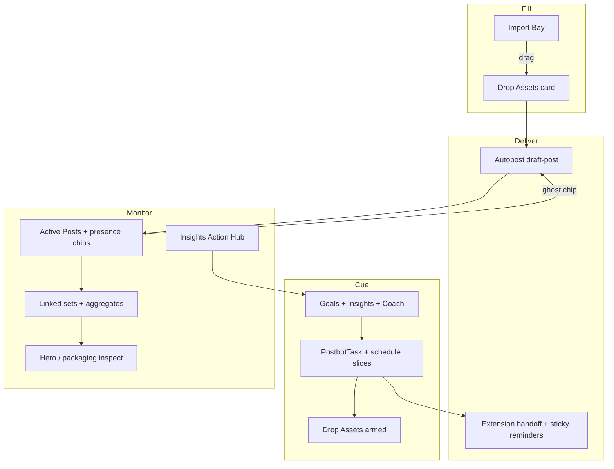

# Plan 2 — Studio renovation master plan

**Status:** Strategic roadmap (not a single sprint)  
**North star:** One Studio for **cue → fill → deliver → monitor** — Active Posts management, Schedule Rail, Autopost/PostBot, and the browser extension share one distribution vocabulary and one data spine.

**Builder rule:** Do **not** assign a worker to “implement Plan 2.” Expand the next phase into an execution pack first (template below). Phases 0–6 are done (`[PLAN_DROP_ASSETS_CHIP_KIT.md](./PLAN_DROP_ASSETS_CHIP_KIT.md)`, `[PLAN_PHASE_2_ACTIVE_POSTS_GRID.md](./PLAN_PHASE_2_ACTIVE_POSTS_GRID.md)`, `[PLAN_PHASE_3_LINKED_SETS.md](./PLAN_PHASE_3_LINKED_SETS.md)`, `[PLAN_PHASE_4_SCHEDULE_RAIL_DATA.md](./PLAN_PHASE_4_SCHEDULE_RAIL_DATA.md)`, `[PLAN_PHASE_5_EXTENSION_STICKY_REMINDERS.md](./PLAN_PHASE_5_EXTENSION_STICKY_REMINDERS.md)`, `[PLAN_PHASE_6_HERO_PACKAGING_INSPECT.md](./PLAN_PHASE_6_HERO_PACKAGING_INSPECT.md)`). **Phase 6.1 pack:** `[PLAN_PHASE_6_1_HERO_VISUAL.md](./PLAN_PHASE_6_1_HERO_VISUAL.md)`. **Phase 6.2 pack:** `[PLAN_PHASE_6_2_LINKED_SET_DATA_TREE.md](./PLAN_PHASE_6_2_LINKED_SET_DATA_TREE.md)`. **Phase 6.3 pack:** `[PLAN_PHASE_6_3_SLIM_SELECTION_BAR.md](./PLAN_PHASE_6_3_SLIM_SELECTION_BAR.md)`. **Phase 6.4 pack:** `[PLAN_PHASE_6_4_GRID_CARD_CHROME.md](./PLAN_PHASE_6_4_GRID_CARD_CHROME.md)`. **Phase 7 pack:** `[PLAN_PHASE_7_HARDENING_STUDIO_SHELL.md](./PLAN_PHASE_7_HARDENING_STUDIO_SHELL.md)`.

**Goal Cycle dependency:** The Library-first Coach planning experience is a separate, dependency-ordered worker program: [`goal-cycle-build-plans/00-README.md`](goal-cycle-build-plans/00-README.md). It consumes the Studio rail, PostBot, extension, and event-media spines documented here; it does not replace their contracts or reopen completed visual phases. Goal Cycle VS6 integrates after its planner contract freezes, VS7 materializes onto the Phase 4 rail, and VS8 extends Phase 5/8 execution.

## Phase execution pack template

Each phase brief (sibling `PLAN_PHASE_N_*.md`) must include:

1. **Goal / exit criteria** (1–3 bullets)
2. **In scope / out of scope** (explicit)
3. **Dependencies** (prior phases, APIs)
4. **Data contract** (wire shapes; mock vs live)
5. **File touch list** (create / edit / do-not-touch)
6. **Ordered todos** (each independently verifiable)
7. **Verify checklist**
8. **Do-not-do list** (prevents v0 monolith port / scope creep)

## Problem

Today’s Library Active Posts are a media grid. The schedule rail is a prototype cue surface. Autopost and the extension live in adjacent flows. The new Active Posts v0 concept (presence rings, linked sets, set drilldown) and Drop Assets / PostBot narrative will **feel patched** unless fused on purpose.

## Product spine (one language)




**Shared atoms (must not fork):**


| Atom                                            | Used by                                                                                                                |
| ----------------------------------------------- | ---------------------------------------------------------------------------------------------------------------------- |
| `PlatformIcon` + Present / Ghost rings          | Active Posts cards, Drop Assets, set members, hero gaps                                                                |
| `present_destinations` / `missing_destinations` | Grid, rail planned destinations, Autopost gap entry                                                                    |
| `creative_work_id` + packaging instances        | Hero inspect, performance rollups (`[docs/analytics/STUDIO_PACKAGING_DATA.md](../analytics/STUDIO_PACKAGING_DATA.md)`) |
| `PostbotTask` + variant `scheduledFor`          | Schedule rail slices + extension sticky toast                                                                          |
| Autopost `media_ids` / `draft_id` entry         | Import Bay, Drop Assets Commit, ghost-chip Autopost                                                                    |


## Phased delivery

### Phase 0 — Shared kit (prerequisite) — DONE

- Extract platform presence chip kit (Plan 1 §A)
- Document destination id map + solid/dashed semantics
- **Exit:** one import path for chips; no duplicate SVG sets in Studio
- **Pack:** `[PLAN_DROP_ASSETS_CHIP_KIT.md](./PLAN_DROP_ASSETS_CHIP_KIT.md)`

### Phase 1 — Drop Assets live (Plan 1) — DONE

- Rail Drop Assets + Import Bay drag + Commit → `draft-post`
- `armed` prop structured for later PostBot truth
- **Exit:** cue→fill→Autopost loop works on `/studio` without Active Posts rewrite
- **Pack:** `[PLAN_DROP_ASSETS_CHIP_KIT.md](./PLAN_DROP_ASSETS_CHIP_KIT.md)`

### Phase 2 — Active Posts grid replace (presence-first) — DONE

Replace current Active Posts tiles in `[GalleryView](../../web/app/studio/GalleryView.tsx)` / gallery grid with v0 card language:

- Portrait media cards + Present/Ghost row
- Ghost click → Autopost for that destination (reuse Plan 1 kit)
- Present click → open external URL when known (distribution attempt / metrics link)
- Wire real `present` / `missing` from distribution summary / packaging APIs — **not** hardcoded `HERO_DATA`
- **Defer:** live SVG thread set drilldown, unused radial hero connectors
- **Exit:** grid answers “where is this posted / what’s missing?” without leaving Library
- **Pack:** `[PLAN_PHASE_2_ACTIVE_POSTS_GRID.md](./PLAN_PHASE_2_ACTIVE_POSTS_GRID.md)`

### Phase 3 — Linked sets (analytics grouping) — DONE

Distinguish **carousel post** (one post, many media) vs **LinkedSet** (many posts, shared analytics):

- Link flow: multi-select posts → confirm sheet → set card (from v0 `LinkConfirmSheet` / `handleLinkConfirm` patterns)
- Set summary: aggregates + member list (simplify geometry vs full measured SVG thread for v1)
- Persist linked-set membership via `CreativeWork` / `CreativeWorkMember` (no new LinkedSet table — align with packaging docs)
- **Exit:** comic/A-B groupings survive refresh; set totals match performance reads where available
- **Pack:** `[PLAN_PHASE_3_LINKED_SETS.md](./PLAN_PHASE_3_LINKED_SETS.md)`

### Phase 4 — Schedule rail production data — DONE

Wire the mounted Schedule rail from mock `INITIAL_DATA` to live creator-scoped month data:

- Creator-scoped list of open `PostbotTask` + scheduled variants (month window, creator TZ)
- Strategy approval → multiple slices (`plan_id` grouping)
- `armed` = pending post task with empty/unattached media
- Slice popover edit / done / delete against real patch APIs
- Dual tracker: cadence + PostBot completion (already designed)
- **Exit:** rail is no longer mock-only; Drop Assets only appears when cued
- **Pack:** `[PLAN_PHASE_4_SCHEDULE_RAIL_DATA.md](./PLAN_PHASE_4_SCHEDULE_RAIL_DATA.md)`

### Phase 5 — Extension sticky reminders — DONE

Fire on due schedule / PostBot step when Remind me is on:

- Packet: event type, title, open URL (`PostbotTask.link` or tracked external URL), ids for done
- Sticky must-dismiss toast (new content script with post-link craft kinship; **no** 15s auto-dismiss — do not replace post-link toast)
- Opt-in global + per-event override (persist what Phase 4 left local)
- **Exit:** due event → toast on active platform tab with Open · Done · Snooze · Dismiss
- **Builder pack:** `[PLAN_PHASE_5_EXTENSION_STICKY_REMINDERS.md](./PLAN_PHASE_5_EXTENSION_STICKY_REMINDERS.md)`

### Phase 6 — Hero / packaging inspect (credibility) — DONE

Replace inspect / Power-adjacent stats paths with a packaging-backed hero for selected `creative_work_id` + `post_id`:

- Per-platform stats + gap rows using the same Present/Ghost chip kit
- Relay View rollup only after instances API is wired per work
- **Column layout only** — do not port dead radial / SVG connectors; do not ship both column and radial
- **Exit:** click post A never shows post B’s stats
- **Builder pack:** `[PLAN_PHASE_6_HERO_PACKAGING_INSPECT.md](./PLAN_PHASE_6_HERO_PACKAGING_INSPECT.md)`

### Phase 6.1 — Hero visual fidelity (v0 HeroUnfold) — IMPLEMENTED

Restyle the live packaging hero to **match the v0 HeroUnfold UX/UI** (composition, motion, row cards) without a parallel Studio:

- Strangler swap on production overlay; v0 zip / `.tmp` is reference-only
- Keep Phase 6 data join + gap → DistributionSheet
- **Hero only** — later panel-by-panel resurfacing (grid, rail, Autopost) uses the same method after 6.1 is reliable
- **Exit:** pixel/motion parity with v0 column hero; live credibility intact
- **Builder pack:** `[PLAN_PHASE_6_1_HERO_VISUAL.md](./PLAN_PHASE_6_1_HERO_VISUAL.md)`

### Phase 6.2 — Linked Set data-tree (v0 SetDrilldown) — IMPLEMENTED

Replace Phase 3’s filmstrip summary drawer with the v0 **SetDrilldown** tapestry on live packaging:

- Measured SVG trunk/branches/leaves; aggregate → member branches → expand platform leaves
- Set-scoped left action bar (live unlink/dissolve only — no toast stubs)
- Member open stacks Phase 6/6.1 hero; gap leaves → DistributionSheet
- Lifts Phase 3’s “ban measured SVG” **for this surface only**
- **Exit:** Linked Set click reads as 3010 data-tree with live A≠B stats
- **Builder pack:** `[PLAN_PHASE_6_2_LINKED_SET_DATA_TREE.md](./PLAN_PHASE_6_2_LINKED_SET_DATA_TREE.md)`

### Phase 6.3 — Slim selection bar + click-to-unfold — IMPLEMENTED

Dock is multi-select only; single-post manage via card/chip/hero:

- Card body opens hero or Linked Set tree; checkbox selects
- Bar mounts at ≥2 posts: Link, Tags, Visibility, Collection, Delete
- Removes Cross-post, Details, Audience, Export from the footer
- Single delete via hero More → `relayNativeDeletePost`
- **Builder pack:** `[PLAN_PHASE_6_3_SLIM_SELECTION_BAR.md](./PLAN_PHASE_6_3_SLIM_SELECTION_BAR.md)`

### Phase 6.4 — Grid card chrome (v0 PostGrid / LinkedSet) — IMPLEMENTED

Active Post + Linked Set tiles match v0 geometry:

- `3/4` aspect, overlay title/chips, mint circular checkbox
- Linked Set mosaic + Linked · N badge
- Grid `gap-3` / column density aligned to v0
- **Builder pack:** `[PLAN_PHASE_6_4_GRID_CARD_CHROME.md](./PLAN_PHASE_6_4_GRID_CARD_CHROME.md)`

### Phase 7 — Hardening and Studio shell — IN PROGRESS

Density / overhaul of Library chrome with rail + new grid coexisting:

- List vs grid: **remove** half-broken list toggle; keep dense + normal grid
- Performance: virtualize Active Posts **grid** with `@tanstack/react-virtual`; keep rail scroll independent
- Empty states aligned (no posts, no cues, no gaps) via shared primitive
- **Exit:** Studio reads as one product under future visual renovation
- **Builder pack (required before code):** `[PLAN_PHASE_7_HARDENING_STUDIO_SHELL.md](./PLAN_PHASE_7_HARDENING_STUDIO_SHELL.md)`

### Phase 8 — Scheduled post create + event media attach — IN PROGRESS

Coach **or** rail `+` → dated post slice → drop media on the event:

- Rail `+` = **Add scheduled post** only (not type picker / custom reminder) — persists post + `PostbotTask` + time
- Schedule-rail payload: per-event `needs_media`
- Attach API: Import Bay media → `PostVersion.mediaIds` for that event’s `post_id`
- Popover drop bin (UI shell shipped; interim commit → Autopost until attach lands)
- Gate: pending `action === "post"` with empty media only — not repost/pin/done
- **Exit:** Manual or Coach-scheduled post on calendar; drop attaches media; due/remind can treat as media-ready
- **Builder pack:** `[PLAN_PHASE_8_EVENT_MEDIA_ATTACH.md](./PLAN_PHASE_8_EVENT_MEDIA_ATTACH.md)`

## Cross-cutting rules

1. **Scheduler consumes queues; it does not re-run Coach.** Insights → approve → tasks/drafts → rail/grid.
2. **One chip kit.** New destinations add one map entry, not a third icon style.
3. **Ghost chip = Autopost shortcut; solid chip = open/monitor.** Do not invent a third click grammar.
4. **Toast stubs are not done.** v0 toasts become real Autopost or real extension packets before calling a phase complete.
5. **Carousel ≠ LinkedSet** — keep both; never merge into one card type.
6. **Visual resurfacing = strangler swaps.** Keep production routes + live contracts; replace one surface’s chrome from v0 reference. No long-lived parallel Studio.

## Dependency order (do not skip)

```
Phase0 chips → Phase1 Drop Assets → Phase2 grid chips
                ↘ Phase4 rail data (can parallel Phase2 after 0)
Phase2 → Phase3 linked sets
Phase4 → Phase5 extension reminders
Phase2/packaging API → Phase6 hero → Phase6.1 hero visual
Phase3 + Phase6 → Phase6.2 Linked Set data-tree
Phase1–6 → Phase7 shell polish
Phase4 + Phase1 → Phase8 event media attach (can parallel Phase7)
Phase4/5/8 + GoalCycle VS0–VS6 → GoalCycle VS7 rail materialization → GoalCycle VS8 execution
(After 6.1/6.2) panel-by-panel visual resurfacing (grid card, rail, Autopost) — separate packs
```

## Explicitly out of master scope

- Full Google Calendar / life-OS scheduler
- Extension auto-click Publish
- Replacing Insights Action Hub or Transformer Coach UI inside the rail
- Finance ROI dashboards on the rail
- Bluesky deliverability before product commits to that destination in production Autopost
- Long-lived parallel Studio (`/dev/studio2`) or quarantine mini-app as the redesign home

## Success picture

A creator sees a dashed Bluesky on an Active Post → Autopost; or gets a PostBot week plan → slices on the rail → opens a post event → drops Import Bay art onto that event → media attaches to the scheduled post → later a sticky extension toast “Post · Open” — and every platform ring looks like it belongs to the same Studio.

## Relationship to Plan 1

**Plan 1 is Phase 0 + Phase 1** (`[PLAN_DROP_ASSETS_CHIP_KIT.md](./PLAN_DROP_ASSETS_CHIP_KIT.md)`) — executed.  
**Phase 2:** `[PLAN_PHASE_2_ACTIVE_POSTS_GRID.md](./PLAN_PHASE_2_ACTIVE_POSTS_GRID.md)` — done.  
**Phase 3:** `[PLAN_PHASE_3_LINKED_SETS.md](./PLAN_PHASE_3_LINKED_SETS.md)` — done.  
**Phase 4:** `[PLAN_PHASE_4_SCHEDULE_RAIL_DATA.md](./PLAN_PHASE_4_SCHEDULE_RAIL_DATA.md)` — done.  
**Phase 5:** `[PLAN_PHASE_5_EXTENSION_STICKY_REMINDERS.md](./PLAN_PHASE_5_EXTENSION_STICKY_REMINDERS.md)` — done.  
**Phase 6:** `[PLAN_PHASE_6_HERO_PACKAGING_INSPECT.md](./PLAN_PHASE_6_HERO_PACKAGING_INSPECT.md)` — done (credibility spine).  
**Phase 6.1:** `[PLAN_PHASE_6_1_HERO_VISUAL.md](./PLAN_PHASE_6_1_HERO_VISUAL.md)` — implemented (await visual sign-off).
**Phase 6.2:** `[PLAN_PHASE_6_2_LINKED_SET_DATA_TREE.md](./PLAN_PHASE_6_2_LINKED_SET_DATA_TREE.md)` — implemented (await visual verify vs 3010).
**Phase 6.3:** `[PLAN_PHASE_6_3_SLIM_SELECTION_BAR.md](./PLAN_PHASE_6_3_SLIM_SELECTION_BAR.md)` — implemented (slim dock + click-to-unfold).
**Phase 6.4:** `[PLAN_PHASE_6_4_GRID_CARD_CHROME.md](./PLAN_PHASE_6_4_GRID_CARD_CHROME.md)` — implemented (v0 card geometry).
**Phase 7:** `[PLAN_PHASE_7_HARDENING_STUDIO_SHELL.md](./PLAN_PHASE_7_HARDENING_STUDIO_SHELL.md)` — briefed; shell polish after Phase 1–6 features — do not rewrite those spines under chrome work.  
**Phase 8:** `[PLAN_PHASE_8_EVENT_MEDIA_ATTACH.md](./PLAN_PHASE_8_EVENT_MEDIA_ATTACH.md)` — briefed; Add scheduled post (`+`) + per-event media attach after Phase 4 (popover UI shell may ship early).