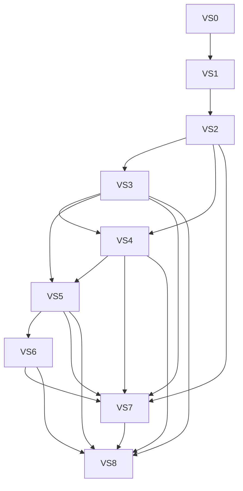

# Schedule Rail Automations — Worker Program

This program builds **Automations** as a thin composition chassis over Relay's existing schedule and action atoms. It is an implementation contract for agentic workers, not permission to redesign the atom taxonomy or add autonomous publishing.

**Product contract:** [`PRODUCT-CONTRACT.md`](PRODUCT-CONTRACT.md)  
**Acceptance:** [`../../qa/AUTOMATIONS_ACCEPTANCE.md`](../../qa/AUTOMATIONS_ACCEPTANCE.md)  
**Builder preamble:** [`BUILDER-ORIENTATION.md`](BUILDER-ORIENTATION.md)  
**Traceability:** [`TRACEABILITY.md`](TRACEABILITY.md)

## Final codebase-synergy review

The original theory was directionally correct but would have duplicated established orchestration. The implementation must use this ownership model:

| Responsibility | Canonical authority | Automation role |
|---|---|---|
| Recurring calendar trigger | `CreatorScheduleSeries` + `CreatorScheduleOccurrence` | Own a trigger-only series; reuse cadence, timezone, horizon, and occurrence idempotency |
| Content-relative action/run | `CreatorDistributionRule` + `CreatorDistributionRuleRun` | Own a rule; reuse source-post run ledger and draft materialization |
| Prepared work | `AutopostDraft` | Store the reviewable crosspost draft and automation context |
| Rail + extension attention | `CreatorScheduleEvent` | Materialize a custom event with a Relay deep link; reuse manual-event rail and sticky-toast paths |
| Preview layout | `CreatorPreviewTemplate` | Reference the creator-owned template and snapshot its config onto the run |
| Preview rendering | `PreviewizerOverlay` / `PreviewizerClient` | Preload the saved config; creator reviews and exports client-side |
| Distribution | `PostDistributionPlan` → variant → attempt | Create only after preview media exists; preserve existing human-confirmed handoff |
| Composition/config | new `CreatorAutomation` | Connect the authorities above; never become a second execution ledger |

Consequences:

- Do **not** add `CreatorAutomationRun`; `CreatorDistributionRuleRun` is the action-run ledger.
- Do **not** add an `automation_occurrence` rail source; future ticks remain `recurrence_occurrence`, and due work becomes an enriched `manual_event`.
- Do **not** add an automation-specific extension packet family; use `schedule_reminder:manual:{event_id}`.
- Do **not** create `PostDistributionPlan` or `PostDistributionVariant` before Previewizer returns a valid `preview_media_id`.
- Saved Previewizer layouts reference `CreatorPreviewTemplate`, not `PostTemplate`.
- Legacy schedule series and distribution rules keep their current behavior. Only automation-owned rows opt into the new connector behavior.

## Program status

| Slice | Name | Global batches | Depends on | Status |
|---|---|---:|---|---|
| VS0 | Baseline, contracts, acceptance fixtures | B01–B02 | — | Done |
| VS1 | Connector schema and migration | B03–B04 | VS0 | Done |
| VS2 | Lifecycle service and API | B05–B06 | VS1 | Done |
| VS3 | Delayed public release preset | B07–B08 | VS2 | Done |
| VS4 | Scheduled preview-and-crosspost preset | B09–B11 | VS2, VS3 shared materializer | Done |
| VS5 | Rail, reminder, and notification projection | B12–B13 | VS3, VS4 | Done |
| VS6 | Previewizer approval and distribution handoff | B14–B16 | VS5 | Done |
| VS7 | Schedule Rail Automations modal | B17–B18 | VS2–VS6 contracts | Done |
| VS8 | Integrated verification and rollout | B19–B20 | VS3–VS7 | Done |

Status changes require a Delta Out proving the slice exit gate. “Code written” is not “Done.”

## Locked product and architecture decisions

- User-facing name: **Automations**.
- Entry point: Automations icon in the Schedule Rail header; it opens a portaled, windowed modal.
- V1 presets: **Preview & crosspost** and **Delayed public release**.
- V1 sources: latest eligible Patreon post for the scheduled preset; triggering Patreon post for delayed release.
- Content series, tags, campaign-like grouping, specific-post recurrence, branching, chaining, custom step editing, and manual run-now are deferred.
- All automation capabilities require Autopost.
- The visible month shows future trigger occurrences.
- If no new eligible post exists, skip the occurrence and notify the creator. (Post-v1: Streak Keeper fallback may replace flat skip — see product contract deferred note.)
- A prepared approval expires after 72 hours unless a later contract-owned setting is approved.
- One automation may have at most one awaiting-review artifact at a time.
- A saved Previewizer template is preloaded but never server-rendered in v1.
- Publishing and social handoff always require creator confirmation.
- The existing post-create playbook → repeat prompt chain stays intact; the new modal is a create/manage surface for the two automation presets.
- `RELAY_FEATURE_AUTOMATIONS` defaults off until a human release owner approves evidence (see [`../AUTOMATIONS_RUNBOOK.md`](../AUTOMATIONS_RUNBOOK.md) and [`../../qa/AUTOMATIONS_RELEASE_EVIDENCE.md`](../../qa/AUTOMATIONS_RELEASE_EVIDENCE.md)).

## Dependency and claim order

Claim the first incomplete global batch whose dependencies are Done. A worker claims **one batch only**, implements at most two work items, writes Delta Out, and stops. The next worker is prompted using the `Next unblocked batch` field.

## Global batch queue

| Batch | Work items | Outcome |
|---:|---|---|
| B01 | AUT-VS0-T01 | Characterize and freeze existing atom behavior |
| B02 | AUT-VS0-T02 + AUT-VS0-T03 | Freeze automation contracts, fixture, and acceptance mapping |
| B03 | AUT-VS1-T01 | Add connector schema and migration |
| B04 | AUT-VS1-T02 | Prove migration, relations, and idempotency constraints |
| B05 | AUT-VS2-T01 | Implement creator-scoped connector lifecycle service |
| B06 | AUT-VS2-T02 | Add routes and web client against frozen fixtures |
| B07 | AUT-VS3-T01 | Wrap delayed release around an owned distribution rule |
| B08 | AUT-VS3-T02 | Converge owned-rule materialization on draft/run lifecycle |
| B09 | AUT-VS4-T01 | Add trigger-only schedule-series mode |
| B10 | AUT-VS4-T02 | Resolve scheduled source and create idempotent rule runs |
| B11 | AUT-VS4-T03 | Implement skip, single-pending, expiry, and recovery |
| B12 | AUT-VS5-T01 | Project planned and materialized automation metadata onto the rail |
| B13 | AUT-VS5-T02 | Reuse manual-event sticky reminders and clustered notifications |
| B14 | AUT-VS6-T01 | Add saved-template preload to Previewizer |
| B15 | AUT-VS6-T02 | Build approval adapter and create distribution only after preview export |
| B16 | AUT-VS6-T03 | Synchronize handoff completion, cancellation, and expiration |
| B17 | AUT-VS7-T01 | Refactor shared routine/rule panels and add gated modal shell |
| B18 | AUT-VS7-T02 | Add preset forms, history, deep links, and accessible state handling |
| B19 | AUT-VS8-T01 | Run integrated service/UI/extension acceptance matrix |
| B20 | AUT-VS8-T02 | Complete browser verification, rollout controls, and operator handoff |

## Slice index

1. [`01-VS0-BASELINE-CONTRACTS.md`](01-VS0-BASELINE-CONTRACTS.md)
2. [`02-VS1-CONNECTOR-SCHEMA.md`](02-VS1-CONNECTOR-SCHEMA.md)
3. [`03-VS2-LIFECYCLE-API.md`](03-VS2-LIFECYCLE-API.md)
4. [`04-VS3-DELAYED-RELEASE.md`](04-VS3-DELAYED-RELEASE.md)
5. [`05-VS4-SCHEDULED-PREVIEW-CROSSPOST.md`](05-VS4-SCHEDULED-PREVIEW-CROSSPOST.md)
6. [`06-VS5-RAIL-REMINDER-PROJECTION.md`](06-VS5-RAIL-REMINDER-PROJECTION.md)
7. [`07-VS6-PREVIEWIZER-APPROVAL.md`](07-VS6-PREVIEWIZER-APPROVAL.md)
8. [`08-VS7-AUTOMATIONS-MODAL.md`](08-VS7-AUTOMATIONS-MODAL.md)
9. [`09-VS8-INTEGRATION-ROLLOUT.md`](09-VS8-INTEGRATION-ROLLOUT.md)

## Worker rules

1. Read `AGENTS.md`, `.cursor/rules/rescue-workflow-always.mdc`, [`BUILDER-ORIENTATION.md`](BUILDER-ORIENTATION.md), this status table, and the claimed slice.
2. Claim exactly one global batch and at most two work items.
3. Keep behavior and focused tests in the same batch.
4. Confirm all dependency slices/batches are complete before editing.
5. Do not invent fields after VS0 freezes contracts.
6. Do not commit, push, apply a production migration, publish an extension build, or activate a flag without explicit authorization.
7. Finish with Automation Delta Out and name exactly one next unblocked batch (or a human gate).
8. Verification workers diagnose and reopen the smallest owning work item through [`TRACEABILITY.md`](TRACEABILITY.md); they do not silently repair adjacent slices.

## Safe parallel work

This program is intentionally mostly serial because it touches shared scheduling and distribution hot files. After B02:

- isolated Prisma fixture preparation may proceed while B03 is owned, but may not edit schema or migrations;
- VS7 presentational extraction may be prototyped against frozen fixtures after B06, but B17 may not merge until VS3–VS6 wire contracts are stable;
- extension characterization tests may proceed after B02, but no extension packet change should be needed;
- documentation and QA fixture work may run in parallel when it does not change production contracts.

## Hot-file ownership

| File/domain | Serialized owner order |
|---|---|
| `prisma/schema.prisma`, automation migration | VS1 only |
| `src/server.ts` | VS2 → VS6 |
| `src/autopost/distribution-rule-service.ts` | VS3 → VS4 → VS6 |
| `src/autopost/schedule-series-service.ts` | VS4 |
| queue names / worker registration / repeat scheduling | VS4 |
| `src/distribution/schedule-rail-service.ts` | VS5 |
| `src/distribution/schedule-reminder-extension-api.ts` | VS5 characterization first; edit only if existing manual-event packet cannot satisfy frozen contract |
| `web/lib/previewizer-session.ts`, `PreviewizerClient`, `PreviewizerOverlay` | VS6 |
| `web/app/components/autopost/AutopostRoutinesPanel.tsx` | VS7 |
| `ScheduleRail.tsx`, `StudioScheduleRail.tsx`, `EventPopover.tsx` | VS5 metadata, then VS7 modal |
| `web/lib/relay-api.ts` | Avoid for automation CRUD; use a dedicated client. VS6 may append only if the existing distribution API cannot be reused. |

## Human stop conditions

Stop and hand off rather than guessing when work requires:

- changing the two locked presets or adding a source-grouping taxonomy;
- autonomous publishing or bypassing creator confirmation;
- production migration/backfill execution;
- a new extension permission, store release, or external OAuth credential;
- changing Autopost entitlement or the 72-hour approval policy;
- destructive adoption/deletion of legacy schedule series or distribution rules;
- resolving a conflict by changing established manual-event, rail, or distribution semantics without a contract amendment.

## Program complete

The program is complete only when AU-01 through AU-12 pass, duplicate worker delivery creates no duplicate runs/drafts/events/plans, creator isolation and DST/month boundaries pass, legacy routines/rules remain unchanged, saved templates preload without storing crop, stale approvals expire cleanly, and no route or extension path publishes without explicit creator confirmation.
