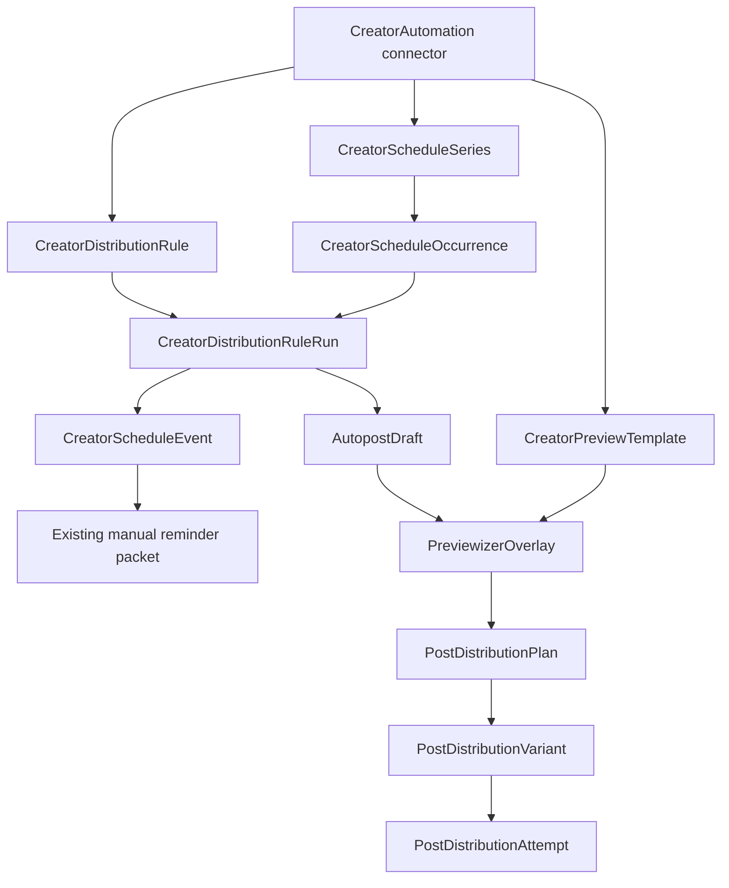

# Schedule Rail Automations — Product and Architecture Contract

## Product promise

Automations help a creator turn an established posting rhythm into prepared, reviewable follow-up work. Relay schedules and prepares; the creator reviews and confirms every external post.

The flagship flow is:

> Every Thursday, select my latest eligible Patreon post, prepare an X preview using my saved Previewizer template, place it on the Schedule Rail, and send a sticky reminder. I review the preview and explicitly hand it off to X.

## V1 presets

### Preview & crosspost

- Trigger: weekly or monthly creator-local schedule.
- Source: latest published Patreon post not already processed by this automation.
- Transform: creator-owned saved Previewizer template.
- Destination: one or more supported distribution destinations.
- Output before approval: nudged `AutopostDraft` plus a `CreatorScheduleEvent` attention atom.
- Approval: creator reviews through Previewizer and the existing distribution flow.
- Completion: existing variant/attempt handoff records external execution; no autonomous publish.

### Delayed public release

- Trigger: Patreon post published, plus a creator-selected day offset.
- Source: triggering Patreon post.
- Transform: existing distribution-rule preview draft behavior; a saved template may be selected for the later review step.
- Output before approval: existing `CreatorDistributionRuleRun` materializes a nudged `AutopostDraft`; automation-owned runs also receive the same rail/reminder attention atom.
- Approval and completion: same review/distribution path as Preview & crosspost.

## UX contract

### Entry and management

- A visible Automations icon sits in the Schedule Rail header.
- It opens a portaled modal above rail popovers and below Previewizer.
- The modal is available to all creators; unavailable actions render an Autopost plan gate rather than disappearing.
- The first screen shows the two presets in plain language.
- Creation is a short configuration flow, not a generic step editor.
- Existing automations show status, next occurrence or trigger description, destination, saved template, latest run state, pause/resume, edit, and archive.
- Existing `/studio/autopost/routines` behavior remains available until the modal reaches parity; deep links must not break.

### Schedule Rail behavior

- Future scheduled Preview & crosspost ticks use the existing `recurrence_occurrence` projection for the visible month.
- When a tick materializes, its placeholder is replaced by an enriched `manual_event` linked to the prepared draft.
- The event shows automation label, destination, source-post context, and `Ready for review`.
- Clicking either the rail event or sticky toast reaches the same resumable approval context.
- Delayed public release has no synthetic future calendar ticks; once its delayed run materializes, the same ready-for-review event appears.

### Reminder behavior

- The attention atom is a `CreatorScheduleEvent` with `event_type=custom`, a safe Relay Studio HTTP(S) deep link, and `remind_me=true`.
- Extension delivery uses the existing `schedule_reminder:manual:{event_id}` identifier and manual-event CTA path.
- A missed toast never loses work: the rail and Automations modal remain persistent recovery surfaces.
- A 72-hour stale approval becomes expired, dismisses its attention event, and emits one clustered in-app notification.
- If no new post is available, the occurrence is skipped and one informative in-app notification is emitted.

### Human confirmation

- Previewizer never auto-exports on open.
- Exporting a preview does not itself publish.
- A distribution plan is created only after Previewizer returns a valid creator-owned `preview_media_id`.
- The creator must explicitly approve/send each destination through the existing distribution handoff.
- Bluesky's existing API handoff and extension-backed destinations keep their existing confirmation semantics.

## Composition chassis

## Authority and state ownership

### `CreatorAutomation`

Owns configuration and connector lifecycle only:

- creator;
- preset kind;
- active/paused/archived state;
- optional trigger-only series;
- owned distribution rule;
- optional Previewizer template;
- source policy;
- approval TTL;
- title and timestamps.

It does not own execution status, calendar math, draft contents, reminder delivery, or distribution attempts.

### `CreatorScheduleSeries` and `CreatorScheduleOccurrence`

Remain authoritative for recurring time:

- Existing rows default to `post_draft` materialization.
- Automation-owned schedule rows use `automation_trigger`.
- Trigger-only occurrences are generated with the existing creator-local recurrence code and shown through the existing rail source.
- The ordinary series reconciler must not call `createScheduledPostForRail` for `automation_trigger`.
- An occurrence becomes `materialized`, `skipped`, `failed`, or `completed` based on its linked rule run.

### `CreatorDistributionRule` and `CreatorDistributionRuleRun`

Remain authoritative for source-relative work:

- Existing `patreon_published` rules keep current discovery behavior.
- Automation-owned scheduled rules use a frozen scheduled trigger kind and are discovered from due trigger-only occurrences.
- A run is idempotent for its trigger identity.
- The run stores source post, due time, prepared draft, attention event, plan/attempt pointers when available, template snapshot, expiry, and failure details.
- Existing `materialized` means ready for creator review. Add only the terminal statuses required for expiration/cancellation if VS0 freezes them.

### `AutopostDraft`

Remains the prepared artifact:

- source post ID;
- selected destinations;
- transform mode;
- automation/rule/run IDs;
- template snapshot reference;
- copy excerpt and source media context.

The draft must be resumable from the rail, toast, and modal.

### `CreatorScheduleEvent`

Remains the attention atom:

- no new rail event taxonomy;
- no automation-specific reminder packet;
- generated through the same validated service used by manual events;
- safe Relay deep link only;
- marked done/dismissed as run state changes.

### Previewizer and distribution

- `CreatorPreviewTemplate` is the persistent layout authority.
- The run snapshots validated `PreviewTemplateConfigV1` so later edits/deletion do not mutate prepared work.
- Crop/selection remains source-image specific and is not stored in the template.
- `PreviewizerClient` accepts an optional initial validated config; ordinary callers behave exactly as before.
- After export, use existing `createPostDistributionPlan` input with preview routing and a real `preview_media_id`.
- Use existing approve/start-handoff/extension or Bluesky paths; automation adds correlation, not a publishing path.

## Idempotency contract

- Automation create is idempotent on a client mutation key or returns the existing connector graph after a safe retry.
- One automation owns at most one series and one rule.
- Scheduled discovery is idempotent on occurrence identity.
- Event-driven discovery remains idempotent on rule + source post.
- A run creates at most one draft and one attention event.
- Approval creates at most one active plan for the run's source/destinations and does not duplicate attempts on request retry.
- Repeated worker delivery, process restart, or concurrent reconcile must not duplicate any materialized artifact.

VS0 must freeze the precise database keys. Prefer a stable run `idempotency_key` that represents either `occurrence:{occurrence_id}` or `rule:{rule_id}:post:{post_id}` rather than an automation-level `lastProcessedPostId`.

## Failure and recovery contract

| Condition | Required state | Creator experience |
|---|---|---|
| No eligible new post | occurrence `skipped`; no draft/event | One informative notification; next cadence remains active. **Post-v1 hook:** Streak Keeper may offer a lighter substitute instead of a flat skip (see Explicitly deferred). |
| Source has no image | run remains recoverable or fails with stable code | Rail/modal explains that an image is required; no broken Previewizer |
| Saved template deleted after scheduling | run uses snapshot if already materialized; future runs require replacement | Clear modal warning and repair action |
| Worker retries | existing rows returned | No duplicate draft/event/toast |
| Creator pauses automation | connector and children stop new discovery | Existing prepared work remains reviewable |
| Creator archives automation | children stop; history retained | No destructive cascade of drafts/runs/events |
| Approval expires | run `expired`; event dismissed | One notification and a visible history row |
| Extension unavailable | run remains ready/approved as appropriate; attempt records failure | Existing connect-extension fallback; no false completion |
| Preview upload fails | run remains ready for review | Retry in same approval context |
| Destination unlinked | existing distribution validation/gate | No task created for an unlinked destination |

## Entitlement and flags

- Server enforcement: `requireCreatorPlanAtLeast(..., CreatorPlan.autopost)`.
- UI enforcement: `StudioPlanGate` in the modal; contextual prompts keep current inline gates.
- New kill switch: `RELAY_FEATURE_AUTOMATIONS=false` by default.
- Existing `RELAY_FEATURE_SCHEDULE_SERIES`, `RELAY_FEATURE_DISTRIBUTION_RULES`, and Previewizer flags remain independently authoritative.
- Disabling Automations stops new discovery/materialization but does not hide or destroy existing prepared work.

## Explicitly deferred

- Content-series, campaign-like, collection, or tag selectors.
- Specific-post recurring promotion and its repeat policy.
- Custom step ordering or arbitrary action graphs.
- Conditional branches, recipe chaining, and multi-source selection.
- Manual Run now.
- Server-side image rendering.
- Automatic external publishing.
- Replacing social playbooks, ordinary schedule series, or legacy distribution-rule management.

### Streak Keeper fallback (post-v1)

**Circle back after v1.** When Preview & Crosspost finds no eligible new Patreon post, v1 skips and notifies. A later pass should offer a **Streak Keeper** substitute instead of a flat skip: keep the cadence alive with a lighter social-management action (sketch from drafts, poll, IRL status update, engagement check / reply / pin / repost), still human-approved.

Design hook: the existing no-new-post skip path (`occurrence skipped` + informative notification) is the intentional insertion point. Do not auto-pick a substitute without creator consent. Prefer “ask each time” before any “always do X” default. Reuse existing atoms (draft picker, schedule events, social playbook reminder atoms, rail/toast approval) — no parallel execution engine.
