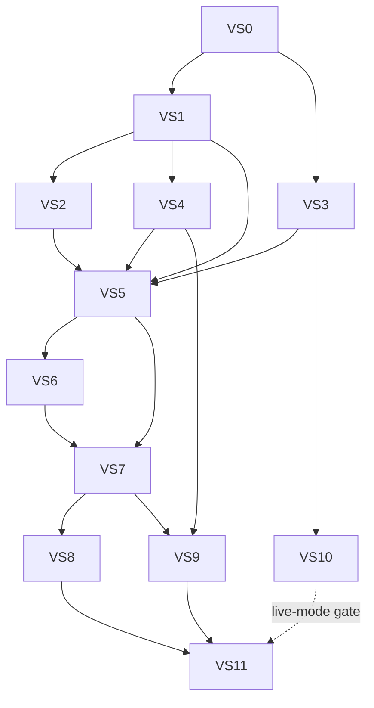

# Relay Goal Cycle — Worker Program

These briefs decompose the Library-first Goal Cycle into twelve executable vertical slices. They are implementation contracts for worker agents, not permission to revisit locked product decisions.

**Product contract:** [`../GOAL_CYCLE_PRODUCT_CONTRACT.md`](../GOAL_CYCLE_PRODUCT_CONTRACT.md)  
**Dream-flow acceptance:** [`../../qa/GOAL_CYCLE_DREAM_FLOW_ACCEPTANCE.md`](../../qa/GOAL_CYCLE_DREAM_FLOW_ACCEPTANCE.md)  
**Builder preamble:** [`BUILDER-ORIENTATION.md`](BUILDER-ORIENTATION.md)  
**Traceability:** [`TRACEABILITY.md`](TRACEABILITY.md)

## Program status

| Slice | Name | Depends on | Status |
|---|---|---|---|
| VS0 | Baseline, contracts, Dream fixture | — | Done |
| VS1 | Goal Cycle core and checkpoints | VS0 | Done |
| VS2 | Coach Plan credits | VS1 | Done |
| VS3 | Trend evidence gateway, fixtures | VS0 | Done |
| VS4 | Paid-support attribution | VS1 | Done |
| VS5 | Bounded planner engine | VS1–VS4 | Done |
| VS6 | Library Dream-flow UI | VS5 | Done |
| VS7 | Approval materialization and rail | VS5, VS6 | Done |
| VS8 | Media, reminders, execution | VS7 | Done |
| VS9 | Outcomes, audit, learning | VS4, VS7 | Done |
| VS10 | Live trend-provider qualification | VS3 + human gates | Blocked |
| VS11 | Production verification and rollout | VS8, VS9; VS10 only for live-mode rollout | In progress — **Batch 6 agent package done; awaiting human sign-off** |

Status changes require a Delta Out proving the slice exit gate. “Code written” is not “Done.”

## Locked decisions

- Library modal/drawer is primary; `/studio/goals` is a quiet secondary audit.
- The rail stays mounted during planning.
- Multiple cycles may occur per month; only one is active.
- Goals: engagement, views, paid support, and take a break.
- Break modes: complete silence, social upkeep, active rest.
- Plan size: 1–8 new posts; at most two clarification questions and two AI revisions.
- Only linked destinations become tasks; publishing always requires creator confirmation.
- Approval idempotently creates unpublished posts, per-post plans, variants, tasks, and rail events.
- Trend evidence combines creator context/history plus interest-series and controlled-web providers. Weak evidence falls back transparently.
- Paid support is deterministic when consented linkage permits it; otherwise campaign-level estimated lift is labeled.
- One Coach Plan credit covers research, initial Plan, and two revisions. Silence is free; upkeep/active rest consume one.
- Included credit allowances and live provider selection are human decisions. Paid top-ups are deferred.
- Relay suggests completion and next adjustments; the creator confirms.

## Dependency and merge order

Claim order follows this graph. VS1 and VS3 may run after VS0. VS2 and VS4 may run after VS1. VS10 qualification may run after VS3 in parallel with VS4–VS9, but live activation remains a launch gate.

## Slice index

1. [`01-VS0-BASELINE-CONTRACTS.md`](01-VS0-BASELINE-CONTRACTS.md)
2. [`02-VS1-GOAL-CYCLE-CORE.md`](02-VS1-GOAL-CYCLE-CORE.md)
3. [`03-VS2-COACH-PLAN-CREDITS.md`](03-VS2-COACH-PLAN-CREDITS.md)
4. [`04-VS3-TREND-EVIDENCE-GATEWAY.md`](04-VS3-TREND-EVIDENCE-GATEWAY.md)
5. [`05-VS4-PAID-SUPPORT-ATTRIBUTION.md`](05-VS4-PAID-SUPPORT-ATTRIBUTION.md)
6. [`06-VS5-BOUNDED-PLANNER.md`](06-VS5-BOUNDED-PLANNER.md)
7. [`07-VS6-LIBRARY-DREAM-FLOW.md`](07-VS6-LIBRARY-DREAM-FLOW.md)
8. [`08-VS7-MATERIALIZE-TO-RAIL.md`](08-VS7-MATERIALIZE-TO-RAIL.md)
9. [`09-VS8-EXECUTION-LOOP.md`](09-VS8-EXECUTION-LOOP.md)
10. [`10-VS9-OUTCOMES-AUDIT.md`](10-VS9-OUTCOMES-AUDIT.md)
11. [`11-VS10-LIVE-TREND-PROVIDER.md`](11-VS10-LIVE-TREND-PROVIDER.md)
12. [`12-VS11-PRODUCTION-VERIFICATION.md`](12-VS11-PRODUCTION-VERIFICATION.md)

## Deferred UX (post–vertical slice)

Conversational Coach Plan polish is **shape-confirmed** but deferred until after VS8 Done (and preferably VS9 audit UI). Spec: [`COACH-PLAN-CONVERSATIONAL-UX-PASS.md`](COACH-PLAN-CONVERSATIONAL-UX-PASS.md). Do not treat that doc as permission to exceed locked question/revision caps without a product-contract amendment. **VS8 is Done** — remaining logistics/Coach polish (archaic inputs, denser research UI, strategy gate, etc.) lands in that pass, not as VS8 reopen.

## Worker rules

1. Read `AGENTS.md`, `.cursor/rules/rescue-workflow-always.mdc`, [`BUILDER-ORIENTATION.md`](BUILDER-ORIENTATION.md), and only the claimed slice’s required references.
2. Claim at most two numbered todos in one builder session. Keep behavior and focused tests in the same batch.
3. Do not invent API fields once a wire contract is frozen.
4. Do not commit, push, migrate a live DB, activate a vendor, or choose allowance values without explicit authorization.
5. Treat `prisma/schema.prisma`, `src/server.ts`, `web/lib/relay-api.ts`, `web/app/studio/GalleryView.tsx`, navigation, and job registration as serialized hot files.
6. A verification worker diagnoses and reopens the owning batch; it does not silently expand scope.
7. Finish every batch with Delta Out: completed IDs, files, migrations, commands/results, risks, flags, and next unblocked IDs.

## Safe parallel work

After VS0 freezes contracts, fixture packs and isolated service tests may proceed in parallel. After VS5 freezes the planner wire shape, VS6 may build against fixtures while the backend is merged. New provider adapters may run in parallel only behind the VS3 registry contract. Hot-file changes merge in the order named by the owning slice.

## Hot-file ownership

| File/domain | Primary owner | Merge note |
|---|---|---|
| `prisma/schema.prisma`, Goal Cycle migrations | VS1 → VS2 → VS3 → VS4 → VS7 → VS9 | Serialize migration merges even when service work is parallel |
| `src/server.ts` | VS1 → VS2 → VS3 → VS4 → VS5 → VS7 → VS9 | One worker at a time |
| `web/lib/relay-api.ts` | VS1 → VS2 → VS5 → VS6 → VS7 → VS9 | Preserve existing exports; VS6 only appends frozen VS5 methods |
| `web/app/studio/GalleryView.tsx` | VS6 → VS7 | VS6 extracts host boundary first |
| `src/goal-cycle/goal-cycle-service.ts` | VS1 → VS2 → VS5 | Lifecycle, then reservation linkage, then planner orchestration |
| `src/distribution/post-distribution-service.ts` | VS4 → VS7 | Campaign context lands before materialization |
| `src/distribution/postbot-task-service.ts` | VS7 → VS8 | Task creation lands before execution synchronization |
| navigation and `/studio/goals` | VS9 | No earlier slice adds a top-level Goals tab |
| job registration | VS2 → VS3 → VS7 → VS8 → VS9 | Credit, research, materialization, execution, then outcome jobs |
| extension reminder listener | Studio Phase 5 → VS8 | VS8 adds Goal Cycle fields only; preserve non-Goal-Cycle reminder behavior |

## Human stop conditions

Stop and hand off rather than guessing when work requires:

- included monthly Coach credit values;
- a live provider/vendor choice, credentials, contract, or procurement/privacy approval;
- a production migration or destructive backfill;
- a new autonomous publish capability;
- a change to attribution confidence thresholds;
- a Stripe/Metronome top-up SKU;
- publishing a browser extension build or changing store policy.

## Program complete

The program is complete only when DF-01 through DF-10 pass, duplicate approval and concurrent credit tests pass, provider failure falls back safely, attribution labels remain truthful, extension publishing remains human-confirmed, tenant isolation is verified, and rollout flags/kill switches have an owner and rollback path.
