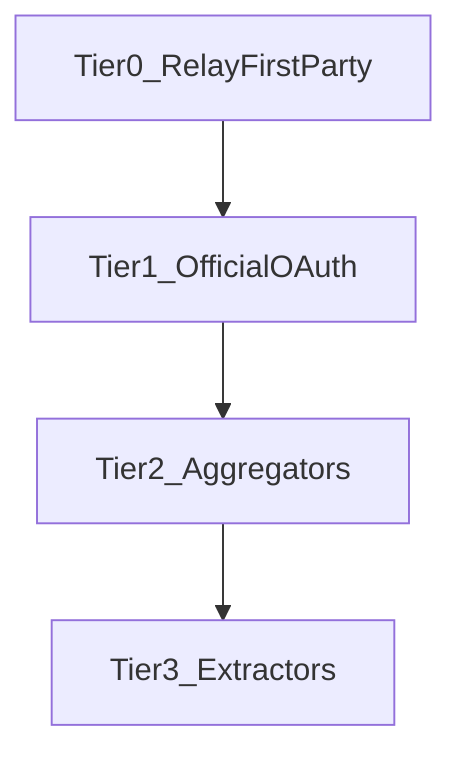

# Third-party & supplemental metrics sourcing — strategy vision

Official creator APIs are often **incomplete, rate-limited, or absent** for the metrics Relay needs for a credible dashboard. This document **formalizes long-term options** for filling gaps: **official routes first**, then **licensed aggregators**, then **high-friction extractors**—without treating any vendor as endorsed until legal and product review completes.

It does **not** override [road map.md](../road%20map.md) execution order. **Near-term:** prioritize **first-party** telemetry on Relay-owned surfaces and **direct OAuth** to platforms the creator controls (see [growth-analytics-features.md](growth-analytics-features.md) phase 1). **Third-party and scraping-backed feeds** are **backlog** until each connector has a named MVP, DPA/subprocessor posture, and UI that labels **data source and freshness**.

**Update this file** when a connector is promoted to a build ledger; link from the road map when navigation changes.

---

## Problem

Building a “source of truth” **only** from official APIs risks a **data desert** for growth views (historical trends, cross-platform reach, public-only engagement). Relay should still keep **semantic truth** for content and entitlements in **canonical ingest + overrides**—external metrics are **annotations**, not replacements for membership or paywall state.

---

## Short-term context (what to ship before expanding)

| Priority | Pointer | Role |
|----------|---------|------|
| First-party | [growth-analytics-features.md](growth-analytics-features.md) — **Phase 1** | Views/clicks/plays on Relay gallery, clone, and future patron surfaces. |
| Direct auth | [road map.md](../road%20map.md) — Patreon OAuth, ingest | Authoritative **owned-account** data where the platform grants it. |
| Action Center | [analytics-action-center-spec.md](../analytics-action-center-spec.md) | Any externally sourced metric shown on cards must carry **provenance**, **confidence**, and **stale-after** semantics. |
| Compliance | [builder-boost-pack/standards/security-compliance-checklist.md](../builder-boost-pack/standards/security-compliance-checklist.md) | Subprocessors, data processing terms, retention. |

**Short-term rule:** do **not** introduce aggregator or scraper dependencies until **first-party event plumbing** and **Workstream E** foundations exist; otherwise the product optimizes for brittle external data.

---

## Hierarchy of truth (non-negotiable)

1. **Relay first-party events** (pixel, short links, hosted page analytics) — creator opts in; highest trust for “did a human hit *my* Relay surface.”
2. **Official APIs / OAuth** for accounts the creator authorizes — authoritative for **their** data where the platform allows.
3. **Licensed third-party APIs** (aggregators, intelligence vendors) — useful for **benchmarks and estimates**; must be labeled **third-party** and may be **wrong or delayed**.
4. **Scraping-as-a-service or custom extractors** — **last resort**; highest ToS and IP risk; requires explicit **creator consent**, rate limits, and kill switches.

Dashboard copy must never equate Tier 3–4 numbers with Relay billing or entitlement state.

---

## Long-term: tiered ingestion model

| Tier | Mechanism | Role | Risk / notes |
|------|-----------|------|----------------|
| **0 — First-party supplement** | **Relay Link** (short URLs), optional **tracking pixel** on permitted outbound surfaces, UTM-normalization | Captures traffic Patreon (or others) do not expose for **links the creator chooses to instrument**. | Privacy policy, consent, ad-blockers, link hygiene; **never** inject into gated content without policy review. |
| **1 — Direct** | Official REST/GraphQL + OAuth2 for **creator-authorized** accounts (e.g. Patreon resource APIs; **evaluate** semi-documented routes such as SubscribeStar GraphQL only after ToS and stability review). | Ground truth for **their** subscribers, posts, and allowed metrics. | Each platform is a **separate** integration spike + ledger slice. |
| **2 — Aggregators** | **Illustrative research candidates** (not commitments): creator-economy analytics APIs, large creator-index APIs, demographic-focused social APIs—**only** where contract allows redistribution into your product and maps to Relay’s use case. | Historical growth, benchmarks, cross-handle **estimates**. | Cost, accuracy, **subprocessor** chain, and **non-compete** / display rules. |
| **3 — Extractors** | **Illustrative research candidates:** managed scraping marketplaces, proxy-backed scraper IDEs—**public** or **consented** data only. | “Missing” public counters (views, favorites) when Tier 1 is silent. | ToS, CFAA-style risk, breakage when sites change; **feature-flag per creator**. |

Names mentioned in brainstorming (e.g. Graphtreon, influencer databases, Modash, Apify, Bright Data, HypeAuditor, Social Blade) are **examples for product planning only**—each requires **commercial agreement**, **legal review**, and a **go/no-go** before engineering commitment.

---

## Relay Link & pixel (product direction)

**Intent:** Let creators attribute clicks and optional page views that **originate from links they control** (e.g. Patreon post links pointing through `relay.link/...`), so Relay can show **first-party** funnels Patreon does not provide.

**Requirements before build:**

- Clear **opt-in** and **disclosure** (creator and, where applicable, end users).
- **Separation** from paywalled content scraping—this is **instrumentation the creator chooses**, not circumvention.
- **Retention and deletion** aligned with [monetization-scheme-infrastructure-plan.md](../monetization-scheme-infrastructure-plan.md) and privacy addenda.

Treat as a **dedicated ledger** when scoped (schema for links, redirects, events, quotas).

---

## Guardrails (all tiers)

- **Provenance field** on every external metric: `source`, `collected_at`, `method` (official_api | aggregator | extractor).
- **No silent merge** into financial or entitlement truth—Patreon (or clone billing) remains authoritative for **who is paid and who has access**.
- **One connector at a time** in engineering: spike → compliance sign-off → ship; no “50 scrapers” monolith.
- **Adult / sensitive content:** third-party vendors often restrict adult; vet per vertical before promising coverage.

---

## Relationship to growth loop doc

[Phase 2 — Aggregation](growth-analytics-features.md) in **growth-analytics-features.md** is where unified cross-channel views **consume** Tier 1–3 data. This file defines **how** Relay may acquire that data **safely**; keep both docs in sync when aggregation ships.

---

## When to promote to a roadmap ledger

Open a **connector-specific** or **Relay Link** ledger when:

1. Vendor or method is **selected** and **contracted** (or first-party spec is frozen).
2. **DPA / subprocessor** and **retention** are documented.
3. **MVP metrics** and **exit gates** (freshness, error budget, UI labels) are written.

Until then, this file remains **strategic backlog** linked from the road map.
