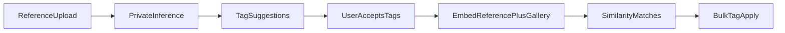

# Project Relay Roadmap

## Executive Summary

Creators on Patreon have limited control over how their work is discovered, archived, and monetized outside Patreon. Relay addresses this through a three-part product strategy:

- Part 1, Gallery Export: creators can export and host their media in a searchable, artist-owned gallery managed through Relay.
- Part 2, Gallery Clone: creators can reproduce their full membership experience (content, tiers, and access logic) on infrastructure they control, with guided audience re-population.
- Part 3, Patron Network: fans get a unified consumption experience—one feed for creators they support, optional discovery of opted-in public or promo content, and (when offered) audience-side monetization that does not tax creator subscription revenue.

This roadmap prioritizes creator safety, legal compliance, migration confidence, and measurable value at each release gate.

## Product narrative

Relay is **two intentional products** that share one **access and content model**, so patron-facing surfaces never fork a second truth from artist curation.

### Artist Relay (creator account)

- After **register** and **Patreon connect** (OAuth plus ingest/scrape as implemented), the artist lands in the **Library**: a chronological or tier-aware inventory of Patreon-sourced content.
- The Library is the **curation hub and source of truth** for what Relay may expose: visibility (including hiding duplicates or legacy work), retagging, hygiene, and **Collections** that shape how viewers browse.
- The **homepage / public gallery** is a **projection** of that policy plus **layout** (Designer): not a separate inventory. Patreon-side changes should **flow in continuously** after initial setup; curation is overlays, not re-entry of every post.
- **Tier and access rules** from Patreon remain authoritative for paywalled material; Relay applies **artist overrides** on top of canonical ingested rows.

### Fan Relay (patron account)

- After **register** and **Patreon patron OAuth**, Relay maintains **entitlements** (active subscriptions and tiers) against its database of artists.
- Fans get a **unified feed** of supported creators, **artist profiles** for deep browsing, and **Browse**: an algorithmic surface that may mix entitled content with **opt-in free / discovery** material (volume and similarity-based suggestions), within caps and policy.
- **Comments, favorites, and Relay-native collections** are on-platform engagement, separate from Patreon’s UI unless explicitly synced later.
- **Paywall enforcement** follows entitlement snapshots: cancel or downgrade on Patreon → lose access here when OAuth/sync confirms the change. **Upgrading a pledge** should unlock higher tiers quickly; prefer **scheduled plus on-demand** entitlement refresh (login, refresh, pre-play, return from checkout) and, where allowed, **in-app upgrade** via Patreon deep links or API flows with compliance review.

### Sync and “instant mirror” (product expectation)

- Deliver **best-effort freshness** via incremental jobs, retries, and clear **sync status** in the Library—not a guarantee of zero lag versus Patreon.
- Document **SLOs** for ingest and patron entitlement refresh as they are defined in operations specs.

## Builder Navigation (Read This First)

Use this roadmap as the execution sequence and use the reference docs for deeper implementation decisions:

- **Coding agents / anyone touching Patreon ingest or gallery duplicate behavior:** read [AGENTS.md](AGENTS.md), [docs/patreon-ingest-canonical.md](docs/patreon-ingest-canonical.md), and [docs/relay-artist-metadata.md](docs/relay-artist-metadata.md) so canonical vs overrides stay aligned (artist tags/visibility survive re-ingest).
- Library + Designer UX ideals, workflows, gaps, and phased UI backlog:
  - [docs/pattern-library.md](docs/pattern-library.md)
- **Sync & access hardening (Slices 1–4, shipped):** [docs/part1-sync-hardening-ledger.md](docs/part1-sync-hardening-ledger.md) — export retries, tier alignment, watermark + re-sync UI, sync health; one ledger for APIs, env vars, and tests.
- Standardized build contracts, quality gates, and traceability:
  - [builder-boost-pack/README.md](c:\Users\jorda\Documents\Coding Projects\Rescue\builder-boost-pack\README.md)
- Analytics decisioning, action cards, data contracts, and execution APIs:
  - [analytics-action-center-spec.md](c:\Users\jorda\Documents\Coding Projects\Rescue\analytics-action-center-spec.md)
- **Long-term growth analytics loop** (first-party truth → optional omni-channel → diagnosis → coach → goals): strategy and phased vision in [docs/growth-analytics-features.md](docs/growth-analytics-features.md). **Near-term** delivery remains Workstream E and Action Center contracts.
- **Third-party metrics when APIs are insufficient** (aggregators, optional extractors, Relay Link / first-party supplements): tiered strategy and compliance posture in [docs/third-party-metrics-sourcing.md](docs/third-party-metrics-sourcing.md). **Not** a substitute for first-party Relay telemetry.
- Pricing model, COGS guardrails, hosting modes, and post-independence operations:
  - [monetization-scheme-infrastructure-plan.md](c:\Users\jorda\Documents\Coding Projects\Rescue\monetization-scheme-infrastructure-plan.md)
- **Audience Premium, daily paywalled promos, and boost tokens** — strategic constraints and agent prompt for roadmap/plan edits:
  - [docs/monetization-discovery-premium-agent-prompt.md](docs/monetization-discovery-premium-agent-prompt.md)

Quick routing:

- Context and product behavior for recommendations -> Analytics Action Center Spec.
- Data sourcing, event contracts, and service boundaries -> Builder Boost Pack contracts + Analytics Action Center Spec.
- Pathing for managed vs BYOI deployment and migration economics -> Monetization Scheme and Infrastructure Plan.
- Daily promo slot, Premium viewer tier, boost tokens, attribution -> [docs/monetization-discovery-premium-agent-prompt.md](docs/monetization-discovery-premium-agent-prompt.md).
- Security, compliance, and outreach governance decisions -> Builder Boost Pack standards + Monetization Scheme and Infrastructure Plan.
- Library and Designer sequencing before heavy patron-facing polish -> [docs/pattern-library.md](docs/pattern-library.md) (Part 3 builds on stable gallery and layout contracts).
- Patreon sync/export hardening Slices 1–4 (what shipped, where to change code) -> [docs/part1-sync-hardening-ledger.md](docs/part1-sync-hardening-ledger.md).
- Private smart tagging and similarity-assisted bulk apply -> **Ledger (Part 1, post-stabilization): Smart Tag Assistant** under [Part 1 Delivery Track: Gallery Export](#part-1-delivery-track-gallery-export).
- Growth analytics phases (hook → aggregation → loop) and short-term pointers -> [docs/growth-analytics-features.md](docs/growth-analytics-features.md).
- External metrics sourcing (tiers, Relay Link idea, aggregator vs scraper guardrails) -> [docs/third-party-metrics-sourcing.md](docs/third-party-metrics-sourcing.md).

## Product Boundaries

### Part 1: Gallery Export

Goal: creator-owned media availability and discovery without requiring full platform migration.

Includes:
- Patreon OAuth connection and recurring ingest.
- Media normalization, tagging, and gallery search.
- Exported content storage under creator-owned or creator-assigned storage.
- Analytics for content performance and audience behavior.
- **Near-term:** Workstream E snapshots and Action Center–style insights per [analytics-action-center-spec.md](c:\Users\jorda\Documents\Coding Projects\Rescue\analytics-action-center-spec.md). **Long-term** measurement and growth-loop vision (optional omni-channel, coaching, goals): [docs/growth-analytics-features.md](docs/growth-analytics-features.md). **Optional** external data fills API gaps only under the tiered model in [docs/third-party-metrics-sourcing.md](docs/third-party-metrics-sourcing.md) (first-party and official OAuth first).
- Optional post-stabilization: **Smart Tag Assistant**—private inference plus similarity-assisted bulk tagging (see Ledger under Part 1 Delivery Track).

Does not include:
- Full Patreon replacement checkout flow.
- Tier-gated clone site deployment.

### Part 2: Gallery Clone

Goal: one-click transition path from Patreon-dependent presence to creator-owned subscription site.

Includes:
- Replica data model for posts, tiers, and access rules.
- Deployable clone site with tier access control.
- Payment provider handoff (Stripe/PayPal first).
- Re-Populate workflow to invite existing members to mapped replacement tiers.

### Part 3: Patron Network

Goal: give patrons a reason to use Relay directly—aggregated updates from creators they follow, tier-appropriate access, and optional discovery—while keeping infrastructure and compliance bounded (metadata-rich, heavy media via creator storage or signed delivery, not an unbounded public CDN).

Includes:
- Patron accounts, session model, and follow graph (seeded where possible from existing OAuth relationships; extended with on-platform follows).
- **Continuous patron OAuth and entitlement refresh** so subscription and tier changes (upgrade, downgrade, cancel) converge without manual re-linking; short-TTL or on-demand checks before sensitive actions (full media, deep browse) where required.
- Unified feed combining subscribed creators’ published or entitled content with configurable mix rules (for example majority subscription, minority discovery).
- **Browse** experience: algorithmic scrolling across libraries the patron is connected to, with **free-tier / opt-in discovery** inserts for volume; similarity and subscription signals inform ranking where policy allows, with **audit-friendly** decision logs for non-chronological ordering.
- **Relay-native engagement**: comments, favorites, and patron-side collections (distinct from artist Library collections); moderation and abuse tooling aligned with Terms.
- **Pledge upgrade path**: transparent flows to Patreon checkout or supported APIs so patrons can increase tier from Relay where permitted; entitlement refresh on return.
- Creator controls for promo or teaser content eligible for discovery surfaces, aligned with tags and access rules.
- Feed and discovery APIs with rate limits, abuse controls, and explainable ranking inputs where ranking is used.

Does not include (until explicitly scoped):
- Full replacement of Patreon (or other platforms) for fan acquisition and checkout.
- Autonomous algorithmic publishing without creator approval for gated content.
- Paid boost or premium viewer products before policy review and baseline DAU (see monetization plan).

## Architecture Baseline

### Application Stack

- Backend: Node.js + TypeScript + NestJS.
- Frontend: Next.js + React + Tailwind.
- Database: PostgreSQL + Prisma.
- Queue and jobs: BullMQ + Redis.
- Object storage: S3 or Cloudflare R2.
- Observability: Sentry + structured logs (Pino).

### Data Domains

- Identity: users, creators, OAuth credentials, provider metadata.
- Content: campaigns, posts, media, tags, content versions.
- Membership: tiers, tier rules, patron snapshots, migration mappings.
- Patron network: patron profiles, follows, feed cursors, notification preferences, entitlement snapshots for feed assembly.
- Engagement: comments, favorites, patron collections (Relay-native; separate schema from artist Library collections unless later unified by product decision).
- Discovery: creator opt-in promo slots, tag targeting metadata, ranking features and audit-friendly decision logs (where applicable).
- Operations: sync jobs, retries, dead letters, migration runs, email batches.

### Security Defaults

- Encrypt OAuth and provider credentials at rest.
- Signed URLs for private media delivery.
- Least privilege service roles for storage and database.
- Per-tenant rate limits and API abuse controls.

### Patreon dependency and contingency

- **Canonical store:** Ingested content and artist overrides in Relay remain the **operational source of truth** for the product experience; Patreon is the **upstream** for creator sync and patron billing state, not a second UI database.
- **Provider abstraction:** Design patron and creator integrations so alternative identity or billing providers can be added without rewriting feed or gallery core logic.
- **Degradation modes:** If Patreon APIs change, rate-limit, or fail, define behavior explicitly: for example stale entitlements with read-only patron experience, creator-visible sync errors, and alerts—rather than silent wrong access.
- **Long-term:** Full independence (Relay as primary platform) is a scale and product decision documented in monetization and clone tracks; it is not assumed for early phases.

Reference for operational cost and hosting tradeoffs:
- [monetization-scheme-infrastructure-plan.md](c:\Users\jorda\Documents\Coding Projects\Rescue\monetization-scheme-infrastructure-plan.md)

## Part 1 Delivery Track: Gallery Export

### Objective

Deliver time-to-value fast: connect Patreon, import content, launch searchable gallery, and give creators reliable exports.

###    A: Onboarding and Auth

- Implement Patreon OAuth with token refresh and rotation handling.
- **Creator vs patron OAuth:** this workstream is the **creator** connection (encrypted token store, ingest/scrape, credential health). **Patron** “Log in with Patreon” for fans—automatic entitlement sync and session—is **Part 3, Workstream K** (“Patreon patron OAuth — end-to-end”); it uses the same Patreon OAuth **app** but a **different redirect URI** and **`/api/v1/auth/patreon/patron/exchange`**, and does **not** write patron tokens into the creator credential file.
- Persist encrypted credentials with explicit credential health statuses.
- Add onboarding progress states:
  - Connect Patreon
  - Initial Import
  - Organize Content
  - Publish Gallery

Exit gate:
- 95 percent of eligible creators complete OAuth without support intervention.
- Token refresh failure rate under 1 percent per day.

### Workstream B: Ingestion and Normalization

- Build idempotent ingest pipeline for campaigns, posts, media, and tier metadata.
- Normalize content into media-centric records while preserving source post relationships.
- Track upstream deletions/edits and maintain version history.
- Add retry policy (exponential backoff) and dead-letter queue.

Builder reference:
- Data contracts and event surface for downstream analytics/action logic:
  - [analytics-action-center-spec.md](c:\Users\jorda\Documents\Coding Projects\Rescue\analytics-action-center-spec.md)

Exit gate:
- Initial import for 5,000 media items completes in under 20 minutes.
- Duplicate creation rate below 0.1 percent.
- Dead-letter rate below 0.5 percent of jobs.

### Workstream C: Export Storage and Delivery

- Download and store original-resolution assets to creator-assigned storage target.
- Attach checksums and integrity metadata to every exported object.
- Support optional local manifest export:
  - `media-manifest.json`
  - `post-map.json`
  - `tier-map.json`
- Serve thumbnails and gallery assets through cache layer/CDN.

Exit gate:
- 99.9 percent media retrieval success over rolling 7 days.
- Integrity verification passes for 100 percent sampled exports.

### Workstream D: Gallery Experience

- Build virtualized, filterable gallery:
  - Search by title, tags, date range, tier, and media type.
- Add bulk tag editor and metadata correction workflow.
- Implement quick preview, keyboard navigation, and saved filters.

Exit gate:
- Median time to locate a known asset under 5 seconds.
- P95 gallery interaction latency under 300 ms for 10,000 items.

### Workstream E: Analytics Foundation

- Capture content and audience trend snapshots.
- Provide creator-facing insights:
  - Top performing tags.
  - Posting cadence vs engagement.
  - Tier-specific content performance.
- Mark all estimated metrics clearly when source data is incomplete.

Builder reference:
- Use the Analytics Action Center Spec as implementation source of truth for:
  - action-card schema
  - recommendation confidence and explainability rules
  - API surface and execution pathways
  - KPI instrumentation and rollout phases
  - [analytics-action-center-spec.md](c:\Users\jorda\Documents\Coding Projects\Rescue\analytics-action-center-spec.md)

Exit gate:
- Dashboard exposes at least 3 actionable insight cards per creator.
- Insight generation job success rate at or above 99 percent.

**Context — short term vs long term:** This workstream ships the **foundation** (snapshots, cards, contracts). A **six-phase growth arc** (first-party analytics hook, optional channel aggregation, diagnosis, AI-assisted strategy, draft-and-approve cross-post, goal-driven loop) is scoped for planning only in [docs/growth-analytics-features.md](docs/growth-analytics-features.md); promote slices to new ledgers when each phase has MVP + exit gates. When official APIs lack metrics, **do not** default to scrapers—follow the tiered sourcing and Relay-first rules in [docs/third-party-metrics-sourcing.md](docs/third-party-metrics-sourcing.md).

### Ledger (Part 1, post-stabilization): Smart Tag Assistant

**Objective:** Enrich Relay’s search and curation beyond Patreon’s native metadata so creators can isolate character-specific or scenario-specific work **by typing** (universal search, facets, saved filters) instead of hunting carousels. Tags are **Relay-level** (taxonomy-backed), applied only after explicit artist confirmation, and flow through the same override/canonical pipeline as manual tags.

**User flow (two stages, both confirmatory):**

- **Stage A — Reference ingest:** In the artist dashboard, a private **processing zone** accepts one or more reference images the artist uploads. A **self-hosted** vision / multimodal model (e.g. CLIP-class) proposes descriptive tags—style, palette, tropes, and **hierarchical child tags** under a **Relay-defined taxonomy** (not unconstrained free text that poisons search).
- **Stage B — Gallery mirror:** The system embeds accepted references and runs **similarity search only within that creator’s gallery** (exported or in-app media). The UI surfaces clusters (e.g. “this subject appears in 5 other works”) with **confidence scores**. The artist confirms **per tag** or **per batch** before tags are written—aligned with **post-scoped** bulk-tag semantics (see Workstream D and gallery APIs).

**Product guardrails (non-negotiable):**

- **No silent apply:** Model output never writes production tags without explicit user action.
- **Viewer parity:** Accepted tags participate in the same read model as manual tags for Library, Designer preview, and future patron surfaces ([docs/pattern-library.md](docs/pattern-library.md); [docs/relay-artist-metadata.md](docs/relay-artist-metadata.md)).
- **Tenant isolation:** Embeddings and vector indexes are **per creator** (or strictly partitioned); no cross-creator retrieval or training aggregation.
- **Positioning:** Market as **private inference** and **no third-party multimodal API** for this feature; operational and contractual assurances—not “cryptographic” guarantees.

**Technical dependencies (sequencing):**

- **After** stable Patreon → canonical → gallery list/search ([docs/patreon-ingest-canonical.md](docs/patreon-ingest-canonical.md), Workstreams B and D).
- **After or in parallel with** durable **queue-backed workers** (BullMQ + Redis per Architecture Baseline) and object storage for batch embedding jobs—not prescriptive of other language-specific queue frameworks.
- **Inference:** Containerized, **private-network** hosting; MVP may use CPU or a **single GPU** before any Kubernetes GPU autoscale story.
- **Vector storage:** Implementation choice between **pgvector** (colocated with Postgres) or a **dedicated vector database**—not locked to a specific vendor in v1.

**Exit gates (ledger-level; detailed SLOs TBD in ops specs):**

- Latency and batch-size targets defined before GA.
- False positives bounded by **confidence thresholds + human confirmation**; immutable **audit trail** of model suggestion, user acceptance, and affected posts/media.

**Monetization posture:** Candidate for premium tier or metered “power tools” ([monetization-scheme-infrastructure-plan.md](monetization-scheme-infrastructure-plan.md)); **not** required to ship core gallery MVP.

### Required Assets for Part 1

Technical assets:
- Patreon OAuth app and callback environments.
- Queue worker deployment with autoscaling policy.
- Object storage bucket policy templates and key management.
- CDN distribution and cache invalidation strategy.

Operational assets:
- Creator onboarding guide and troubleshooting flow.
- Support runbook for failed syncs and expired credentials.
- Data retention and deletion policy.

## Part 2 Delivery Track: Gallery Clone

### Objective

Enable creators to transition from Patreon dependency to a creator-owned subscription site with minimal audience loss.

### Workstream F: Replica Model and Clone Generation

- Extend schema to represent clone-ready posts, media relations, tiers, and access constraints.
- Generate clone site content model from canonical dataset.
- Support preview environment with deterministic URL structure before launch.

Exit gate:
- Clone preview parity reaches 98 percent on sampled pages.
- Tier rule evaluation is deterministic and test-covered.

### Workstream G: Access and Identity

- Implement access control for public, member-only, and tier-specific content.
- Support Patreon-auth fallback during transition window.
- Add independent account creation for post-migration continuity.

Exit gate:
- Unauthorized tier content access rate equals zero in test suite and staging attack tests.

### Workstream H: Payment Provider Handoff

- Initial providers: Stripe and PayPal (additional providers after launch).
- Create tier-to-product mapping wizard with preflight checks:
  - Currency consistency
  - Tax behavior
  - Billing interval compatibility
- Add dry-run mode before live charge enablement.

Builder reference:
- Pricing packages, plan boundaries, and managed vs BYOI implications:
  - [monetization-scheme-infrastructure-plan.md](c:\Users\jorda\Documents\Coding Projects\Rescue\monetization-scheme-infrastructure-plan.md)

Exit gate:
- 100 percent of configured tiers can be validated in preflight mode.
- Payment checkout success rate at or above 97 percent in pilot.

### Workstream I: Re-Populate Audience Recovery

- Build consent-safe invite pipeline that maps prior membership tier to destination tier.
- Create signed, expiring re-subscribe links per recipient and tier.
- Add migration campaign controls:
  - Staged sends
  - Bounce and complaint monitoring
  - Automatic suppression list enforcement
- Provide creator preview:
  - Recipient counts by tier
  - Message preview
  - Risk flags before send

Builder reference:
- Campaign safety rails, recommendation-to-execution model, and measurement loop:
  - [analytics-action-center-spec.md](c:\Users\jorda\Documents\Coding Projects\Rescue\analytics-action-center-spec.md)
- Deliverability economics, policy posture, and service responsibility boundaries:
  - [monetization-scheme-infrastructure-plan.md](c:\Users\jorda\Documents\Coding Projects\Rescue\monetization-scheme-infrastructure-plan.md)

Exit gate:
- Email delivery rate at or above 98 percent (excluding hard bounces).
- Complaint rate below 0.1 percent.
- Re-subscribe conversion benchmark established and tracked per cohort.

### Workstream J: One-Click Deploy and Rollback

- Integrate deploy APIs (Vercel first, optional Netlify second).
- Release flow:
  - Build clone
  - Preview approval
  - DNS and domain check
  - Launch
- Implement rollback to previous stable deployment with one action.

Exit gate:
- Median production deployment time under 2 minutes after approval.
- Verified rollback completes in under 5 minutes.

### Required Assets for Part 2

Technical assets:
- Clone template repository with theme slots and tier gating hooks.
- Payment provider adapter layer.
- Email infrastructure with domain authentication (SPF, DKIM, DMARC).
- Migration orchestration service with audit log storage.

Operational assets:
- Legal/compliance review checklist for outreach and migration communications.
- Domain and DNS setup guide for creators.
- Incident runbook for migration failures and rollback recovery.

## Part 3 Delivery Track: Patron Network

### Objective

Turn Relay from a creator-centric tool into a **patron-valued surface**: one place to catch up on supported creators, with optional discovery that respects paywalls and creator opt-in. Bootstrap via creators sharing gallery or site links; a feed with few followed creators still beats opening multiple platform profiles.

**Sequencing:** Start Part 3 after Part 1 gallery and Designer **data contracts** are stable (including section sources and entitlement semantics), so the feed does not fork a second truth for visibility and tiers. See [docs/pattern-library.md](docs/pattern-library.md).

### Workstream K: Patron Identity and Follow Graph

- Patron registration, login, and session lifecycle (including optional link to provider identity where allowed).
- **Patreon patron OAuth** lifecycle: **today**, each successful patron authorization drives a **login-time entitlement sync** (code exchange → Patreon identity → Relay `tier_ids` update → Relay session). **Next** (same workstream): optional persistence of patron refresh tokens, credential health, **revalidation** on a schedule, and provider webhooks so upgrade/downgrade/cancel converges without requiring a full re-link—aligned with Part 3 “continuous patron OAuth and entitlement refresh” above.
- Follow model: creators on Relay, with initial suggestions from OAuth-derived relationships when available.
- Privacy controls: unfollow, mute, data export and deletion aligned with regional privacy requirements.

#### Patreon patron OAuth — end-to-end (implementation reference)

This is the **automatic** path when a patron signs up or logs in with Patreon: no separate manual “register this user” step beyond completing OAuth and hitting Relay’s exchange. It **reuses the same access model** as creator-side member sync and clone/gallery checks: Relay session carries `tier_ids`; gated content uses intersection with post access rules (see Workstream G). It does **not** fork a second entitlement truth.

| Step | Responsibility |
| --- | --- |
| 1. Start OAuth | Browser redirects to Patreon `oauth2/authorize` with the **same OAuth client** as creator connect, a **patron-specific redirect URI** registered in the Patreon app, and scopes: `identity`, `identity[email]`, `identity.memberships`. |
| 2. State payload | Must include Relay **`creator_id`** (tenant) and Patreon **numeric campaign id** (same number as in `patreon_campaign_{id}` in canonical ingest) so Relay can filter the patron’s **memberships** to the correct campaign when `identity.memberships` returns multiple campaigns. |
| 3. Callback | Authorization `code` returned to the patron redirect URI; server (or BFF) calls Relay—**not** the creator token store path. |
| 4. Relay API | `POST /api/v1/auth/patreon/patron/exchange` with `code`, `redirect_uri`, `creator_id`, `patreon_campaign_numeric_id`. Relay exchanges the code for a **patron** access token, calls Patreon **`GET /api/oauth2/v2/identity`** with `include=memberships,memberships.currently_entitled_tiers` and explicit `fields[...]`, then derives **`patreon_tier_*`** ids from **`currently_entitled_tiers`** for **active patrons** only—**same id shape** as creator-triggered **member list sync** (`PatreonSyncService` / register-patreon fallback). |
| 5. Identity store | **Upsert** patron user (`registerPatreonFallback` semantics): refresh `tier_ids` on every successful exchange so return visits pick up tier changes. |
| 6. Session | Issue a normal Relay **session token** (same contract as `login` / `login-patreon`). Patron Patreon tokens are **not** persisted in the **creator** encrypted credential file; only the Relay session (and identity row) gate the product until refresh-token support is added. |
| 7. Product UI | Production signup/login routes replace dev pages (`/patreon/patron/connect` → callback); store session per your app’s cookie or storage policy. |

**Architectural fit:** Patreon remains **upstream** for patron billing and entitled tiers; Relay identity holds a **snapshot** for authorization and feed assembly (Workstream L). Canonical content and artist Library visibility remain the creator-controlled source for **what** can be shown; patron OAuth answers **whether** this user may see tier-gated material for that creator.

**Code reference (current repo):** `src/patreon/patreon-user-identity.ts`, `src/patreon/patreon-patron-oauth.ts`, `POST /api/v1/auth/patreon/patron/exchange` in `src/server.ts`, dev UI under `web/app/patreon/patron/`.

Exit gate:
- Cross-tenant isolation tests pass for patron data and follow lists.
- Median feed assembly for a patron with N follows completes within agreed P95 latency target at pilot scale.

### Workstream L: Feed Assembly and Entitlements

- **Entitlement snapshots** per patron: materialized tier access used by feed, profile, and Browse; invalidate on OAuth refresh or provider webhook where available.
- Server-side feed builder: merge updates from followed creators; enforce tier, **artist Library visibility**, and layout-derived surfaces before surfacing gated thumbnails or links (same rules as artist “viewer sees” projection—see [docs/pattern-library.md](docs/pattern-library.md)).
- **Browse** assembly: algorithmic ordering across connected libraries with discovery caps; document non-chronological behavior for patrons.
- Pagination and stale-content handling; graceful degradation if upstream sync or OAuth is temporarily unavailable.
- Clear labeling when content is discovery vs subscription-sourced.

Exit gate:
- Zero unauthorized tier content in feed integration and security tests.
- Documented fallback behavior when a creator disconnects Patreon or export stalls.

### Workstream M: Discovery and Creator-Opt-In Promos

- Creator UI to designate content safe for discovery or promo surfaces (and to revoke).
- Tag-aware insertion rules for optional discovery slice of the feed (for example cap on percentage of discovery items).
- Instrumentation for impressions and clicks to support analytics and future Action Center style recommendations.

Exit gate:
- Only opt-in content appears in discovery; automated tests cover revocation.
- Creator-facing summary of what is exposed to non-subscribers.

### Workstream O: Patron Engagement and Upgrade Path

- **Relay-native** comments, favorites, and patron **collections** (distinct from artist Library collections); moderation tooling and Terms alignment before broad launch.
- **Upgrade flows:** deep links or supported flows to Patreon for higher tiers; post-return entitlement refresh; clear UX when access is pending verification.

Exit gate:
- Engagement features covered by abuse playbook and content policy review.
- Upgrade path tested end-to-end for at least one tier increase scenario in staging.

### Workstream N: Audience Monetization (Optional Layer)

- After baseline feed retention exists: optional **premium viewer** tier (cosmetics, denser discovery, or similar non-extractive perks).
- Optional **boost** or signal products: paid visibility must be disclosed, auditable, and subordinate to creator opt-in and policy.
- Revenue model stays aligned with [monetization-scheme-infrastructure-plan.md](c:\Users\jorda\Documents\Coding Projects\Rescue\monetization-scheme-infrastructure-plan.md): primary recurring revenue remains creator SaaS; audience revenue offsets patron-side COGS.

Exit gate:
- Legal and product review for paid ranking or boosts completed before launch.
- No hidden pay-to-win against creator subscription economics without explicit positioning.

### Required Assets for Part 3

Technical assets:
- Patron-facing app routes or client bundle (**dedicated shell** recommended: feed and Browse separate from artist control-room chrome); feed, Browse, and follow APIs.
- Caching strategy for hot feeds without breaking entitlement checks.
- Feature flags for discovery percentage and premium modules.

Operational assets:
- Abuse and spam playbook for fake follows and feed gaming.
- Transparency copy for how discovery ordering works where it is not purely chronological.
- Moderation alignment with Terms for user-generated discovery context (comments or reactions, if added later).

## Re-Populate User Experience Flow

### Creator Flow

1. Select migration campaign.
2. Review tier mapping suggestions and edit as needed.
3. Run preflight checks (contacts, suppressions, link validity, template quality).
4. Preview recipient counts and sample messages.
5. Launch staged send (small cohort first, then full audience).
6. Track conversion dashboard and retry non-openers safely.

### Patron Flow

1. Receive invite with creator branding and clear reason for transition.
2. Click tier-specific secure link.
3. Review destination benefits and pricing.
4. Create account or sign in.
5. Complete checkout and gain mapped access immediately.

### UX Safeguards

- No send without passing preflight validation.
- No tier assignment without explicit mapping confirmation.
- Automatic pause if bounce/complaint threshold is exceeded.
- Every campaign action written to immutable audit log.

## Compliance and Policy Guardrails

- Respect source platform terms and regional privacy laws.
- Process member contact data only with valid legal basis.
- Provide unsubscribe and preference center in all outreach emails.
- Enforce suppression list checks before any campaign send.
- Maintain audit trails for imports, exports, and outreach actions.
- Part 3: honor patron consent for notifications and discovery; disclose paid or boosted placement where applicable; avoid deceptive engagement patterns in ranked surfaces; align feed retention features with applicable consumer and platform rules as the product scales.

Builder reference:
- Contract/policy baseline and operational compliance ownership model:
  - [monetization-scheme-infrastructure-plan.md](c:\Users\jorda\Documents\Coding Projects\Rescue\monetization-scheme-infrastructure-plan.md)

## Testing and Release Gates

### Test Coverage

- Unit: ingest transforms, tier mapping logic, entitlement checks.
- Integration: OAuth refresh, queue retry behavior, payment adapters.
- End-to-end: creator onboarding, clone deploy, Re-Populate campaign.
- Part 3: feed entitlement tests, follow graph isolation, discovery opt-in enforcement, patron OAuth refresh, Browse ranking invariants where applicable.
- Security: auth bypass tests, signed URL expiration tests, data isolation tests.

### Reliability SLOs

- API availability at or above 99.9 percent monthly.
- Sync freshness target: 95 percent of creators updated within configured interval.
- Background job success rate at or above 99 percent.

### Release Policy

- Pilot with a small creator cohort first.
- Require dry-run migration success before production migrations.
- Gate broad release on conversion, support load, and reliability targets.
- Part 3: ship patron feed and follows before widening discovery; gate paid audience features on policy review and engagement baselines.

Builder reference:
- Analytics rollout phases and recommendation quality gates:
  - [analytics-action-center-spec.md](c:\Users\jorda\Documents\Coding Projects\Rescue\analytics-action-center-spec.md)
- Monetization rollout milestones and infra readiness checkpoints:
  - [monetization-scheme-infrastructure-plan.md](c:\Users\jorda\Documents\Coding Projects\Rescue\monetization-scheme-infrastructure-plan.md)

## Milestone Build Order

1. Part 1 foundation: OAuth, ingest, normalized data model.
2. Part 1 value: export storage, gallery UX, analytics (long-term context: [docs/growth-analytics-features.md](docs/growth-analytics-features.md); external metrics strategy when APIs are thin: [docs/third-party-metrics-sourcing.md](docs/third-party-metrics-sourcing.md)).
3. Part 1 hardening: SLOs, observability, support runbooks.
4. Part 1 smart tagging: private inference, similarity suggestions, and confirmed bulk apply (tenant-scoped Smart Tag Assistant).
5. Part 2 foundation: replica schema, clone generation, access model.
6. Part 2 migration: payment handoff, Re-Populate pipeline, deploy and rollback.
7. Part 2 hardening: compliance automation, deliverability tuning, DR readiness.
8. Part 3 foundation: patron identity, follow graph, feed assembly with strict entitlements.
9. Part 3 growth: discovery and creator-opt-in promos, Browse ranking, patron engagement (comments, favorites, collections), pledge upgrade path, instrumentation, abuse controls.
10. Part 3 optional monetization: premium viewer and disclosed boost surfaces after policy review and baseline engagement.

## End State

Relay provides a practical ladder to creator independence and a durable network layer for fans:

- Part 1 gives creators ownership and discoverability now.
- Part 2 gives creators an operational off-ramp from Patreon when they choose.
- Part 3 gives patrons a unified, trustworthy way to follow and discover supported creators without replacing creator-owned checkout by default.

Parts 1 and 2 are measured by migration safety, creator confidence, and audience continuity. Part 3 adds patron retention, fair discovery, and sustainable audience-side economics where offered.